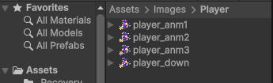
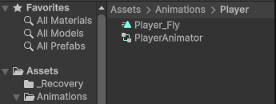
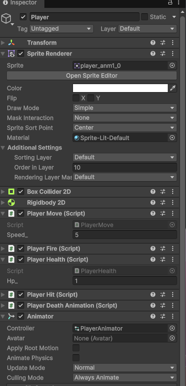
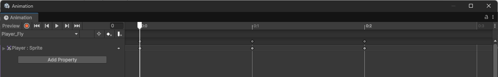
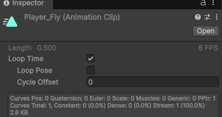
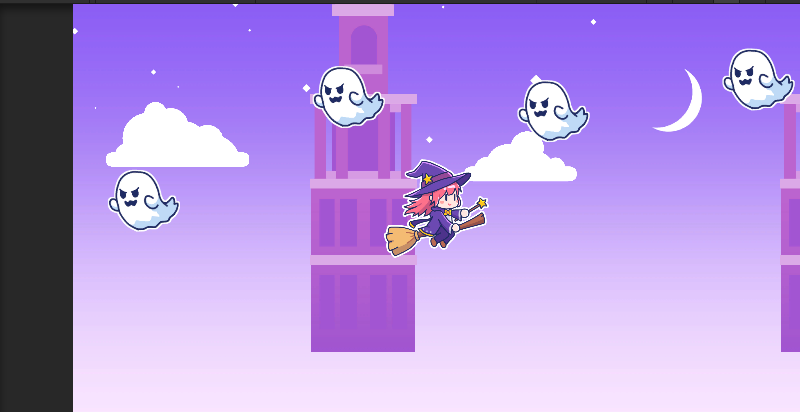

# 【6-01】プレイヤーに飛行アニメーションをつけよう【6章：アニメーション・背景】

1. クリア条件：プレイヤーが羽ばたくように動いて見える状態にする

2. ここまでのプレイヤーは、ずっと同じ1枚の絵のままでした。動きはPlayerMoveで付いていますが、見た目そのものはピクリとも変わっていません。
   今回は複数の絵を切り替えて表示する「アニメーション」を組んで、プレイヤーが飛んでいるように見せます。

   素材フォルダの `Assets/Images/Player` を見ると、`player_anm1`〜`player_anm3` という3枚の絵が入っています（`player_down`はこの章では使いません）。ほんの少しずつポーズが違う絵で、これを順番に切り替えると「パタパタ動いている」ように見えます。

   

   用語：Animator（アニメーター）
   ゲームオブジェクトにアニメーションを再生させるための部品（コンポーネント）。「どのアニメーションを、どういう条件で再生するか」を管理します。
   用語：Animation Clip（アニメーションクリップ）
   実際の絵の切り替えを記録したデータ。「0秒目はこの絵、0.1秒目はこの絵……」という情報が入っています。

3. `player_anm1`・`player_anm2`・`player_anm3` の3枚をShiftキーを押しながらクリックして、まとめて選択します（`player_down`は選ばないように注意します）。

4. 選択した3枚を、Hierarchy上の `Player` にドラッグ＆ドロップします。
   「Create New Animation」というダイアログが出るので、保存先を `Assets/Animations/Player`、ファイル名を `Player_Fly` にして保存します。
   ※`Assets/Animations` フォルダが無い場合は、ダイアログの中で新規フォルダを作成できます。

5. これだけで、Playerに次の3つが自動で作られます。

   - `Player_Fly.anim`（アニメーションクリップ本体）
   - `PlayerAnimator.controller`（アニメーションを管理するコントローラー）
   - Player自身に付いた `Animator` コンポーネント

   `Assets/Animations/Player` フォルダを見ると、2つのファイルができているのが確認できます。

   

   Playerを選択してInspectorを見ると、一番下に `Animator` が追加されていて、Controllerに `PlayerAnimator` が設定されています。

   

6. パタパタの速さを確認します。`Window > Animation > Animation` を開き、Playerを選択した状態で、上のドロップダウンから `Player_Fly` を選びます。
   3枚分のキーフレーム（ひし形のマーク）が並んでいるのが見えます。

   

   再生が速すぎる・遅すぎると感じたら、Projectウィンドウで `Player_Fly.anim` を選択し、InspectorのFPS欄の数字を変えます。小さくすると遅く、大きくすると速くなります。あわせて「Loop Time」にチェックが入っていることも確認しておきましょう（チェックが無いと1回再生して止まってしまいます）。

   

   見た目で気持ちいい速さになるように調整します。

7. Playボタンを押して確認します。プレイヤーが羽ばたくように動いていればクリアです。

   

8. ↓ここから先は次回。同じ手順を敵（ゴースト）にも使って、アニメーションを反復定着させます。
