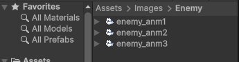
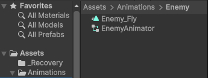
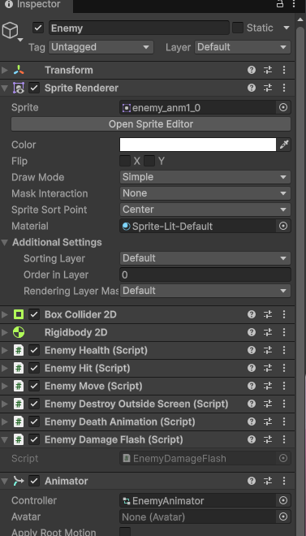
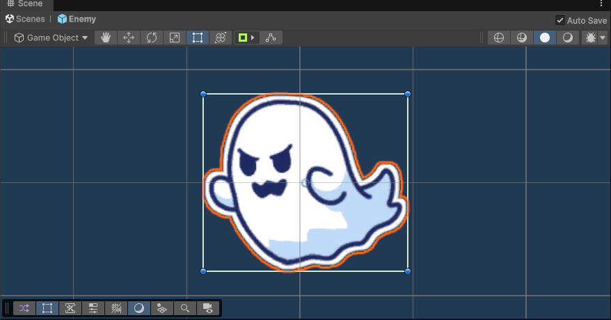

# 【6-02】敵（ゴースト）にもアニメーションをつけよう【6章：アニメーション・背景】

1. クリア条件：敵にもアニメーションがついた状態にする

2. 前回と同じ手順を敵（Enemy）に行います。敵は`Assets/Prefabs/Enemy.prefab`なので、シーンではなくプレハブにアニメーションをつけます。

3. `Assets/Prefabs`の`Enemy`をダブルクリックしてプレハブ編集モードを開いてください。

4. `Assets/Images/Enemy`の`enemy_anm1`〜`enemy_anm3`の3枚をShiftキーで選択し、Hierarchyの`Enemy`にドラッグ＆ドロップしてください。保存先は`Assets/Animations/Enemy`、ファイル名は`Enemy_Fly`にします。

   

5. `Enemy_Fly.anim`・`EnemyAnimator.controller`・`Enemy`の`Animator`コンポーネントが自動で作られます。

   

   

   

   速さは、`Enemy_Fly.anim`のInspectorにあるFPSで調整してください。

6. プレハブ編集モード左上の「←」で通常のシーン編集に戻ってください（プレハブは編集した時点で保存されます）。

7. Playボタンを押し、敵が出てきたときにアニメーションしていればクリアです。

   

8. 次回からは背景を作ります。
