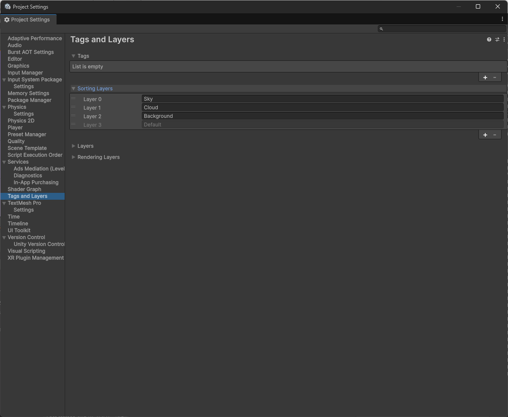
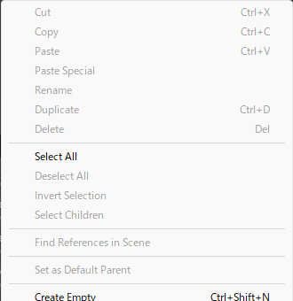
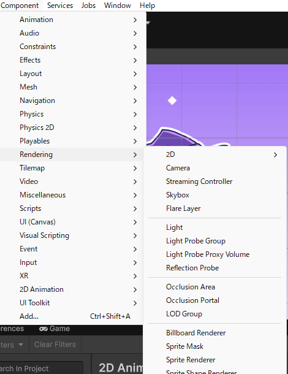
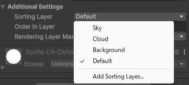
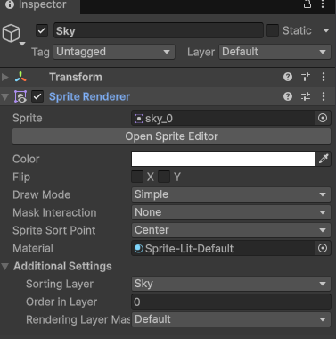
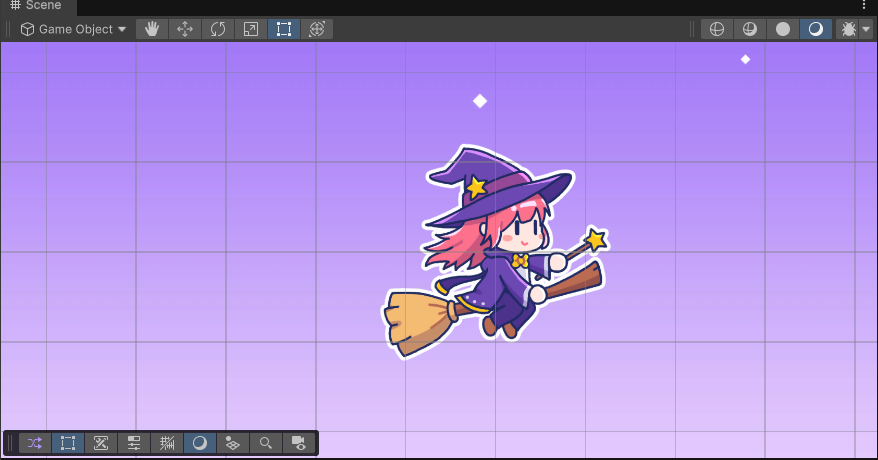

# 【6-03】空を最奥レイヤーとして敷こう【6章：アニメーション・背景】

1. クリア条件：画面いっぱいに空が敷かれ、プレイヤーや敵より奥に表示されている状態にする

2. ここから3回に分けて、背景に奥行きを作ります。`Assets/Images`の3種類の絵を使います。

   - `Sky`：一番奥。夜空と月の絵、1枚
   - `Cloud`：真ん中。雲の絵、6種類
   - `Background`：一番手前。建物の絵、9種類

   奥のものほどゆっくり動いて白っぽく、手前のものほど速く動いてくっきり見えるようにすると、奥行きが出ます。今回は一番奥の空を敷きます。

3. 描画の順番を決める仕組みが「Sorting Layer（ソーティングレイヤー）」です。

   用語：Sorting Layer
   どの絵をどの順番で重ねて描くかを決める設定。リストの上にあるものほど奥（先に描かれ、後から描かれる絵の下に隠れる）、下にあるものほど手前に表示されます。

   `Edit > Project Settings > Tags and Layers`の「Sorting Layers」に、`Sky`・`Cloud`・`Background`を追加し、`Sky`・`Cloud`・`Background`・`Default`の順に並べてください。プレイヤーや敵は`Default`のままなので、一番手前に表示されます。

   

4. Hierarchyの何もないところを右クリックし、`Create Empty`で空のオブジェクト`Sky`を作成してください。

   

5. `Sky`に`Sprite Renderer`をAdd Component（`Component > Rendering > Sprite Renderer`）してください。

   

6. `Sprite Renderer`のSpriteに`Assets/Images/Sky/sky.png`を設定し、「Additional Settings」のSorting Layerを`Sky`にしてください。

   

   

7. 座標を (0, 0, 0)、スケールを (1, 1, 1) にしてください。空の絵は画面より一回り大きいので、これで画面全体を覆います。

8. Sceneビューで、プレイヤーの後ろに空が敷かれていればクリアです。空はここでは動かしません。

   
