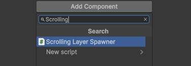
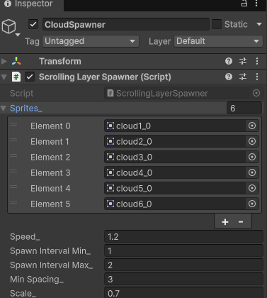

# 【6-04】雲を流れる中景にしよう【6章：アニメーション・背景】

1. クリア条件：雲がランダムな種類・位置で左に流れ続ける状態にする

2. 空は敷けたので、次は雲を流します。ここからはスクリプトを書いて、次のことを同時にやります。

   - `Assets/Images/Cloud` の6種類からランダムに絵を選ぶ
   - 画面の外から出現させて、左へゆっくり流す
   - 画面の外に出たら消す
   - 出現の瞬間や間隔が不自然にならないようにする

3. `Assets/Scripts/Scene` フォルダに `ScrollingLayerSpawner.cs` という名前で新しいスクリプトを作り、次のコードにします。

   ```csharp
   using System.Collections.Generic;
   using UnityEngine;

   public class ScrollingLayerSpawner : MonoBehaviour
   {
       // 使用する画像(この中からランダムに選ばれる)
       [SerializeField] private Sprite[] sprites_;

       // 流れる速さ
       [SerializeField] private float speed_ = 2.0f;

       // スポーン間隔(最小・最大)
       [SerializeField] private float spawnIntervalMin_ = 1.0f;
       [SerializeField] private float spawnIntervalMax_ = 2.0f;

       // 直前に出したものとの最低限のすき間(ワールド座標の距離)
       // これが無いと、間隔が短いときに次々出てきて重なって見えてしまう
       [SerializeField] private float minSpacing_ = 3.0f;

       // 表示する大きさ(1で原寸、0.7なら70%に縮小)
       [SerializeField] private float scale_ = 1.0f;

       // 元の色と透明度(Aを下げると透けて見える)
       [SerializeField] private Color color_ = Color.white;

       // このレイヤーの奥行き(値が大きいほど奥にある)
       [SerializeField] private float distance_ = 0.0f;

       // 霧の色(distance_がFog End Distanceに近づくほど、この色のベールが濃くかぶさっていく)
       [SerializeField] private Color fogColor_ = new Color(0.85f, 0.9f, 1.0f, 1.0f);

       // ここまでの距離は霧がかからない
       [SerializeField] private float fogStartDistance_ = 0.0f;

       // ここまで距離が離れると、霧が最大(Fog Colorそのもの)になる
       [SerializeField] private float fogEndDistance_ = 10.0f;

       // 地面に接するように配置するか(trueならSpawn Y Min/Maxは使わず、画面の一番下に底辺を合わせる)
       [SerializeField] private bool alignToGroundY_ = false;

       // 画面の一番下からのオフセット(alignToGroundY_がtrueのときだけ使う。0で画面の下端にぴったり接地)
       [SerializeField] private float groundOffsetY_ = 0.0f;

       // スポーンするY座標の範囲(alignToGroundY_がfalseのときだけ使う)
       [SerializeField] private float spawnYMin_ = -2.0f;
       [SerializeField] private float spawnYMax_ = 2.0f;

       // Sorting Layer名
       [SerializeField] private string sortingLayerName_ = "Default";

       // Order in Layer
       [SerializeField] private int orderInLayer_ = 0;

       // 生成済みの断片(先頭が一番古い＝一番左、末尾が一番新しい＝一番右)
       private readonly List<Transform> pieces_ = new List<Transform>();

       // 次のスポーンまでの時間
       private float nextSpawnTimer_ = 0.0f;

       // カメラ
       private Camera camera_;

       // Start is called once before the first execution of Update after the MonoBehaviour is created
       void Start()
       {
           camera_ = Camera.main;
           nextSpawnTimer_ = Random.Range(spawnIntervalMin_, spawnIntervalMax_);
       }

       // Update is called once per frame
       void Update()
       {
           // スポーン判定
           nextSpawnTimer_ -= Time.deltaTime;
           if (nextSpawnTimer_ <= 0.0f && CanSpawn())
           {
               Spawn();
               nextSpawnTimer_ = Random.Range(spawnIntervalMin_, spawnIntervalMax_);
           }

           // 既存の断片を流す
           float screenHalfWidth = camera_.aspect * camera_.orthographicSize;
           float despawnX = camera_.transform.position.x - screenHalfWidth - 10.0f;

           for (int i = pieces_.Count - 1; i >= 0; i--)
           {
               Transform piece = pieces_[i];

               // 左へ流す
               piece.position += Vector3.left * speed_ * Time.deltaTime;

               // 完全に画面外に出たら削除
               float halfWidth = GetSpriteHalfWidth(piece);
               if (piece.position.x + halfWidth < despawnX)
               {
                   Destroy(piece.gameObject);
                   pieces_.RemoveAt(i);
               }
           }
       }

       /// <summary>
       /// 直前に出した断片が、まだスポーン地点の近くに残っていないか確認する
       /// </summary>
       private bool CanSpawn()
       {
           if (pieces_.Count == 0) return true;

           // 一番新しい(＝一番右にいる)断片との距離を見る
           Transform lastPiece = pieces_[pieces_.Count - 1];
           float screenHalfWidth = camera_.aspect * camera_.orthographicSize;
           float spawnX = camera_.transform.position.x + screenHalfWidth;

           return (spawnX - lastPiece.position.x) >= minSpacing_;
       }

       /// <summary>
       /// ランダムな画像を画面右側の、完全に見えない位置にスポーンする
       /// </summary>
       private void Spawn()
       {
           if (sprites_ == null || sprites_.Length == 0) return;

           // ランダムに画像を選ぶ
           Sprite sprite = sprites_[Random.Range(0, sprites_.Length)];

           // 断片用のゲームオブジェクトを作成
           GameObject piece = new GameObject("ScrollingLayerPiece");
           piece.transform.SetParent(transform);

           // SpriteRendererを追加して画像を設定
           SpriteRenderer spriteRenderer = piece.AddComponent<SpriteRenderer>();
           spriteRenderer.sprite = sprite;
           spriteRenderer.sortingLayerName = sortingLayerName_;
           spriteRenderer.sortingOrder = orderInLayer_;
           spriteRenderer.color = color_;

           // 指定した大きさに縮小・拡大する
           piece.transform.localScale = Vector3.one * scale_;

           // 距離に応じて、断片の上に半透明の霧ベールを重ねる
           // (色を掛け算で明るくすると光っているように見えてしまうので、
           //  ベールを1枚上に重ねる方式にしている)
           // ベールには建物と同じSpriteを使う。四角い板にすると、建物の周りの
           // 透明な部分（隙間から見える背景）まで霧色に染めてしまうため。
           float fogAmount = Mathf.InverseLerp(fogStartDistance_, fogEndDistance_, distance_);
           if (fogAmount > 0.0f)
           {
               GameObject veil = new GameObject("FogVeil");
               veil.transform.SetParent(piece.transform);
               veil.transform.localPosition = Vector3.zero;
               veil.transform.localRotation = Quaternion.identity;
               veil.transform.localScale = Vector3.one;

               SpriteRenderer veilRenderer = veil.AddComponent<SpriteRenderer>();
               veilRenderer.sprite = sprite;
               veilRenderer.sortingLayerName = sortingLayerName_;
               veilRenderer.sortingOrder = orderInLayer_ + 1;
               veilRenderer.color = new Color(fogColor_.r, fogColor_.g, fogColor_.b, fogColor_.a * fogAmount);
           }

           // 画像自身の大きさ分(縮小後のサイズ)も含めて、完全に画面の外からスポーンさせる
           float halfWidth = sprite.bounds.extents.x * scale_;
           float halfHeight = sprite.bounds.extents.y * scale_;
           float screenHalfWidth = camera_.aspect * camera_.orthographicSize;
           float spawnX = camera_.transform.position.x + screenHalfWidth + halfWidth;

           // 接地させる場合は画面の一番下に底辺を合わせる、そうでなければ範囲内でランダム
           float spawnY;
           if (alignToGroundY_)
           {
               float screenBottom = camera_.transform.position.y - camera_.orthographicSize;
               spawnY = screenBottom + groundOffsetY_ + halfHeight;
           }
           else
           {
               spawnY = Random.Range(spawnYMin_, spawnYMax_);
           }

           piece.transform.position = new Vector3(spawnX, spawnY, 0.0f);

           pieces_.Add(piece.transform);
       }

       /// <summary>
       /// 断片についているSpriteRendererから、画像の半分の幅を取得する
       /// </summary>
       private float GetSpriteHalfWidth(Transform piece)
       {
           SpriteRenderer spriteRenderer = piece.GetComponent<SpriteRenderer>();
           return spriteRenderer.sprite.bounds.extents.x * piece.localScale.x;
       }
   }
   ```

   ポイントは4つあります。

   スポーン位置は画像自身の半分の幅を足して計算しています（`halfWidth`）。ただ画面の外に置いただけだと、絵が大きいときに右端がすでに画面内に入ってしまい、湧いて出た瞬間が見えてしまうからです。

   出現の間隔は、時間（`spawnIntervalMin_`〜`spawnIntervalMax_`）だけでなく、直前に出した断片とのワールド座標の距離（`minSpacing_`）でも管理しています（`CanSpawn()`）。時間だけで管理すると、前の断片がまだ近くにいるうちに次が出てきて、団子状に重なって見えてしまいます。

   `scale_` で画像自体を縮小できるようにしてあります。次回の建物レイヤーでは、この`scale_`を変えるだけで奥・中間・手前の3段階を表現します。

   `distance_`〜`fogEndDistance_`の4つで、距離に応じた疑似的なFogを作っています。仕組みは「断片の上に、半透明な1枚の板（`FogVeil`）を重ねる」というものです。板の色は`fogColor_`、透明度は距離に応じて`Mathf.InverseLerp(fogStartDistance_, fogEndDistance_, distance_)`で決まります。奥（`fogEndDistance_`に近い）ほど板が濃くなり、建物の上に霧色のベールがかぶさって見えます。

   `SpriteRenderer`の色（`spriteRenderer.color`）は元の画像に**掛け算**されるので、これを直接明るくして霧を表現しようとすると、建物が光っているように見えてしまいます。板を1枚重ねてアルファブレンドする今の方式なら、掛け算ではなく上から色を乗せる形になるので、光らずに白っぽく霞んだ見た目になります。

   ベールの`Sprite`には、白い四角ではなく建物と**同じ画像**（`sprite`）を使っています。建物の絵は輪郭の外側が透明になっているので、もし白い四角のような別の形をベールに使うと、建物の隙間から見えている空や雲まで霧色に染めてしまいます。同じ画像を重ねれば、透明な部分は透明なまま、建物の輪郭の内側だけに霧がかかります。

   このスクリプトは雲だけでなく、次回の建物にもそのまま使い回します。

4. Hierarchyで `Create Empty` を作り、名前を `CloudSpawner` にします。座標は (0, 0, 0) のままにします。

5. Inspectorの「Add Component」から `ScrollingLayerSpawner` を検索して追加します。名前の一部（例えば「Scrolling」）を打ち込むと絞り込めます。

   

6. 追加した `ScrollingLayerSpawner` に、次のように設定します。

   - Sprites：`Assets/Images/Cloud` の6枚（`cloud1`〜`cloud6`）をすべて登録
   - Sorting Layer Name：`Cloud`
   - Align To Ground Y：チェックを外したまま（雲は空のどこにあっても不自然ではないので、ランダムなY座標のままにします）
   - Distance：`0`（雲はFogの対象外にします。雲自体がもともと白いので、これ以上白く霞ませても意味がありません）

   

   Speed 1.2、Scale 0.7、Spawn Interval 1〜2秒、Min Spacing 3で組んでいます。Colorは白いまま、Distanceも0のままなので、雲にはFogがかかりません。透明度だけ変えたい場合はColorのAlphaを直接下げてください。

7. Playを押して確認します。雲が画面の外から自然に現れて左へゆっくり流れ、前の雲と重ならない間隔を保っていればクリアです。

8. 次回はこのスクリプトをそのまま使って、手前に建物を流します。建物では`distance_`を使って、奥の建物ほど霞んで見えるようにします。
