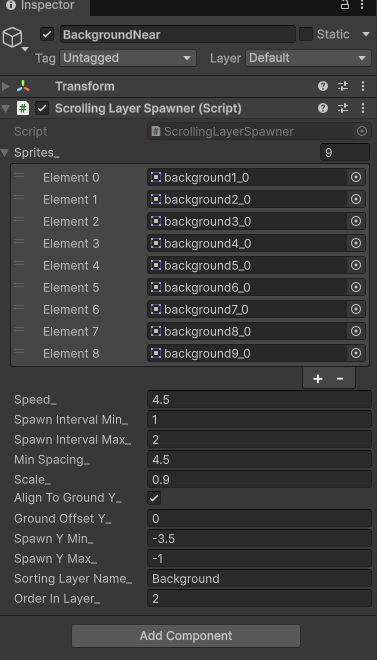
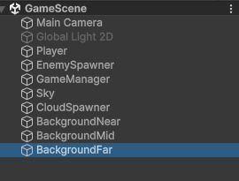
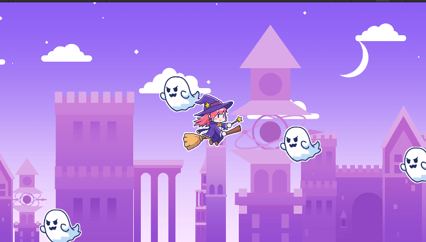

# 【6-05】建物を3レイヤーに分けて奥行きを出そう【6章：アニメーション・背景】

1. クリア条件：建物が奥・中間・手前の3段階の大きさで流れ、地面に接している状態にする

2. 最後は建物です。ここまでSky・Cloudの2枚で背景を作ってきましたが、建物はこれをさらに3枚に分けます。奥にある建物ほど小さく・ゆっくり、手前にある建物ほど大きく・速く流すと、1枚のときよりずっと奥行きが出ます。

   `Assets/Images/Background` にある9種類の建物の絵はどのレイヤーでも同じものを使います。違うのは大きさと速さだけです。6-04で作った `ScrollingLayerSpawner` にはそのための `Scale`（大きさ）が用意してあるので、これをレイヤーごとに変えます。

3. Hierarchyで `Create Empty` を作り、名前を `BackgroundFar` にします。座標は (0, 0, 0) のままにします。

4. Inspectorの「Add Component」から `ScrollingLayerSpawner` を検索して追加します。次のように設定します。

   - Sprites：`Assets/Images/Background` の9枚（`background1`〜`background9`）をすべて登録
   - Sorting Layer Name：`Background`
   - Order In Layer：`0`
   - Align To Ground Y：チェックを入れる
   - Scale：`0.35`
   - Speed：`2`
   - Min Spacing：`2.5`
   - Distance：`10`
   - Fog Color：薄い水色がかった白（R 0.85、G 0.9、B 1.0くらい、Alphaは`1`のまま）
   - Fog Start Distance：`0`
   - Fog End Distance：`10`

   

   一番奥のレイヤーなので、小さく・遅くしています。

   `Distance`が`Fog End Distance`と同じ`10`なので、Fogが最大までかかった状態です。6-04で作った仕組みのとおり、建物の上に半透明の霧色の板を1枚重ねているだけなので、建物自体の色を明るくしているわけではありません。板の透明度が`Distance`によって変わるだけです。

5. `BackgroundFar` を選んだ状態でCtrl+Dを押して複製し、名前を `BackgroundMid` にします。設定を次のように変えます。

   - Order In Layer：`1`
   - Scale：`0.6`
   - Speed：`3`
   - Min Spacing：`3.5`
   - Distance：`5`

   

   Fog Color・Fog Start Distance・Fog End Distanceは`BackgroundFar`と同じ数字のままにします。`Distance`だけ`5`にすると、`Fog Start Distance`の`0`と`Fog End Distance`の`10`のちょうど真ん中なので、Fogが半分だけかかった状態になります。

6. もう一度複製して `BackgroundNear` を作り、次のように変えます。

   - Order In Layer：`2`
   - Scale：`0.9`
   - Speed：`4.5`
   - Min Spacing：`4.5`
   - Distance：`0`

   

   `Distance`が`Fog Start Distance`と同じ`0`なので、Fogはかかりません。一番手前なので、色が一番くっきり見えます。

   Order In Layerを0・1・2と分けているのは、同じ`Background`レイヤーの中で手前のものが奥のものを隠すように描画順を揃えるためです。数字が大きいほど手前に描かれます。

   Align To Ground Yは3つとも入れたままにします。建物ごとに絵の高さが違っても、これで全部同じ地面の位置に接地します。

   `Distance`を`0`〜`10`の間で3段階（`10`・`5`・`0`）にしたことで、奥ほど霞み・手前ほどくっきりという、距離に応じた自然なFogのグラデーションができました。

7. Hierarchyはこうなっているはずです。

   

8. Playを押して確認します。奥の小さい建物、中間の建物、手前の大きい建物が、それぞれ違う速さで流れているのが見えるはずです。3つとも地面にきちんと接地していることも確認してください。

   

9. これで6章は完成です。Playerの飛行アニメーション、Enemyのアニメーション、空・雲・3段階の建物。最初は静止画1枚だったゲーム画面に、奥行きが出ました。
