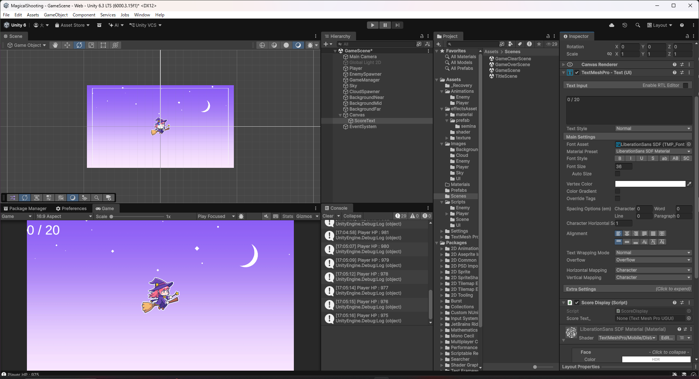
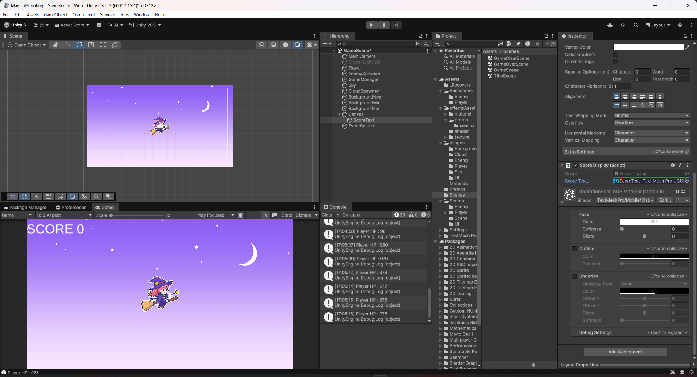
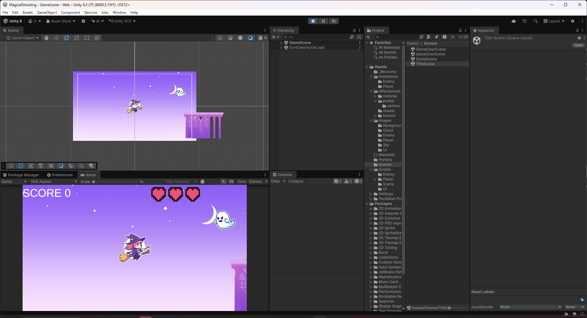

# 【8-01】スコアを表示しよう【8章：UI】

1. クリア条件：敵を倒すたびに画面左上のスコアが加算されて表示される状態にする

2. これまでも撃破数（`defeatCount_`）は`GameManager`が内部で数えていましたが、画面には表示していませんでした。8章では、これをUIとして表示していきます。まずはスコアからです。

3. `GameManager.cs`に、外部から撃破数を読み取るためのメソッドを追加します。

   ```csharp
   /// <summary>
   /// 現在の撃破数を取得（スコア表示用）
   /// </summary>
   public int GetDefeatCount()
   {
       return defeatCount_;
   }

   /// <summary>
   /// クリアに必要な撃破数を取得（スコア表示用）
   /// </summary>
   public int GetClearTargetCount()
   {
       return clearTargetCount_;
   }
   ```

   `defeatCount_`と`clearTargetCount_`はどちらも`private`のままなので、直接書き換えられることはありません。読み取り専用のメソッド越しに値を渡します。

4. `Assets/Scripts/UI`フォルダを新しく作り、`ScoreDisplay.cs`という名前で次のスクリプトを作ります。

   ```csharp
   using TMPro;
   using UnityEngine;

   public class ScoreDisplay : MonoBehaviour
   {
       // 撃破数を表示するテキスト
       [SerializeField] private TextMeshProUGUI scoreText_;

       // Update is called once per frame
       void Update()
       {
           // 現在の撃破数を表示する
           int defeatCount = GameManager.Instance.GetDefeatCount();
           scoreText_.text = "SCORE " + defeatCount;
       }
   }
   ```

   `GameManager.Instance`はシングルトンなので、シーン内のどこからでも直接呼び出せます。

5. `GameScene`にはまだCanvasが無いので、Hierarchyを右クリックして「UI > Canvas」から新しく作ります。これで`Canvas`と`EventSystem`が一緒に追加されます。

6. Canvasの子として「UI > Text - TextMeshPro」でテキストを作り、名前を`ScoreText`にします。Rect TransformのPos X・Pos Yを調整して画面左上に配置し、Textの内容を`SCORE 0`にしておきます。

   

7. `ScoreText`に`ScoreDisplay`コンポーネントを追加し、`Score Text_`フィールドに`ScoreText`自身（同じオブジェクトのTextMeshProUGUI）を設定します。

   

8. Playを押して敵を倒すと、スコアが`SCORE 0`→`SCORE 1`…と加算されていくことを確認します。

   
