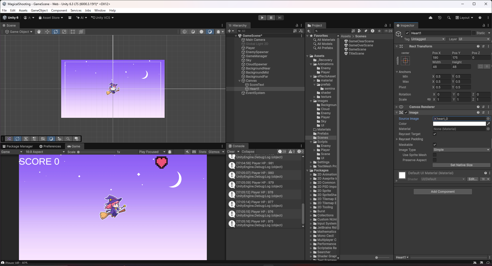
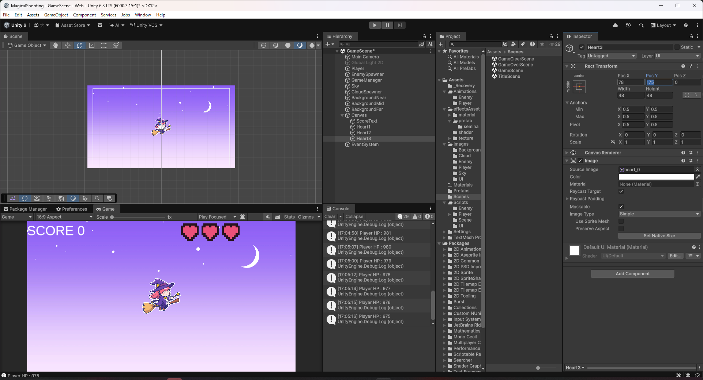
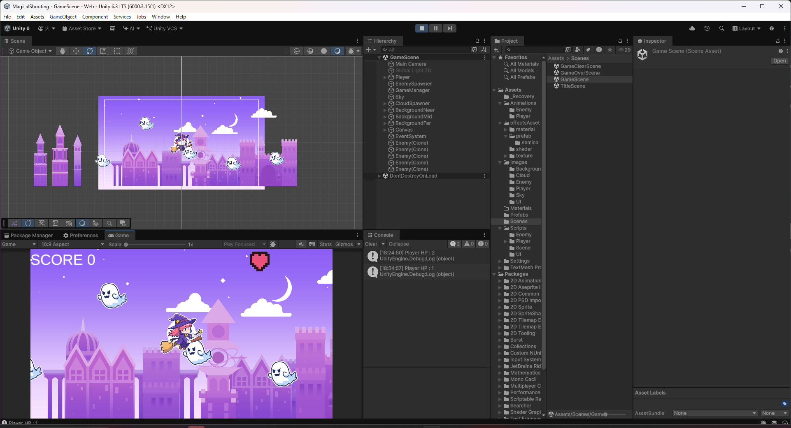

# 【8-02】HPをハートで表示しよう【8章：UI】

1. クリア条件：HPをハートアイコン3個で表示し、ダメージを受けるたびに1個ずつ消えていく状態にする

2. 今までの`PlayerHealth`は最大HPが1で、1回攻撃を受けると即座にやられていました。ハートを3個表示するにあたって、最大HPも3に変更します。

3. `PlayerHealth.cs`を次のように書き換えます。

   ```csharp
   public class PlayerHealth : MonoBehaviour
   {

       // 最大HP（ハート表示の数と一致させる）
       [SerializeField] private int maxHp_ = 3;

       // 現在のHP
       private int hp_;

       // プレイヤー死亡アニメーション
       private PlayerDeathAnimation playerDeathAnimation_;

       void Start()
       {
           // 開始時は満タンのHPにする
           hp_ = maxHp_;

           // プレイヤー死亡アニメーションを取得
           playerDeathAnimation_ = GetComponent<PlayerDeathAnimation>();
       }

       public void Damage(int damage)
       {
           // ダメージ計算
           hp_ -= damage;

           // わかりやすいようにログを出す
           Debug.Log("Player HP : " + hp_);

           // hpがゼロ以下ならプレイヤーを削除
           if (hp_ <= 0)
           {
               playerDeathAnimation_.StartAnimation();
           }
       }

       public bool IsAlive() { return hp_ > 0; }

       /// <summary>
       /// 現在のHPを取得（ハート表示用）
       /// </summary>
       public int GetHp()
       {
           return hp_;
       }

       /// <summary>
       /// 最大HPを取得（ハート表示用）
       /// </summary>
       public int GetMaxHp()
       {
           return maxHp_;
       }

   }
   ```

   これまでの`hp_`は「最大HPかつ現在のHP」を1つの変数で兼ねていましたが、`maxHp_`（最大HP）と`hp_`（現在のHP）に分け、`Start()`で満タンの状態から始めるようにしています。

4. `Assets/Scripts/UI`に`HeartDisplay.cs`という名前で次のスクリプトを作ります。

   ```csharp
   using UnityEngine;
   using UnityEngine.UI;

   public class HeartDisplay : MonoBehaviour
   {
       // HPを持っているプレイヤー
       [SerializeField] private PlayerHealth playerHealth_;

       // ハートのImage（左からHP1個分ずつ並べる）
       [SerializeField] private Image[] hearts_;

       // Update is called once per frame
       void Update()
       {
           int hp = playerHealth_.GetHp();

           // 現在のHPより後ろのハートを消し、それ以外は表示する
           for (int i = 0; i < hearts_.Length; i++)
           {
               hearts_[i].enabled = i < hp;
           }
       }
   }
   ```

5. Canvasの子として「UI > Image」でハートを1個作り、名前を`Heart1`にします。Source Imageには`Assets/Images/UI/heart`を設定し、画面右上に配置します。

   

6. `Heart1`をCtrl+Dで2回複製し、`Heart2`・`Heart3`という名前にして、横に並ぶようにPos Xだけずらします。

   

7. Canvasに`HeartDisplay`コンポーネントを追加し、`Player Health_`にシーン内の`Player`を、`Hearts_`の配列にサイズ3を設定して`Heart1`・`Heart2`・`Heart3`を順番に登録します。

   

8. Playを押し、敵やゴーストに当たってHPが減るたびにハートが右から1個ずつ消えていくことを確認します。

   
