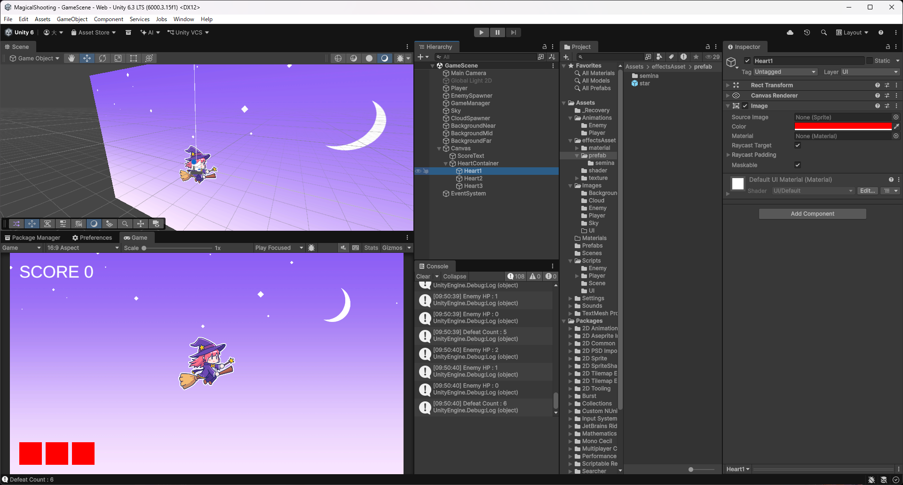
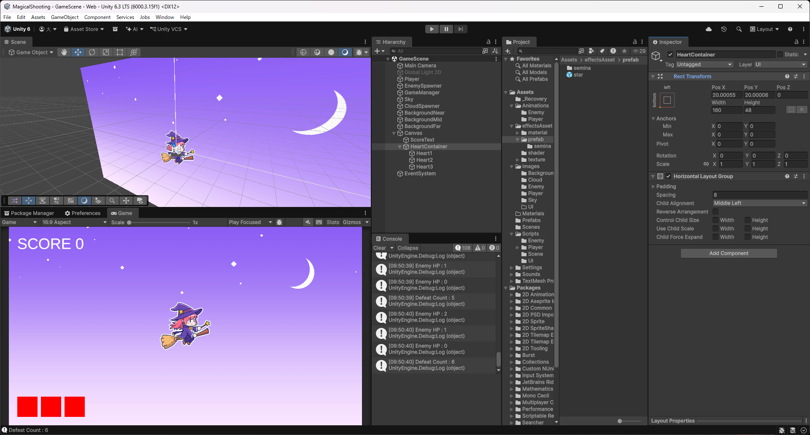
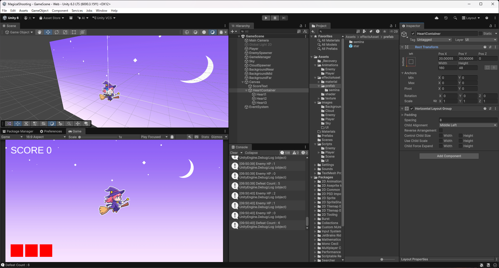
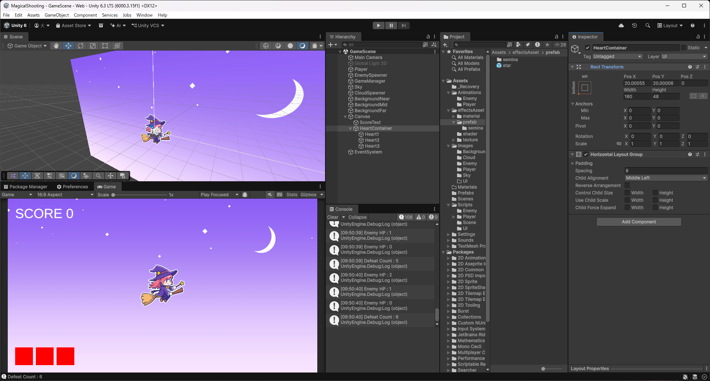
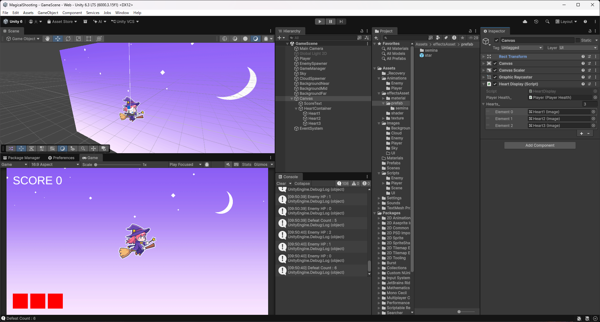
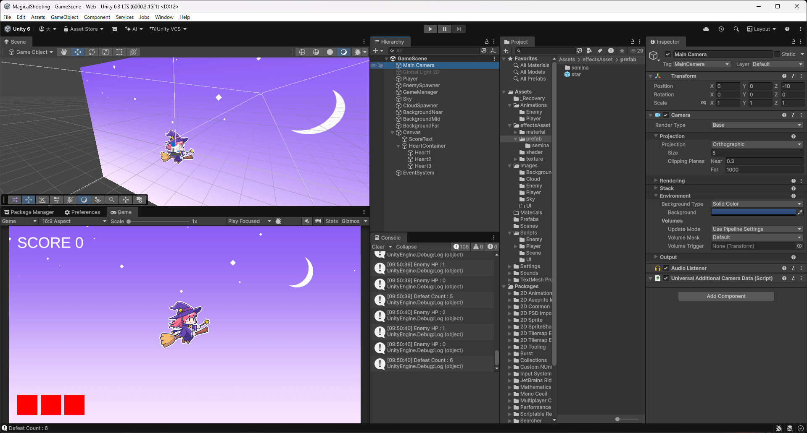

# 【8-02】HPをハートで表示しよう【8章：UI】

1. クリア条件：HPをハートアイコン3個で表示し、ダメージを受けるたびに1個ずつ消えていく状態にする

2. 今までの`PlayerHealth`は最大HPが1で、1回攻撃を受けると即座にやられていました。ハートを3個表示するにあたって、最大HPも3に変更します。

3. `PlayerHealth.cs`を次のように書き換えます。

   ```csharp
   public class PlayerHealth : MonoBehaviour
   {

       // 最大HP（ハート表示の数と一致させる）
       [SerializeField] private int maxHp_ = 3;

       // 現在のHP
       private int hp_;

       // プレイヤー死亡アニメーション
       private PlayerDeathAnimation playerDeathAnimation_;

       void Start()
       {
           // 開始時は満タンのHPにする
           hp_ = maxHp_;

           // プレイヤー死亡アニメーションを取得
           playerDeathAnimation_ = GetComponent<PlayerDeathAnimation>();
       }

       public void Damage(int damage)
       {
           // ダメージ計算
           hp_ -= damage;

           // わかりやすいようにログを出す
           Debug.Log("Player HP : " + hp_);

           // hpがゼロ以下ならプレイヤーを削除
           if (hp_ <= 0)
           {
               playerDeathAnimation_.StartAnimation();
           }
       }

       public bool IsAlive() { return hp_ > 0; }

       /// <summary>
       /// 現在のHPを取得（ハート表示用）
       /// </summary>
       public int GetHp()
       {
           return hp_;
       }

       /// <summary>
       /// 最大HPを取得（ハート表示用）
       /// </summary>
       public int GetMaxHp()
       {
           return maxHp_;
       }

   }
   ```

   これまでの`hp_`は「最大HPかつ現在のHP」を1つの変数で兼ねていましたが、`maxHp_`（最大HP）と`hp_`（現在のHP）に分け、`Start()`で満タンの状態から始めるようにしています。

4. `Assets/Scripts/UI`に`HeartDisplay.cs`という名前で次のスクリプトを作ります。

   ```csharp
   using UnityEngine;
   using UnityEngine.UI;

   public class HeartDisplay : MonoBehaviour
   {
       // HPを持っているプレイヤー
       [SerializeField] private PlayerHealth playerHealth_;

       // ハートのImage（左からHP1個分ずつ並べる）
       [SerializeField] private Image[] hearts_;

       // Update is called once per frame
       void Update()
       {
           int hp = playerHealth_.GetHp();

           // 現在のHPより後ろのハートを消し、それ以外は表示する
           for (int i = 0; i < hearts_.Length; i++)
           {
               hearts_[i].enabled = i < hp;
           }
       }
   }
   ```

5. Canvasの子として「UI > Image」でハートを1個作り、名前を`Heart1`にします。Source Imageは特に設定せず、`Color`を赤（`R: 255, G: 0, B: 0`）にします。

   

   このチュートリアルではハートの絵は用意していないので、赤い四角をハートの代わりにして進めます。余裕があれば、あとで自分でハートの絵を描いて`Source Image`に設定してみましょう。

6. `Heart1`をCtrl+Dで2回複製し、`Heart2`・`Heart3`という名前にします。この時点では3個とも同じ位置に重なっていてかまいません。

7. ここでハート1個ずつに直接`Pos X`を設定して横に並べる方法もありますが、それだと後で「ハート全体を右にずらしたい」となったときに3個すべてのPos Xを1つずつ書き換えることになります。表示位置とスコア表示の余白がずれていないかも、3個ぶん目視で揃える必要が出てきます。ここでは、3個をまとめる空のオブジェクトを作り、その中で自動的に整列させる方法を使います。

8. Canvasの子として空のオブジェクトを作り（Hierarchyを右クリック→「Create Empty」）、名前を`HeartContainer`にします。Rect Transformの`Anchors`（Min・Max・Pivot）をすべて`X: 0, Y: 0`（画面の左下）にし、`Pos X: 20, Pos Y: 20`、`Width: 160, Height: 48`にします。スコア表示と同じ20pxの余白で、対角の左下に配置する形です。

   

9. `HeartContainer`に`Horizontal Layout Group`コンポーネントを追加し、`Spacing: 8`、`Child Alignment: Middle Left`にします。`Control Child Size`と`Child Force Expand`はどちらもチェックを外しておきます（チェックが入っていると、ハートの大きさが自動的に引き伸ばされてしまいます）。

   

   このコンポーネントを付けたオブジェクトは、子として入れたものを自動的に一定間隔で並べてくれます。ハート1個ずつが自分のPos Xを持つ必要がなくなり、並べ方（間隔・寄せ方）はこの1箇所だけで管理できます。

10. `Heart1`・`Heart2`・`Heart3`をHierarchy上でドラッグし、`HeartContainer`の子に入れます。

    

    自動で等間隔に並んだことを確認します。もし`HeartContainer`ごと表示位置を変えたくなったら、以後は`HeartContainer`のPos X・Pos Yだけ変更すれば3個まとめて動きます。

11. Canvasに`HeartDisplay`コンポーネントを追加し、`Player Health_`にシーン内の`Player`を、`Hearts_`の配列にサイズ3を設定して`Heart1`・`Heart2`・`Heart3`を順番に登録します。親を`HeartContainer`に変えても、`Heart1`〜`3`というオブジェクトそのものは変わっていないため、配線はそのまま使えます。

    

12. スコアが画面左上、ハートが画面左下に、同じ20pxの余白で対角に配置されました。Playを押し、敵やゴーストに当たってHPが減るたびにハートが1個ずつ消えていくことを確認します。

    
