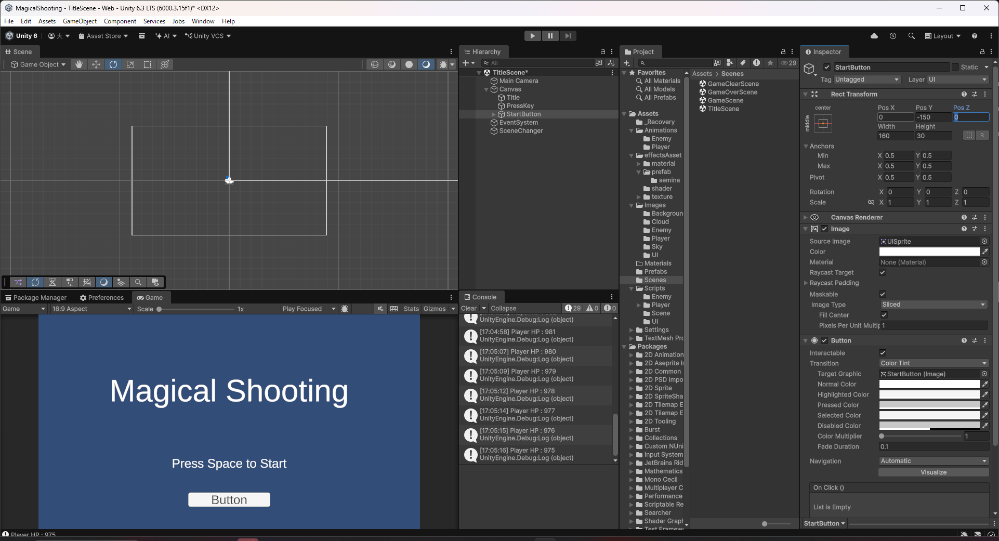
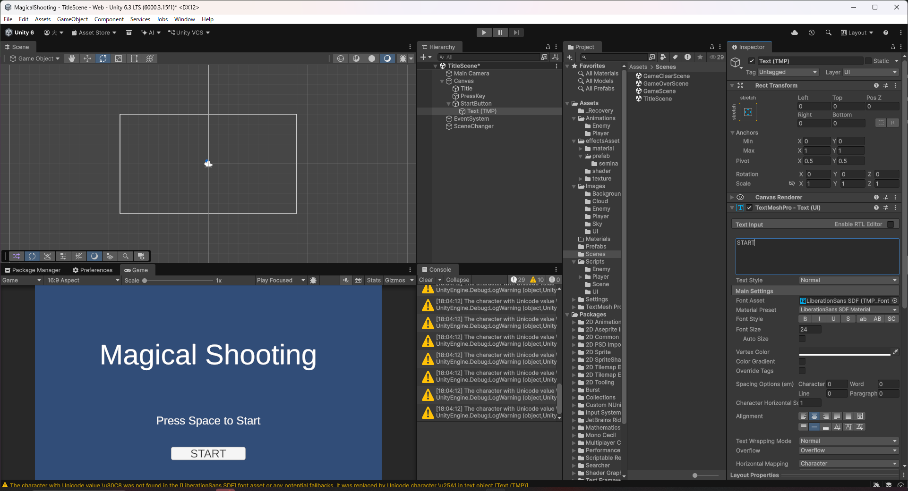
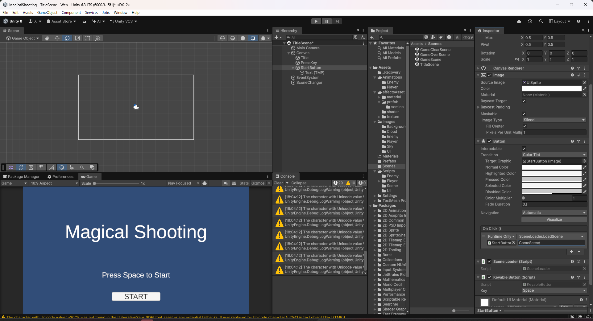
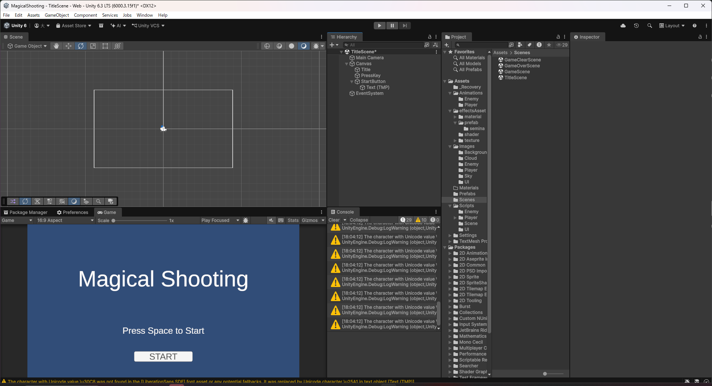
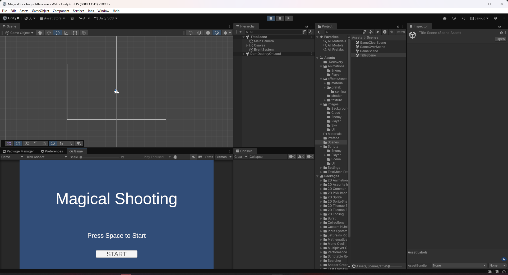

# 【8-03】タイトル画面にボタンを追加しよう【8章：UI】

クリア条件：タイトル画面の「START」ボタンをクリックしてもSpaceキーを押してもゲームが始まる状態にする

1. これまで各画面は、`SceneChangeOnKey`でキー入力だけを見てシーンを切り替えていました。これを、クリックとキー入力の両方に反応するボタンに置き換えます。

2. `Assets/Scripts/UI`に`SceneLoader.cs`を作成します。ボタンの`On Click`から呼び出す、シーン読み込み用のスクリプトです。

   ```csharp
   using UnityEngine;
   using UnityEngine.SceneManagement;

   public class SceneLoader : MonoBehaviour
   {
       /// <summary>
       /// 指定した名前のシーンを読み込む（ボタンのOnClickから呼び出す）
       /// </summary>
       public void LoadScene(string sceneName)
       {
           SceneManager.LoadScene(sceneName);
       }
   }
   ```

3. 続けて`KeyableButton.cs`を作成します。指定したキーが押されたときに、ボタンのクリックと同じ処理を呼び出すスクリプトです。

   ```csharp
   using UnityEngine;
   using UnityEngine.UI;

   // クリックだけでなく、指定したキーでも同じボタンを押せるようにする
   [RequireComponent(typeof(Button))]
   public class KeyableButton : MonoBehaviour
   {
       // ボタンのクリックと同時に反応させたいキー
       [SerializeField] private KeyCode key_ = KeyCode.Space;

       // 対象のボタン
       private Button button_;

       void Start()
       {
           button_ = GetComponent<Button>();
       }

       // Update is called once per frame
       void Update()
       {
           // キーが押されたら、ボタンをクリックしたときと同じ処理を呼び出す
           if (Input.GetKeyDown(key_))
           {
               button_.onClick.Invoke();
           }
       }
   }
   ```

4. `TitleScene`を開き、Canvasの子に`UI > Button - TextMeshPro`を作成し、名前を`StartButton`にしてください。「Press Space to Start」の下に配置し、ラベルを`START`にします（既定のフォントは日本語に対応していないため、英語表記にします）。

   

   

5. `StartButton`に`SceneLoader`と`KeyableButton`をAdd Componentしてください。

6. `StartButton`の`Button`の`On Click()`に「＋」で項目を追加し、対象に`StartButton`自身、関数に`SceneLoader.LoadScene(string)`、引数に`GameScene`を設定してください。クリックでも`KeyableButton`によるSpaceキーでも、同じ`LoadScene("GameScene")`が呼ばれます。

   

7. 不要になった`SceneChanger`（`SceneChangeOnKey`が付いたオブジェクト）をHierarchyから削除してください。

   

8. Playを押し、`START`ボタンのクリックでも、タイトルに戻ってSpaceキーでも、ゲームが始まればクリアです。

   
