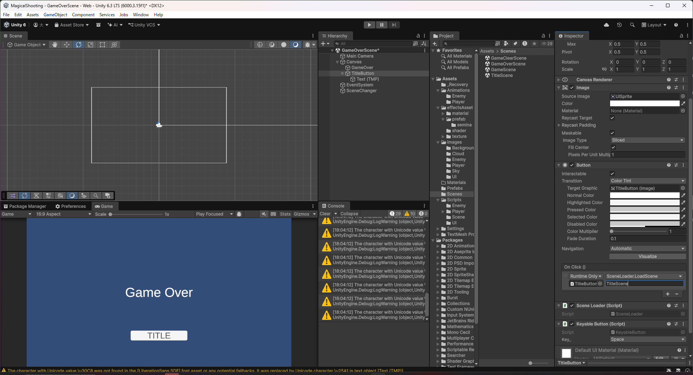
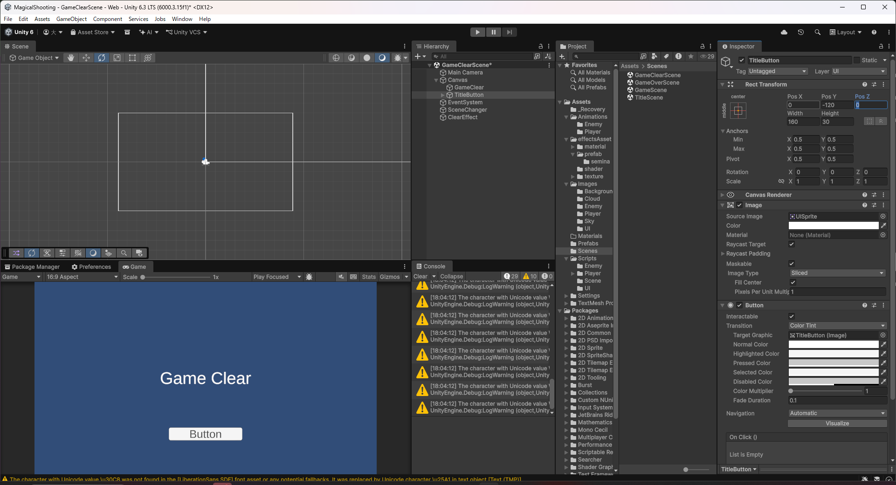
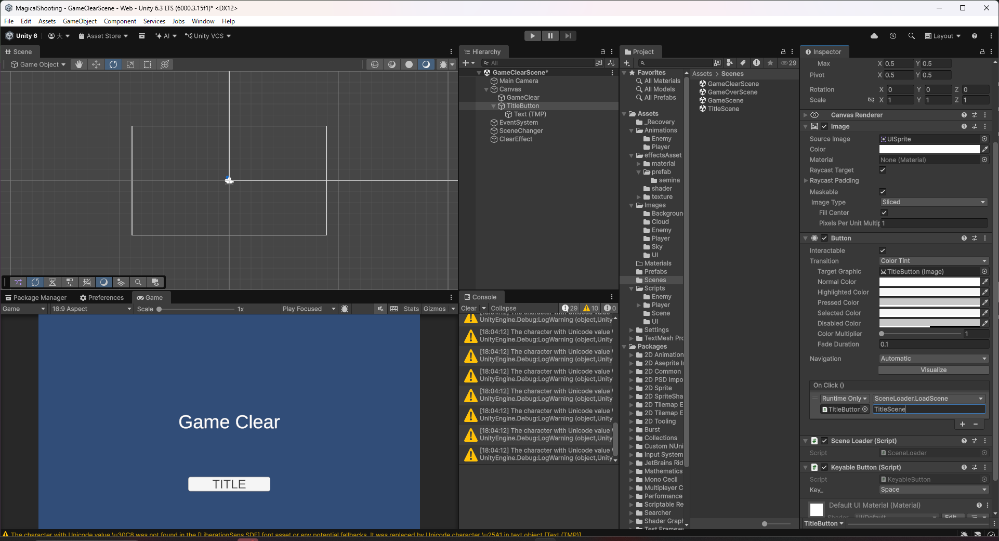

# 【8-04】リザルト画面にボタンを追加しよう【8章：UI】

1. クリア条件：ゲームオーバー画面とゲームクリア画面の両方に、タイトルへ戻る「TITLE」ボタンを追加する

2. 前回`TitleScene`に作った`StartButton`と同じ手順を、`GameOverScene`と`GameClearScene`にも適用します。`SceneLoader`と`KeyableButton`はすでに作成済みなので、ボタンを配置して配線するだけです。

3. `GameOverScene`を開き、Canvasの子として「UI > Button - TextMeshPro」でボタンを作り、名前を`TitleButton`にします。「Game Over」の下あたりに配置し、ラベルのテキストを`TITLE`にします。

   

4. `TitleButton`に`SceneLoader`と`KeyableButton`を追加します。`On Click()`の対象は`TitleButton`自身、関数は`SceneLoader.LoadScene(string)`、引数は`TitleScene`にします。

   

5. 元々あった`SceneChanger`（`SceneChangeOnKey`）は役目が重複するため削除します。

6. `GameClearScene`にも同じ手順を繰り返します。Canvasの子に`TitleButton`を作り、「Game Clear」の下あたりに配置してラベルを`TITLE`にします。

   

7. `TitleButton`に`SceneLoader`と`KeyableButton`を追加し、`On Click()`の対象を`TitleButton`自身、関数を`SceneLoader.LoadScene(string)`、引数を`TitleScene`に設定します。こちらも元の`SceneChanger`は削除します。

   

8. Playを押してゲームオーバー・ゲームクリアのそれぞれで`TITLE`ボタンをクリックし、タイトル画面に戻ることを確認します。Spaceキーでも同様に戻れることを確認します。

9. これで8章は完了です。スコア表示・HPのハート表示・各画面のボタンが揃い、遊びやすさが大きく変わりました。
