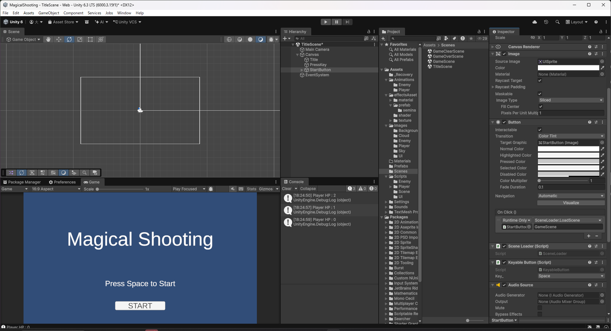
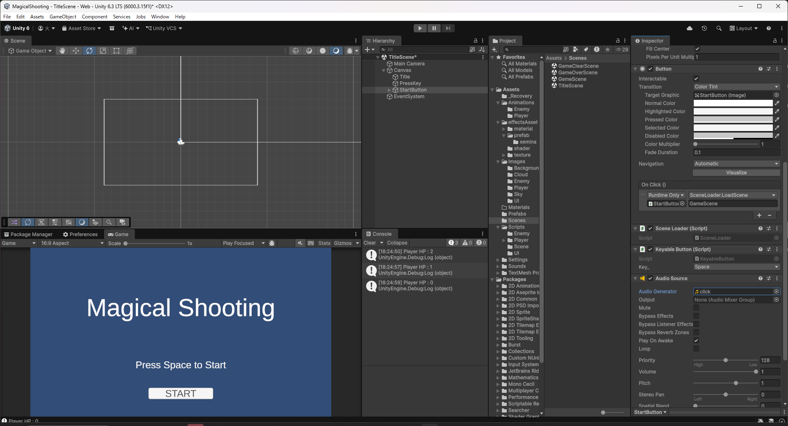
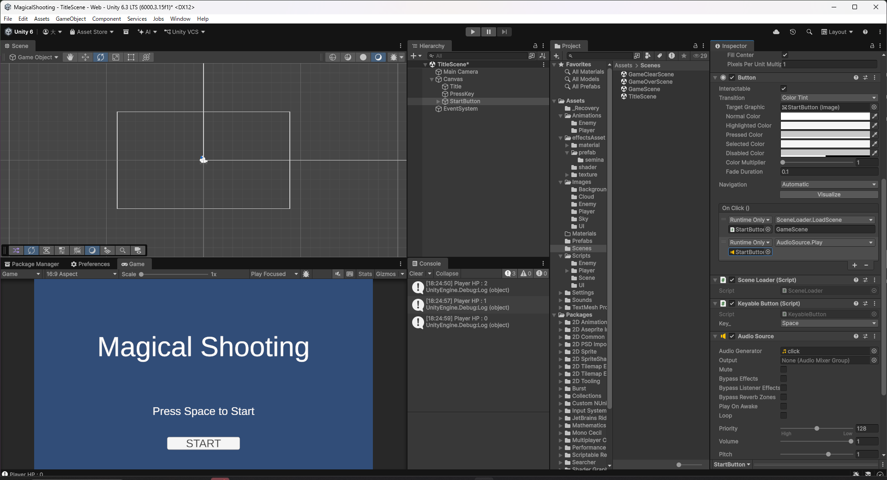

# 【9-01】ボタンにクリック音をつけよう【9章：サウンド】

1. クリア条件：タイトル・ゲームオーバー・ゲームクリアの各ボタンをクリック（またはキー入力）すると音が鳴る状態にする

2. 効果音は、フリー素材サイト「効果音ラボ」からダウンロードします。

   効果音ラボ：https://soundeffect-lab.info/

   商用・非商用問わず利用でき、クレジット表記も不要ですが、アダルト用途への利用と、素材そのものの再配布は禁止されています。

3. 「ボタン・システム音」の「決定ボタンを押す1」をダウンロードし、`Assets/Sounds/SE`に`click.mp3`という名前で保存してください。

4. `TitleScene`の`StartButton`に`Audio Source`をAdd Componentし、`Audio Generator`に`click`を設定して、`Play On Awake`のチェックを外してください（入ったままだと、シーンの読み込み時に鳴ってしまいます）。

   

   

   

5. `Button`の`On Click()`に項目を1つ追加し、対象を`StartButton`自身、関数を`AudioSource.Play`にしてください。`On Click()`には`SceneLoader.LoadScene("GameScene")`と`AudioSource.Play()`の2つが並び、順番に実行されます。`KeyableButton`は`onClick`自体を呼び出すため、Spaceキーで操作しても同じ2つが実行されます。

   

6. `GameOverScene`と`GameClearScene`の`TitleButton`にも、4・5と同じ設定をしてください。

7. Playを押し、各画面のボタンのクリックでもSpaceキーでも、クリック音が鳴ればクリアです。

   シーンを切り替えるボタンでは、`Audio Source`を持つボタン自体が切り替えと同時に消えるため、音が短く途切れて聞こえることがあります。
