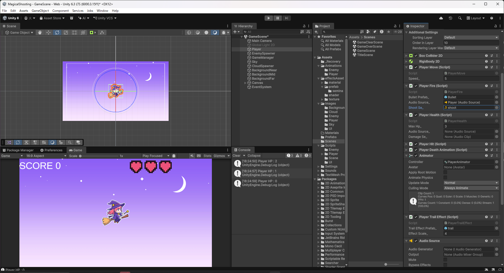

# 【9-02】発射音を鳴らそう【9章：サウンド】

1. クリア条件：魔法弾を発射した瞬間に発射音が鳴る状態にする

2. 「戦闘」カテゴリの「魔法のステッキ」をダウンロードし、`Assets/Sounds/SE`に`shoot.mp3`という名前で保存します。

3. `PlayerFire.cs`に、発射音を鳴らすためのフィールドと処理を追加します。

   ```csharp
   public class PlayerFire : MonoBehaviour
   {
       // 魔法弾のプレハブ
       [SerializeField] private GameObject bulletPrefab_;

       // 発射音を鳴らすAudioSource
       [SerializeField] private AudioSource audioSource_;

       // 発射音
       [SerializeField] private AudioClip shootSe_;

       // Start is called once before the first execution of Update after the MonoBehaviour is created
       void Start()
       {
           
       }

       // Update is called once per frame
       void Update()
       {
           // スペースキーで魔法弾発射
           if (Input.GetKeyDown(KeyCode.Space))
           {
               // 生成する(弾のプレハブを, プレイヤーの座標で, 何も回転していない状態で) 
               Instantiate(bulletPrefab_, transform.position, quaternion.identity);

               // 発射音を鳴らす
               audioSource_.PlayOneShot(shootSe_);
           }
       }
   }
   ```

   `PlayOneShot`は、`Audio Source`が今何かを再生中でも気にせず、指定した音を重ねて鳴らすためのメソッドです。連射したときに音が途切れず重なって聞こえます。

4. `GameScene`の`Player`に`Audio Source`を追加します。8章までの`Player`にはまだ`Audio Source`がありません。

   

5. `Player Fire`コンポーネントの`Audio Source_`に、いま追加した`Player`自身の`Audio Source`を設定し、`Shoot Se_`に`shoot`を設定します。

   

6. Playを押してSpaceキーで弾を発射し、発射のたびに音が鳴ることを確認します。連射しても音が途切れないことも確認します。
