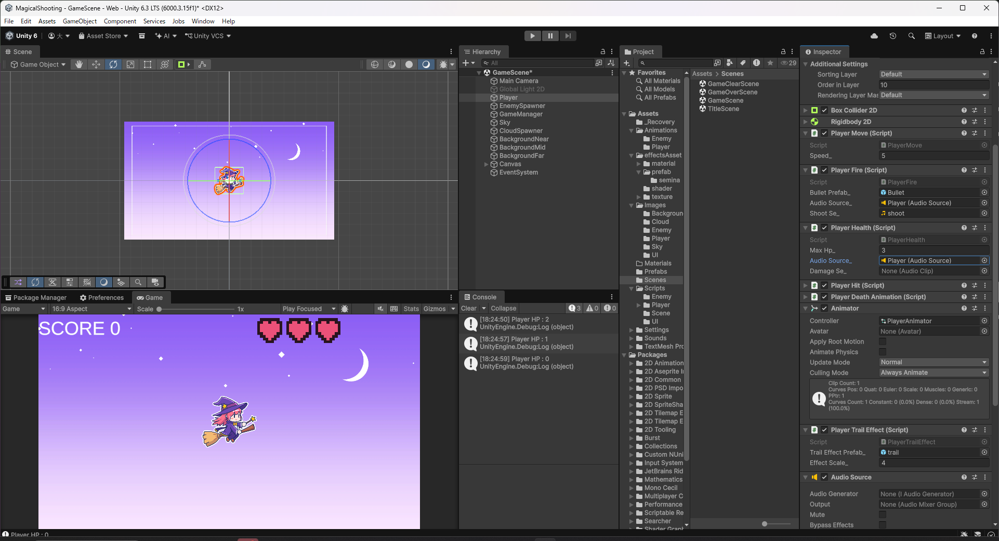
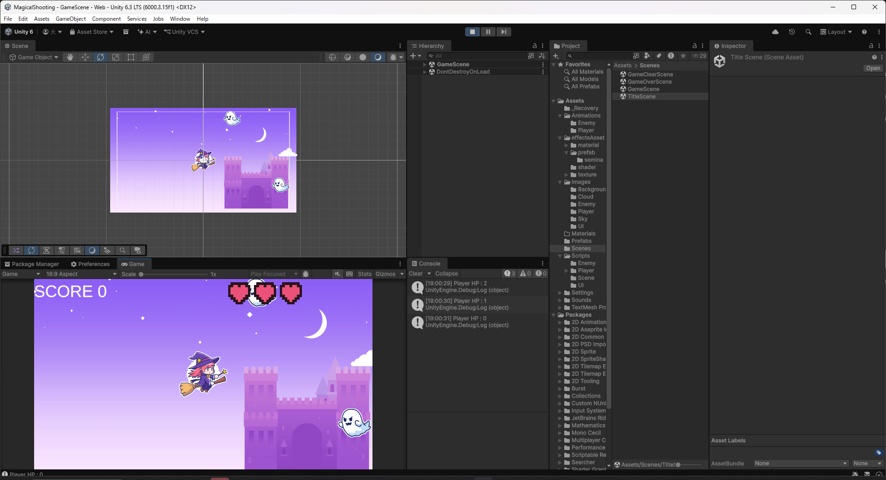

# 【9-03】被弾音を鳴らそう【9章：サウンド】

クリア条件：プレイヤーが敵に当たってダメージを受けるたびに被弾音が鳴る状態にする

1. [効果音ラボ](https://soundeffect-lab.info/)の「戦闘」カテゴリから「打撃2」をダウンロードし、`Assets/Sounds/SE`に`hit.mp3`という名前で保存します。

2. `PlayerHealth.cs`に、被弾音のフィールドと処理を追加します。

   ```csharp
   public class PlayerHealth : MonoBehaviour
   {

       // 最大HP（ハート表示の数と一致させる）
       [SerializeField] private int maxHp_ = 3;

       // 現在のHP
       private int hp_;

       // プレイヤー死亡アニメーション
       private PlayerDeathAnimation playerDeathAnimation_;

       // 被弾音を鳴らすAudioSource
       [SerializeField] private AudioSource audioSource_;

       // 被弾音
       [SerializeField] private AudioClip damageSe_;

       void Start()
       {
           // 開始時は満タンのHPにする
           hp_ = maxHp_;

           // プレイヤー死亡アニメーションを取得
           playerDeathAnimation_ = GetComponent<PlayerDeathAnimation>();
       }

       public void Damage(int damage)
       {
           // ダメージ計算
           hp_ -= damage;

           // わかりやすいようにログを出す
           Debug.Log("Player HP : " + hp_);

           // 被弾音を鳴らす
           audioSource_.PlayOneShot(damageSe_);

           // hpがゼロ以下ならプレイヤーを削除
           if (hp_ <= 0)
           {
               playerDeathAnimation_.StartAnimation();
           }
       }

       public bool IsAlive() { return hp_ > 0; }

       public int GetHp() { return hp_; }

       public int GetMaxHp() { return maxHp_; }

   }
   ```

   `Audio Source`は発射音と共用できます（1つの`Audio Source`で複数の効果音を`PlayOneShot`できます）。

3. `Player`の`Player Health`の`Audio Source_`に9-02で追加した`Audio Source`を、`Damage Se_`に`hit`を設定してください。

   

   

4. Playを押し、敵に当たってHPが減るたびに被弾音が鳴ればクリアです。

   

5. これで9章は完了です。
