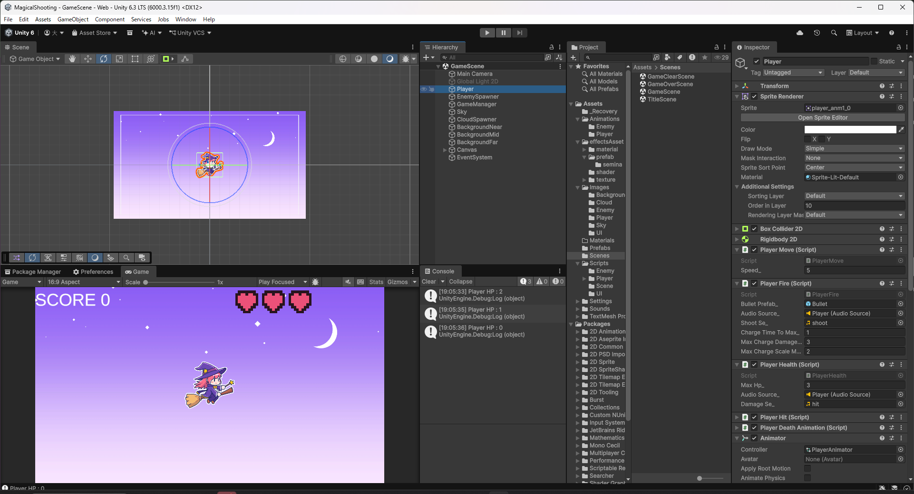
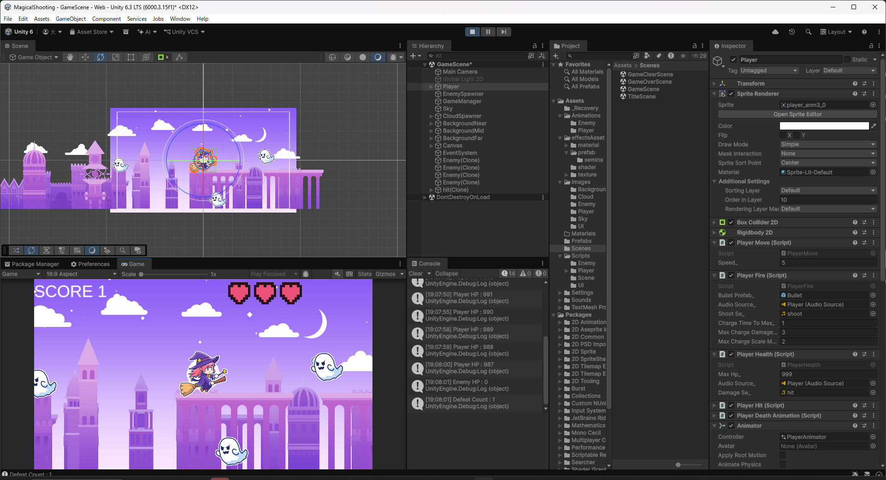

# 【10-01】最終試練：創造しろ、己の迷作！【10章：企画】

1. クリア条件：このゲームに、自分で考えた新しい要素を1つ追加する

2. ここまでの9章で、移動・射撃・敵・当たり判定・アニメーション・背景・UI・サウンドと、シューティングゲームとして遊べる形が一通り揃いました。10章はチュートリアルではなく、ここからは自分の手でゲームを面白くしていく回です。

3. 何を追加するかは自由です。例えば次のようなものが考えられます。

   - アイテム（拾うとHP回復・一定時間無敵になる、など）
   - チャージショット（ボタンを長押しすると強い弾を撃てる）
   - 新しい敵の種類や、弾を撃ってくる敵
   - スコアに応じたランク表示や、コンボ演出
   - BGM

   「今のゲームに足りないもの」「自分ならここを変えたい」と思ったところから考えると見つけやすいです。

4. ここでは一例として、チャージショットを実装してみます。スペースキーを押しっぱなしにすると魔法弾をチャージし、離した瞬間にチャージ時間に応じて威力と大きさが増した弾を発射する機能です。

5. `PlayerFire.cs`を次のように書き換えます。

   ```csharp
   using Unity.Mathematics;
   using UnityEngine;

   public class PlayerFire : MonoBehaviour
   {
       // 魔法弾のプレハブ
       [SerializeField] private GameObject bulletPrefab_;

       // 発射音を鳴らすAudioSource
       [SerializeField] private AudioSource audioSource_;

       // 発射音
       [SerializeField] private AudioClip shootSe_;

       // 最大チャージにかかる秒数
       [SerializeField] private float chargeTimeToMax_ = 1.0f;

       // 最大までチャージしたときのダメージ倍率
       [SerializeField] private float maxChargeDamageMultiplier_ = 3.0f;

       // 最大までチャージしたときの見た目の拡大率
       [SerializeField] private float maxChargeScaleMultiplier_ = 2.0f;

       // チャージ中かどうか
       private bool isCharging_ = false;

       // 現在のチャージ時間
       private float chargeTime_ = 0.0f;

       // Update is called once per frame
       void Update()
       {
           // スペースキーを押した瞬間にチャージを開始する
           if (Input.GetKeyDown(KeyCode.Space))
           {
               isCharging_ = true;
               chargeTime_ = 0.0f;
           }

           // チャージ中はスペースキーを押している時間を数える(最大値まで)
           if (isCharging_ && Input.GetKey(KeyCode.Space))
           {
               chargeTime_ = Mathf.Min(chargeTime_ + Time.deltaTime, chargeTimeToMax_);
           }

           // スペースキーを離した瞬間に、チャージ量に応じた魔法弾を発射する
           if (isCharging_ && Input.GetKeyUp(KeyCode.Space))
           {
               Fire();
               isCharging_ = false;
           }
       }

       /// <summary>
       /// チャージ量に応じた魔法弾を発射する
       /// </summary>
       private void Fire()
       {
           // チャージの度合い(0〜1)
           float chargeRatio = chargeTime_ / chargeTimeToMax_;

           // 生成する(弾のプレハブを, プレイヤーの座標で, 何も回転していない状態で)
           GameObject bullet = Instantiate(bulletPrefab_, transform.position, quaternion.identity);

           // チャージ量に応じてダメージを増やす
           if (bullet.TryGetComponent(out BulletParam param))
           {
               float damageMultiplier = Mathf.Lerp(1.0f, maxChargeDamageMultiplier_, chargeRatio);
               param.damage_ = Mathf.RoundToInt(param.damage_ * damageMultiplier);
           }

           // チャージ量に応じて見た目も大きくする
           float scaleMultiplier = Mathf.Lerp(1.0f, maxChargeScaleMultiplier_, chargeRatio);
           bullet.transform.localScale *= scaleMultiplier;

           // 発射音を鳴らす
           audioSource_.PlayOneShot(shootSe_);
       }
   }
   ```

   これまでは「押した瞬間に即発射」でしたが、「押した瞬間にチャージ開始」「離した瞬間に発射」という2段階の処理に変えています。チャージ時間の割合（`chargeRatio`）を`Mathf.Lerp`に渡すことで、ダメージ（`BulletParam.damage_`）と見た目の大きさの両方を、チャージなし（1倍）から最大チャージ（`maxChargeDamageMultiplier_`倍・`maxChargeScaleMultiplier_`倍）まで滑らかに変化させています。

   軽く叩いた場合は`chargeRatio`がほぼ0になるので、これまで通りの威力・大きさの弾が出ます。既存の動作を壊さずに新しい要素を足せるのも、このやり方の利点です。

   

6. Playを押し、スペースキーを軽くタップしたときと、長押ししてから離したときで、弾の大きさと威力が変わることを確認します。通常は3回当てないと倒せない敵が、最大までチャージした一撃で倒せることを確認します。

   

7. これで10章は完了です。ここまでの10章で、動く・当たる・演出がつく・音が鳴る・遊びやすくなる、というゲーム作りの一通りの流れを体験しました。ここから先は、この`PlayerFire.cs`の例を参考にしながら、自分のアイデアを自分の手で足していってください。
