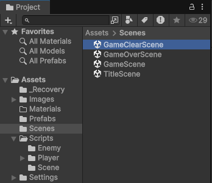
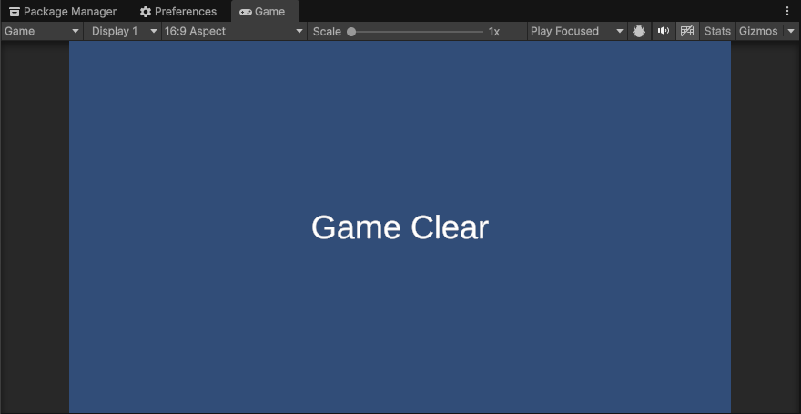
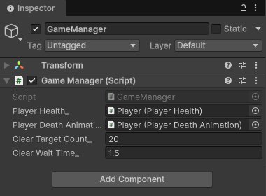

# 【5-02】GameClearになるようにしよう！【5章：ゲームループ】

1. クリア条件：敵を20体倒したら、ゲームクリアシーンに移行する

2. 前回はゲームオーバーを作ったので、今回はその逆、ゲームクリアを作ろう。
   やられたら終わり、だけだと切ないので、ちゃんと「勝ち」も用意してあげよう。
   今回のクリア条件は「敵を20体倒す」です。

3. まずはゲームクリアシーンを作りましょう。
   と言っても、ほぼGameOverSceneと同じものなので、ゼロから作る必要はありません。
   ScenesフォルダのGameOverSceneを選択して、Ctrl + D（Macは Command + D）で複製してください。

   用語：複製（Duplicate）
   選択中のものをコピーしてすぐ隣に作ること。ショートカットはCtrl + D。シーンでもスクリプトでもゲームオブジェクトでも使える万能技です。

4. 複製したシーンの名前を「GameClearScene」に変更しましょう。

   

5. GameClearSceneをダブルクリックで開いて、
   - ヒエラルキーの「GameOver」オブジェクトの名前を「GameClear」に変更
   - インスペクターのテキストを「Game Over」から「Game Clear」に変更
   しましょう。

   

6. こうなっていれば、成功です！

7. では、GameSceneに戻って「敵を20体倒したらクリア」の仕組みを作っていきます。
   問題です。敵を倒した数は、誰が数えるべきでしょうか？

   - 敵自身？　→　倒されたら消えちゃうので数えられない
   - プレイヤー？　→　できなくはないけど、プレイヤーは「動く・撃つ・やられる」で手一杯

   こういう「ゲーム全体のこと」は、5-01で作ったゲームの監督、GameManagerの出番です。

8. GameManager.csを開いて、このコードにしましょう。

   ```csharp
   using Unity.VisualScripting;
   using UnityEngine;
   using UnityEngine.SceneManagement;

   public class GameManager : MonoBehaviour
   {
       // シングルトン化
       public static GameManager Instance { get; private set; }

       // ゲームの状態
       public enum GameState
       {
           PLAYING,
           GAMEOVER,
           GAMECLEAR,
       }

       // ゲームの状態
       public GameState gameState_ { get; private set; }

       // プレイヤーの体力
       [SerializeField] private PlayerHealth playerHealth_;

       // プレイヤーのやられアニメーション
       [SerializeField] private PlayerDeathAnimation playerDeathAnimation_;

       // クリアに必要な撃破数
       [SerializeField] private int clearTargetCount_ = 20;

       // クリアしてからシーン切り替えまでの待機時間（秒）
       [SerializeField] private float clearWaitTime_ = 1.5f;

       // 敵の撃破数
       private int defeatCount_ = 0;

       void Awake()
       {
           // instance元を設定
           Instance = this;
       }

       // Start is called once before the first execution of Update after the MonoBehaviour is created
       void Start()
       {
           // nullチェック
           Debug.Assert(playerHealth_ != null, "PlayerHealth が設定されていません");
           Debug.Assert(playerDeathAnimation_ != null, "PlayerDeathAnimation が設定されていません");

           // 開始時のゲーム状態を設定
           gameState_ = GameState.PLAYING;
       }

       // Update is called once per frame
       void Update()
       {
           // 各状態の更新
           switch (gameState_)
           {
               case GameState.PLAYING:
                   // プレイヤーが死んだらゲームオーバー
                   if (!playerHealth_.IsAlive())
                   {
                       gameState_ = GameState.GAMEOVER;
                   }

                   // 敵を規定数倒したらゲームクリア
                   if (defeatCount_ >= clearTargetCount_)
                   {
                       gameState_ = GameState.GAMECLEAR;
                   }

                   break;
               case GameState.GAMEOVER:
                   // ゲームオーバーシーンに切り替え
                   if (playerDeathAnimation_.isAnimationFinished_)
                   {
                       ChangeGameOverScene();
                   }
                   break;

               case GameState.GAMECLEAR:
                   // 少し待ってからゲームクリアシーンに切り替え
                   clearWaitTime_ -= Time.deltaTime;
                   if (clearWaitTime_ <= 0.0f)
                   {
                       ChangeGameClearScene();
                   }
                   break;

               default:
                   break;
           }
       }

       /// <summary>
       /// シーン切り替え
       /// </summary>
       void ChangeGameOverScene()
       {
           SceneManager.LoadScene("GameOverScene");
       }

       /// <summary>
       /// シーン切り替え（ゲームクリア）
       /// </summary>
       void ChangeGameClearScene()
       {
           SceneManager.LoadScene("GameClearScene");
       }

       /// <summary>
       /// 敵の撃破数を加算
       /// </summary>
       public void AddDefeatCount()
       {
           // 撃破数を加算
           defeatCount_++;

           // わかりやすいようにログを出す
           Debug.Log("Defeat Count : " + defeatCount_);
       }

   }
   ```
   GameManager.cs

9. ポイントは3つ。
   - 撃破数を数える変数 defeatCount_ と、それを+1する AddDefeatCount() を追加した
   - PLAYING中に「撃破数がクリア目標に届いたか」をチェックして、届いたらGAMECLEARに切り替え
   - GAMECLEARになったら、少しだけ待ってからゲームクリアシーンへ移動

   すぐにシーンを切り替えず1.5秒待っているのは、20体目の敵が吹っ飛ぶところを見届けてから移動したほうが気持ちいいからです。この辺はお好みで。

10. 次に、「敵が倒されたよ」とGameManagerに報告する側を作ります。
    敵のHPを管理しているのは誰だったか覚えていますか？そう、EnemyHealthです。
    EnemyHealth.csをこのコードにしましょう。

    ```csharp
    using UnityEngine;

    public class EnemyHealth : MonoBehaviour
    {
        [SerializeField] private int hp_ = 3;

        private EnemyDamageFlash flash_;
        private EnemyDeathAnimation deathAnimation_;
        void Start()
        {
            flash_ = GetComponent<EnemyDamageFlash>();
            deathAnimation_ = GetComponent<EnemyDeathAnimation>();
        }

        public void Damage(int damage)
        {
            // ダメージ計算
            hp_ -= damage;

            // わかりやすいようにログを出す
            Debug.Log("Enemy HP : " + hp_);

            // 赤色にセット
            flash_.Flash();

            // hpがゼロ以下ならエネミーを削除
            if (hp_ <= 0)
            {
                // GameManagerに撃破数を報告
                GameManager.Instance.AddDefeatCount();

                deathAnimation_.StartAnimation();
            }
        }

        /// <summary>
        /// 生きているかどうか
        /// </summary>
        /// <returns></returns>
        public bool IsAlive()
        {
            return (hp_ > 0);
        }
    }
    ```
    EnemyHealth.cs

11. 追加したのは GameManager.Instance.AddDefeatCount(); の1行だけです。
    5-01でGameManagerをシングルトンにしておいたおかげで、敵は「GameManager.Instance」と書くだけで、どこからでも監督に報告できます。仕込みが効いてくると気持ちいいですね。

    ちなみに、画面外に逃げられた敵は倒したことにはなりません。あくまで「撃破」した数だけカウントされます。

12. 最後に、GameClearSceneをUnityに登録します。5-01でやったやつです。
    File > Build Profiles を開いて、Open Scene Listをクリック。
    GameClearSceneを開いた状態で「Add Open Scenes」を押すと、GameClearSceneがリストに追加されます。

    
    ※スクショは次回のTitleSceneまで追加済みのものです。この時点ではGameClearSceneが増えていればOK！

13. では、GameSceneに移行してテストプレイ！敵を20体倒すと。。。ゲームクリアシーンに移動したら完成！

    20体倒すのが面倒な人は、ヒエラルキーのGameManagerを選択して、インスペクターの「Clear Target Count」を2とかに変えてテストしましょう。
    2-10でやった[SerializeField]のおかげで、コードを書き換えずに調整できます。テストが終わったら20に戻すのを忘れずに！

    

14. ↓ーーー　質問コーナー　ーーー↓
