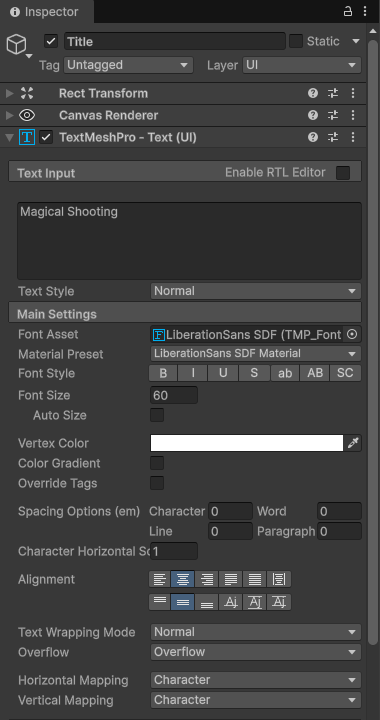
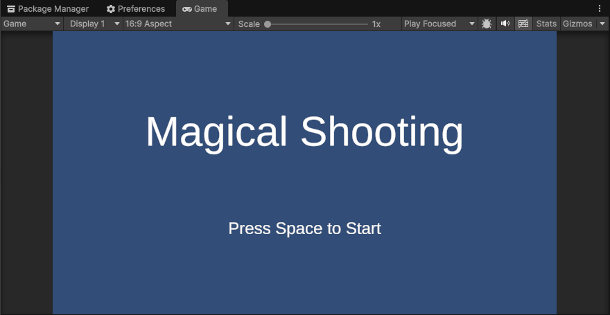
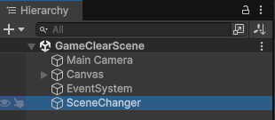
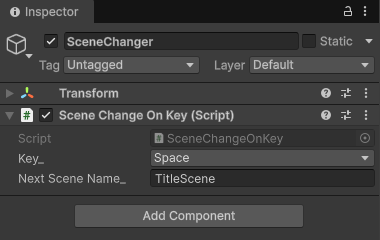
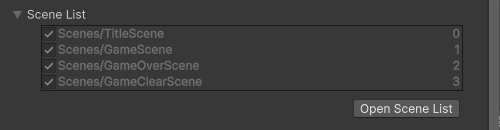

# 【5-03】タイトルから始められるようにしよう！【5章：ゲームループ】

1. クリア条件：タイトル→ゲーム→ゲームオーバー／ゲームクリア→タイトル　のループを完成させる

2. ゲームオーバーとゲームクリアができたので、いよいよ仕上げです。
   世の中のゲームを思い出してみてください。起動したらまずタイトル画面が出て、遊び終わったらまたタイトルに戻ってきますよね。
   この「1周まわる流れ」のことをゲームループと呼びます。これができると、一気に「ゲームらしく」なります。今回で5章のタイトル回収です。

3. まずはタイトルシーンを作りましょう。もうお馴染み、GameOverSceneをCtrl + Dで複製して、名前を「TitleScene」にしてください。

4. TitleSceneを開いて、テキストをタイトルっぽくします。
   - ヒエラルキーの「GameOver」オブジェクトの名前を「Title」に変更
   - テキストを「Magical Shooting」に変更（自分のゲーム名にしてもOK！）
   - Font Sizeを60に変更
   - 見切れる場合は、Rect TransformのWidthを600、Heightを100くらいに
   - Pos Yを60にして、少し上に配置

   

5. タイトルだけだと寂しいので、「スペースキーで始まるよ」の案内も置きましょう。
   ヒエラルキーのTitleを選択してCtrl + Dで複製し、
   - 名前を「PressKey」に変更
   - テキストを「Press Space to Start」に変更
   - Font Sizeを24に変更
   - Pos Yを-80にして、タイトルの下に配置
   してください。

6. このような画面になっていれば、成功です！

   

7. では、「キーを押したらシーンが切り替わる」スクリプトを作ります。
   Scripts > Sceneフォルダに「SceneChangeOnKey」スクリプトを作成して、このコードを書きましょう。

   ```csharp
   using UnityEngine;
   using UnityEngine.SceneManagement;

   public class SceneChangeOnKey : MonoBehaviour
   {
       // 押されたら遷移するキー
       [SerializeField] private KeyCode key_ = KeyCode.Space;

       // 遷移先のシーン名
       [SerializeField] private string nextSceneName_ = "";

       // Start is called once before the first execution of Update after the MonoBehaviour is created
       void Start()
       {
           // nullチェック
           Debug.Assert(nextSceneName_ != "", "nextSceneName_ が設定されていません！");
       }

       // Update is called once per frame
       void Update()
       {
           // キーが押された瞬間にシーンを切り替える
           if (Input.GetKeyDown(key_))
           {
               SceneManager.LoadScene(nextSceneName_);
           }
       }
   }
   ```
   SceneChangeOnKey.cs

   用語：KeyCode
   キーボードのキー1つ1つに付いている名前。KeyCode.Spaceはスペースキー、KeyCode.Returnはエンターキー。PlayerMoveで使ったKeyCode.UpArrowの仲間です。

8. このスクリプトのえらいところは、「どのキーで」「どのシーンに」移動するかを[SerializeField]にしてあるところです。
   つまりコードは1個だけ書いて、あとはインスペクターで設定を変えれば、タイトルでもゲームオーバーでもどこでも使い回せます。プログラムは書けば書くほどバグるので、使い回せるものは使い回しましょう。

9. TitleSceneのヒエラルキーで「Create Empty」をして、空のゲームオブジェクトを作成しましょう。
   名前は「SceneChanger」です。

10. SceneChangerに、Add ComponentでSceneChangeOnKeyを追加して、
    - Key：Space
    - Next Scene Name：GameScene
    と設定しましょう。

    ※シーン名は1文字でも間違えると動きません！「gamescene」や「Game Scene」はダメです。不安な人はScenesフォルダの名前をコピペしましょう。

    

    

11. 同じことを、GameOverSceneとGameClearSceneにもやります。
    それぞれのシーンを開いて、SceneChangerオブジェクトを作成し、SceneChangeOnKeyを追加。ただし今度は、
    - Key：Space
    - Next Scene Name：TitleScene
    です。ゲームが終わったらタイトルに帰ってくるわけですね。

12. 最後に、TitleSceneをUnityに登録します。File > Build Profiles > Open Scene Listで、TitleSceneを開いた状態で「Add Open Scenes」。

13. そして今回はもうひと手間。追加したTitleSceneをドラッグして、Scene Listの一番上に移動してください。

    これで、ゲームオーバーシーンに移行できる・・・のは前回までで出来ていましたが。
    書き出した（ビルドした）ゲームは、Scene Listの一番上のシーンから起動するんです。
    エディターでは今開いているシーンからプレイが始まるので気づきませんが、ここを並べ替えておかないと、完成品がいきなりゲーム本編から始まってしまいます。

    

14. では、TitleSceneを開いてテストプレイ！
    タイトル → スペースでゲーム開始 → やられたらゲームオーバー → スペースでタイトル → もう一回遊んで今度はクリア → スペースでタイトル。
    ぐるぐる回れたら、ゲームループ完成です！！

15. ちなみに「タイトルでスペースを押したら、ゲーム開始と同時に弾が出ちゃわない？」と思った人、鋭い。
    GetKeyDownは「押しっぱなし」には反応せず、「押した瞬間」だけ反応するので、シーンが切り替わった後に押し直さない限り弾は出ません。安心してください。

16. ↓ーーー　質問コーナー　ーーー↓
