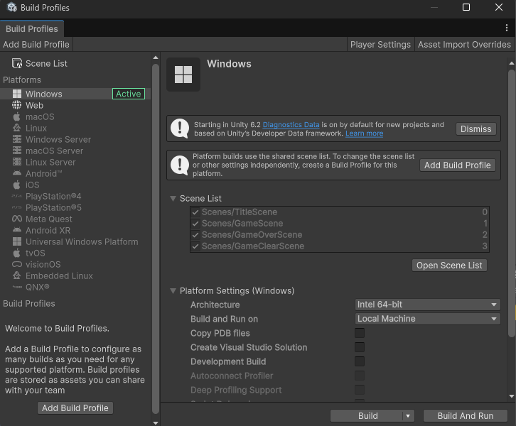
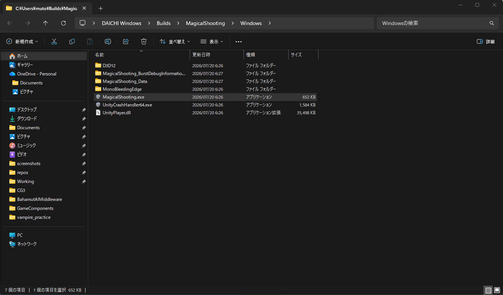
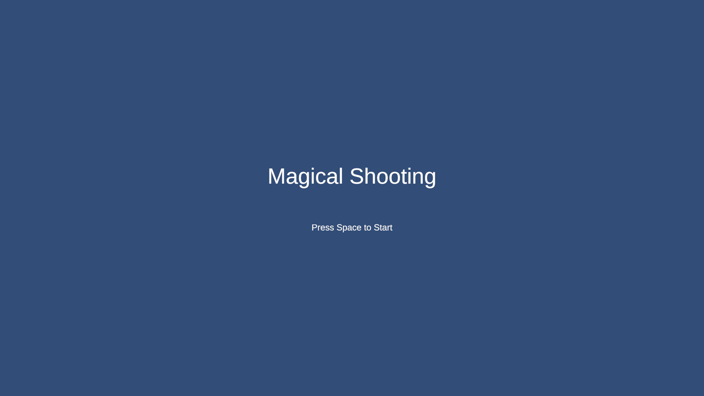

# 【5-04】ゲームを書きだそう！【5章：ゲームループ】

1. クリア条件：自分のPC向けにゲームをビルドして、Unityがなくても遊べる状態にする

2. ゲームループが完成したので、いよいよゲームを「書き出し」ます。

   用語：ビルド
   Unityのプロジェクトを、Unityを持っていない人でも遊べる形に変換すること。今まではUnityエディターの中でしか動かせませんでしたが、ビルドすると単体のゲームとして動くようになります。

3. 書き出す先はWindowsアプリ、Macアプリ、スマホ、Web、いろいろ選べます。
   今回はまず、一番シンプルな「自分のPC向け」に書き出します。
   - Windowsの人　→　exeファイル
   - Macの人　→　アプリ（.app）
   ブラウザで遊べるWeb向けの書き出しは、次回unityroomに投稿するときにやります。

4. その前に、ビルド前の下ごしらえがあります。
   実は、このままビルドすると赤いエラーが出て失敗する人が多いはずです。犯人はスクリプトの先頭にいる、こういうやつら。

   ```csharp
   using UnityEditor.Analytics;
   using NUnit.Framework;
   ```

   「UnityEditor」で始まるものは、Unityエディターの中でだけ使える機能です。ビルドしたゲームにはエディターは入っていないので、「そんなものは無い！」とエラーになります。NUnitも同じくテスト用なのでビルドには入りません。

   これ、自分で書いた覚えがないと思います。VSCodeやVisual Studioが入力補完のついでに勝手に追加してくるんです。ひどい話ですね。

5. 対処は簡単で、使っていないusingを消すだけです。
   自分のスクリプトを見て、「UnityEditor」「NUnit」で始まるusingがあったら削除して保存しましょう。
   僕の環境では、PlayerMove.csに「using UnityEditor.Analytics;」、EnemyDeathAnimation.csに「using NUnit.Framework;」などが紛れ込んでいました。

   消していいのか不安なusingは、試しに消してみてConsoleにエラーが出なければ不要だったということです。エラーが出たら戻せばOK。

6. 下ごしらえができたら、File > Build Profiles を開きましょう。
   Platformsで、Windowsの人は「Windows」に緑の「Active」が付いていることを確認してください。Macの人は「macOS」がActiveのはずです。
   ※Activeになっていない場合は、自分のOSを選択して「Switch Platform」を押しましょう。

   

   ちなみに、WindowsでMac向けをビルド（またはその逆）もできなくはないのですが、署名などの面倒な問題があるので、基本は「自分のOS向け」でOKです。

7. Scene Listに4つのシーンが入っていて、TitleSceneが一番上にあることも、前回の復習がてら確認しておきましょう。

8. では、「Build」ボタンを押しましょう。
   書き出し先のフォルダを聞かれるので、プロジェクトの外にフォルダを作って選択してください。
   僕は「C:\Users\ユーザー名\Builds\MagicalShooting\Windows」というフォルダを作りました。
   ※フォルダのパスに日本語が入らない場所が安全です。

9. あとは待つだけ。初回は数分かかります。お茶でも飲みながら、完成に思いを馳せましょう。
   ※途中でエラーが出て止まった場合は、Consoleの赤いエラーを読んでみましょう。だいたいはさっきのusingの消し忘れです。

10. ビルドが終わると、フォルダの中にこんなものができています。

    Windowsの人：
    - MagicalShooting.exe　←　これがゲーム本体！
    - UnityPlayer.dll など、いくつかのファイルとフォルダ

    Macの人：
    - MagicalShooting.app　←　これがゲーム本体！

    

11. では、MagicalShooting.exe（Macの人は.app）をダブルクリック！
    Unityエディターを介さずに、ゲームが単体で起動したら大成功です！自分のゲームが「製品」になった瞬間です。

    ※Macの人は「開発元が未確認のため開けません」と出ることがあります。その場合は.appを右クリック→「開く」で起動できます。

    

    もちろんゲームループもまるごと動きます。フルスクリーンで遊ぶ自分のゲームは感慨深いですよ。

    

12. このフォルダをまるごとzipに圧縮して渡せば、友達のPCでも遊んでもらえます（Windows向けビルドはWindowsの人に、Mac向けはMacの人に）。
    ※初回起動時に「WindowsによってPCが保護されました」と青い画面が出ることがあります。「詳細情報」→「実行」で起動できます。知らない発行元のアプリに出る警告なので、慌てなくて大丈夫。

13. ゲームが単体で動いたら、今回は完成です！
    次回はいよいよ最終回、Web向けにビルドしてunityroomに投稿します！

14. ↓ーーー　質問コーナー　ーーー↓
