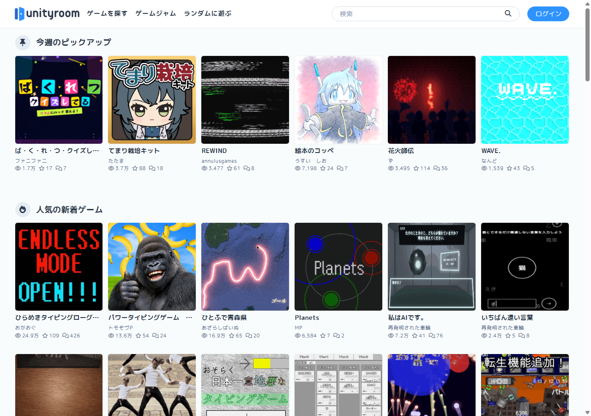
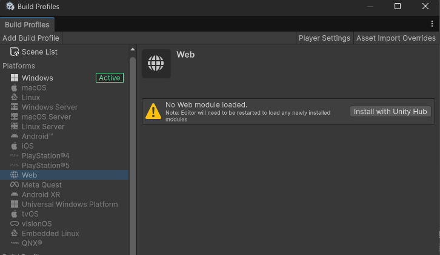
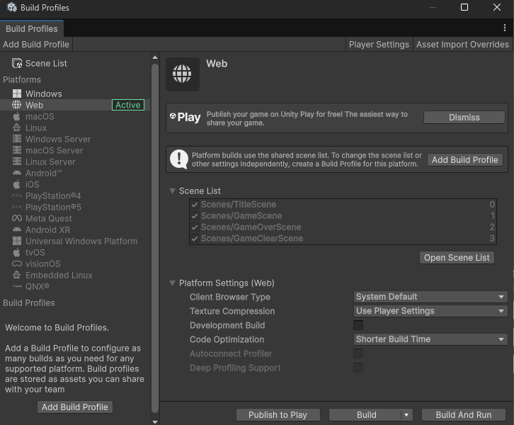
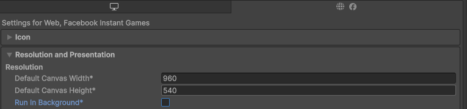
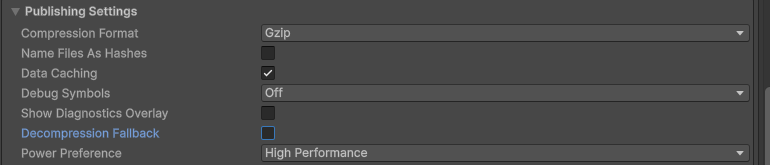
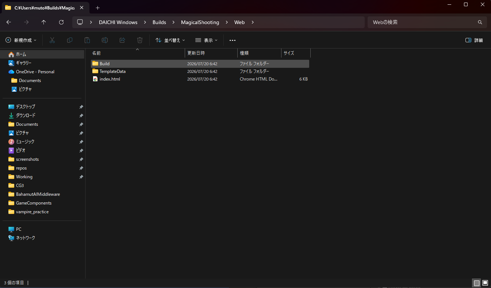
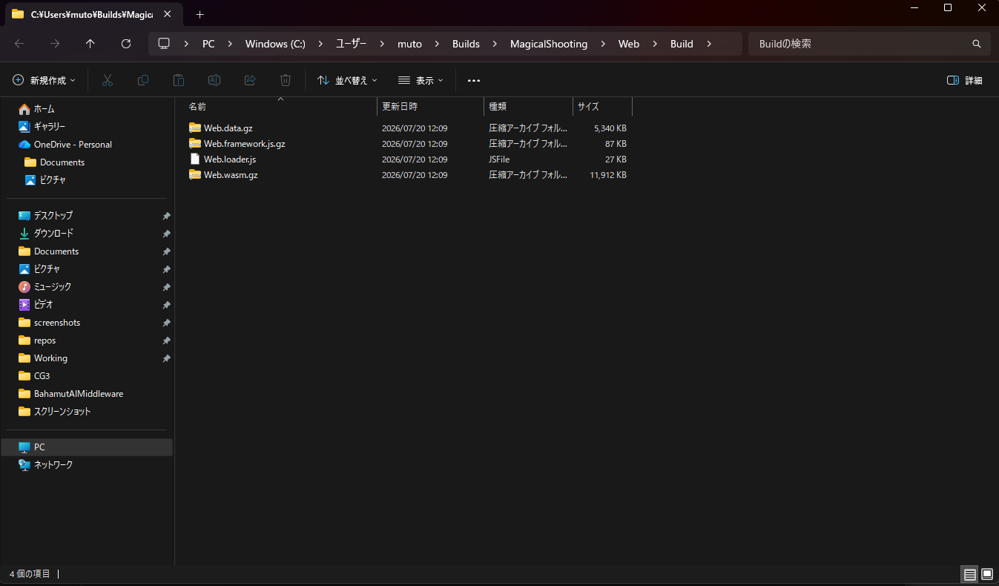

# 【5-05】UnityRoomに投稿しよう！【5章：ゲームループ】

1. クリア条件：Web向けにビルドして、unityroomに投稿し、ブラウザで遊べる状態にする

2. ついに最終回です。前回は自分のPC向けに書き出しましたが、今回はWeb（ブラウザ）向けに書き出して、世界に公開しましょう。
   投稿先はunityroom。無料でUnity製ゲームを投稿・プレイできる、日本最大級のサイトです。
   https://unityroom.com/

   眺めているだけでも「これ、自分が作ったのと同じ仕組みで動いてるのか」と思えるゲームがたくさんあるので、遊んでみてください。

   

3. まずはWeb向けのビルドの準備から。File > Build Profiles を開いて、Platformsから「Web」を選択してください。

4. このとき、「No Web module loaded.」と表示された人もいると思います。

   

   これはWeb Build Support（Web向けに書き出す部品）が入っていない状態です。ちなみに僕も入っていませんでした。
   「Install with Unity Hub」を押すか、1-03を見ながらUnityHubのInstallsからWeb Build Supportを追加してください。
   ※インストール後はUnityの再起動が必要です。再起動したらまたBuild Profilesに戻ってきましょう。

5. Webを選択して「Switch Platform」を押しましょう。
   Unityが素材をWeb用に変換し直すので、数分かかります。終わるとWebに緑の「Active」が付きます。
   ※WindowsでもMacでも、ここから先の手順は同じです。

   

6. 次に、ビルドの設定を2か所いじります。Build Profiles右上の「Player Settings」を開いてください。
   （Edit > Project Settings > Player でも同じ画面が開きます）

7. 1か所目。Resolution and Presentation を開いて、
   - Default Canvas Width：960
   - Default Canvas Height：540
   に設定しましょう。unityroomの標準サイズです。今まで作ってきた16:9の画面比率とも一致しています。1-05で16:9にしておいたのはこのためでした。

   

8. 2か所目。Publishing Settings を開いて、
   - Compression Format：Gzip
   - Decompression Fallback：チェックが入っていたら外す
   に設定しましょう。

   用語：Gzip
   ファイルを小さく圧縮する形式。zipの親戚です。ゲーム本体はけっこう大きいので、圧縮しないと遊ぶ人のロード時間が長くなってしまいます。ブラウザはGzipを標準で解凍できるので、遊ぶ側は何も意識しません。

   Decompression Fallbackは「解凍できない環境向けに、解凍プログラムをゲームに同梱する」保険のような設定ですが、今のunityroomでは不要どころか、公式が「チェックを外す」を指定しています。
   ここの設定を間違えると、unityroomにアップロードしてもゲームが動きません！要注意！

   

9. 設定ができたら、Build Profilesに戻って「Build」ボタンを押しましょう。
   前回と同じように書き出し先を聞かれるので、今度は「Web」用のフォルダを作って選択してください。
   僕は「C:\Users\ユーザー名\Builds\MagicalShooting\Web」にしました。

10. Webビルドは、PC向けよりだいぶ時間がかかります。初回は10分以上かかることも。
    ブラウザで動く形式に全部変換し直しているので、気長に待ちましょう。

11. ビルドが終わると、フォルダの中にこんなものができています。
    - index.html
    - Buildフォルダ
    - TemplateDataフォルダ

    さらにBuildフォルダの中を見ると、4つのファイルがあります。
    - 〇〇.loader.js
    - 〇〇.data.gz
    - 〇〇.framework.js.gz
    - 〇〇.wasm.gz

    この4つが入った「Buildフォルダ」を、あとでunityroomにアップロードします。場所を覚えておいてください。
    ※ファイル名の「〇〇」部分は、書き出し先のフォルダ名になります。僕の場合は「Web」フォルダに書き出したので「Web.loader.js」などになっていました。
    ※拡張子が「.gz」ではなく「.unityweb」になっている人は、Decompression Fallbackのチェックが外れていません。外してもう一度ビルドしましょう。

    

    

    ちなみに「index.htmlをダブルクリックすれば遊べるのでは？」と思った人、鋭い。しかし残念、ブラウザのセキュリティ制限で、手元のファイルから直接は起動できません。動作確認はunityroomにアップしてから！

12. ここからはunityroomでの作業です。まずはアカウント作成。unityroomのトップページ右上の「ログイン」からユーザー登録をしましょう。

13. ログインしたら、「ゲーム投稿」からゲームの基本情報を入力します。
    - タイトル：ゲームの名前。「Magical Shooting」でも、自分で考えた名前でもOK！
    - ゲームID：ゲームページのURLの一部になります。半角英数で。あとから変更できないので慎重に！
    - 紹介文：どんなゲームか。「魔女っ子が魔法弾で敵を撃ちまくるシューティング！」とか
    - 操作方法：矢印キーで移動、スペースキーでショット。書いておかないと誰も操作がわかりません

    【スクショ：ゲーム投稿フォーム】

14. 次に、WebGL設定でUnityのバージョン（6000.3.〇〇）を選択し、画面サイズを960×540に設定しましょう。
    さっきビルド設定した数字と同じです。

15. いよいよアップロードです。「Webビルドアップロード」の画面に、書き出した「Build」フォルダを、フォルダごとドラッグ＆ドロップしましょう。
    中の4つのファイルが自動でアップロードされて、「ファイルアップロード状況」が全部「完了」になればOKです。

    ※アップロード画面にも「Compression Format：Gzip」「Decompression Fallbackのチェックを外す」と注意書きがあります。さっきUnityで設定したやつですね。ここでエラーが出た人は、設定を見直してもう一度ビルドしましょう。

    【スクショ：WebGLアップロード画面】

16. アイコン（サムネイル画像）も設定しましょう。
    ゲーム画面のスクショでOKです。Gameビューを撮って設定しましょう。一覧ページで最初に見られるのはサムネなので、ゲームの顔だと思って選んでください。

17. 公開設定は、最初は「限定公開」がおすすめです。
    限定公開はURLを知っている人だけが遊べる状態。まず自分でこっそり動作確認してから、堂々と公開しましょう。

18. 保存したら、自分のゲームページを開いて動作確認です！
    - タイトルが表示されるか
    - スペースでゲームが始まるか
    - 敵を倒せるか、やられたらゲームオーバーになるか
    - 20体倒したらゲームクリアになるか
    - ちゃんとタイトルに戻ってくるか

    最初の読み込みには少し時間がかかります。画面が変わらなくても、慌てずに待ってください。

19. 動作確認ができたら、公開設定を「公開」に変更！これであなたも、ゲームを世に出したゲーム開発者です。

    【スクショ：公開されたゲームページ】

20. 完成！！そしてこれで、全チュートリアル完了です！！
    Unityのインストールから始めて、キャラを動かし、弾を撃ち、敵を出し、ゲームループを組んで、公開までたどり着きました。本当にお疲れ様でした。

    ゲームのURLは、ぜひこのスレに貼って自慢してください。全員分遊びに行きます。

21. ここから先は自由です。敵の種類を増やすもよし、スコアを付けるもよし、BGMを鳴らすもよし。
    「こうしたら面白いかも」を試しては壊すのが、ゲーム開発の一番楽しいところです。良い開発ライフを！

22. ↓ーーー　質問コーナー　ーーー↓
