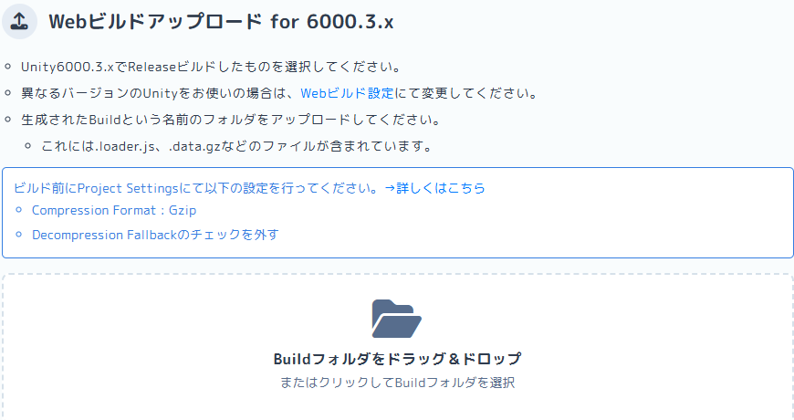
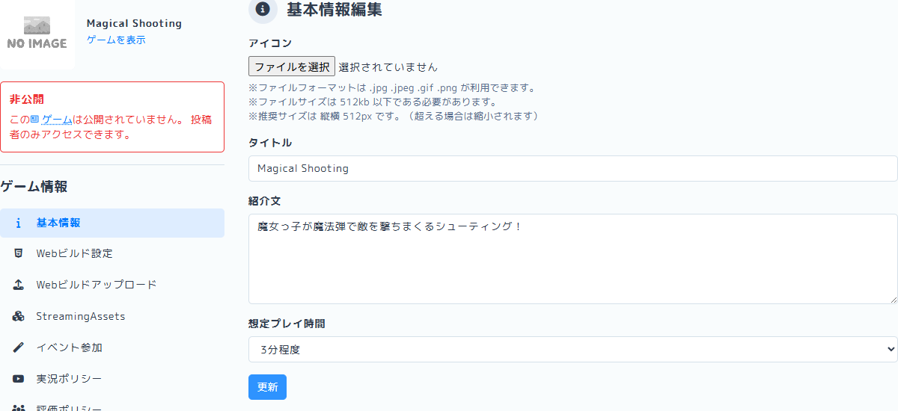
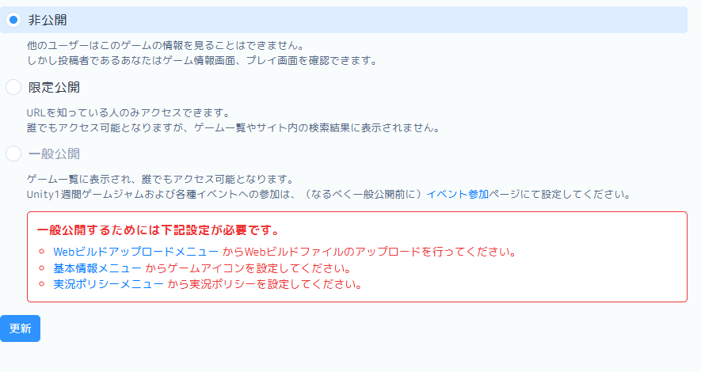

# 【5-05】unityroomに投稿しよう！【5章：ゲームループ】

1. クリア条件：Web向けにビルドして、unityroomに投稿し、ブラウザで遊べる状態にする

2. ついに最終回です。前回は自分のPC向けに書き出しましたが、今回はWeb（ブラウザ）向けに書き出して公開します。
   投稿先はunityroom。無料でUnity製ゲームを投稿・プレイできる、日本最大級のサイトです。
   https://unityroom.com/

   眺めているだけでも「これ、自分が作ったのと同じ仕組みで動いてるのか」と思えるゲームがたくさんあるので、遊んでみてください。

   

3. その前に、今回いちばん大事なことを先に書きます。
   **unityroomは、決まった形式で書き出したファイルしか受け付けません。**

   アップロード画面には、こう書かれています。

   

   - Unity 6000.3.x で **Release** ビルドしたもの
   - **Compression Format：Gzip**
   - **Decompression Fallback：チェックを外す**
   - 生成された **「Build」という名前のフォルダ**をそのままアップロードする

   この4つのどれかが違うと、アップロードで弾かれるか、アップロードできてもゲームが読み込み中のまま止まります。
   これから順番に設定していくので、ここでは「そういう決まりがある」とだけ覚えておいてください。

4. まずはWeb向けのビルドの準備から。File > Build Profiles を開いて、Platformsから「Web」を選択しましょう。

5. このとき、「No Web module loaded.」と表示された人もいると思います。

   

   これはWeb Build Support（Web向けに書き出す部品）が入っていない状態です。ちなみに僕も入っていませんでした。
   「Install with Unity Hub」を押すか、1-03を見ながらUnity HubのInstallsからWeb Build Supportを追加しましょう。
   ※インストール後はUnityの再起動が必要です。再起動したらまたBuild Profilesに戻ってきましょう。

6. Webを選択して「Switch Platform」を押しましょう。
   Unityが素材をWeb用に変換し直すので、数分かかります。終わるとWebに緑の「Active」が付きます。
   ※WindowsでもMacでも、ここから先の手順は同じです。

   

7. 同じBuild Profilesの画面で、2つ確認しておきます。

   - **Scene List** に TitleScene / GameScene / GameOverScene / GameClearScene の4つが並んでいて、TitleSceneが0番目にあること（5-03で設定したものです）
   - **Platform Settings (Web)** の中の **Development Build のチェックが外れていること**

   Development Buildにチェックが入っていると、開発用のビルドになってしまいます。unityroomが受け付けるのは3で書いたとおりReleaseビルドだけなので、ここは外したままにしておきましょう。

8. 次に、ビルドの設定を2か所いじります。Build Profiles右上の「Player Settings」を開きましょう。
   （Edit > Project Settings > Player でも同じ画面が開きます）

9. 1か所目。Resolution and Presentation を開いて、
   - Default Canvas Width：960
   - Default Canvas Height：540
   に設定しましょう。unityroomの標準サイズです。今まで作ってきた16:9の画面比率とも一致しています。1-05で16:9にしておいたのはこのためでした。

   

10. 2か所目。Publishing Settings を開いて、
    - Compression Format：**Gzip**
    - Decompression Fallback：**チェックを外す**
    に設定しましょう。

    

    用語：Compression Format（圧縮形式）
    書き出したファイルをどう圧縮するかの設定。ゲーム本体はサイズが大きいので、圧縮しないと遊ぶ人のロード時間が長くなります。unityroomはGzip形式で送られてくる前提で作られているので、ここは必ずGzipにします。

    用語：Decompression Fallback（解凍の予備手段）
    「ブラウザ側で解凍できなかったときのために、解凍プログラムをゲームに同梱しておく」設定です。一見あると安心そうですが、これを入れると書き出されるファイルの拡張子が `.gz` ではなく `.unityweb` に変わってしまい、unityroomが求める形式と合わなくなります。

    ここの2つを間違えると、unityroomにアップロードしてもゲームが動きません。今回いちばんつまずくポイントです。

11. 設定ができたら、Build Profilesに戻って「Build」ボタンを押しましょう。
    前回と同じように書き出し先を聞かれるので、今度は「Web」用のフォルダを新しく作って選択してください。
    僕は「C:\Users\ユーザー名\Builds\MagicalShooting\Web」にしました。
    ※フォルダのパスに日本語やスペースが入らない場所を選ぶと安心です。

12. Webビルドは、PC向けよりだいぶ時間がかかります。初回は10分以上かかることも。
    ブラウザで動く形式に全部変換し直しているので、気長に待ちましょう。

13. ビルドが終わると、フォルダの中にこんなものができています。
    - index.html
    - Buildフォルダ
    - TemplateDataフォルダ

    

14. さらにBuildフォルダの中を見ると、4つのファイルが入っています。

    - 〇〇.loader.js
    - 〇〇.data.gz
    - 〇〇.framework.js.gz
    - 〇〇.wasm.gz

    

    unityroomにアップロードするのは、この **「Build」フォルダごと**です。場所を覚えておきましょう。
    ※ファイル名の「〇〇」部分は、書き出し先のフォルダ名になります。僕の場合は「Web」フォルダに書き出したので「Web.loader.js」などになっていました。
    ※拡張子が `.gz` ではなく `.unityweb` になっている人は、10のDecompression Fallbackのチェックが外れていません。外してもう一度ビルドしましょう。

15. ちなみに、この時点でindex.htmlをダブルクリックしても、ゲームは動きません。
    ブラウザのセキュリティ制限で、手元のファイルから直接は起動できない仕組みになっています。動作確認はunityroomにアップしてからになります。

16. ここからはunityroomでの作業です。まずはアカウント作成。
    unityroomのトップページ右上の「ログイン」から、TwitterなどのSNSアカウントで登録できます。

17. ログインしたら、右上の「ゲームを登録」を押します。「基本情報編集」の画面が開くので、ゲームの情報を入力しましょう。

    

    - **アイコン**：一覧ページで最初に見られる画像です。Gameビューのスクショで大丈夫。.jpg .jpeg .gif .png、512kb以下、推奨サイズは縦横512pxです
    - **タイトル**：ゲームの名前。「Magical Shooting」でも、自分で考えた名前でもOK
    - **紹介文**：どんなゲームか。「魔女っ子が魔法弾で敵を撃ちまくるシューティング！」とか
    - **想定プレイ時間**：プルダウンから選択

    入力したら「更新」を押します。これでゲームのページ自体はできましたが、まだ中身が入っていません。

18. 左のメニューから「Webビルド設定」を選び、次の3つを設定して「更新」を押します。

    - **Unityバージョン**：6000.3.x（チュートリアルと同じバージョンの場合）
    - **画面サイズ**：960 × 540　←　9で設定した数字と同じです
    - **操作方法**：矢印キーで移動、スペースキーでショット

    【スクショ：Webビルド設定の画面】

    操作方法は、書いておかないと遊ぶ人が何もできません。忘れずに書きましょう。
    ここで選んだUnityバージョンと、実際にビルドしたUnityのバージョンがズレていると、アップロードで弾かれます。

19. 左のメニューから「Webビルドアップロード」を選びます。
    「Buildフォルダをドラッグ＆ドロップ」の枠に、14で確認した **Buildフォルダをフォルダごと**ドラッグ＆ドロップしましょう。
    （枠をクリックしてフォルダ選択ダイアログから選んでも同じです）

    

    ブラウザから「4個のファイルをこのサイトにアップロードしますか？」という確認が出るので、「アップロード」を押します。

    

20. 緑色の帯で「アップロード完了しました。」と表示され、ファイル一覧の状態がすべて「完了」になればOKです。

    

    うまくいかないときは、だいたい3の4つのどれかが守れていません。

    | 症状 | 見直すところ |
    |---|---|
    | ファイル名が `.unityweb` になっている | 10のDecompression Fallbackのチェックが外れていない |
    | アップロードは通るが、ゲームが読み込み中のまま止まる | 10のCompression FormatがGzipになっていない |
    | バージョンが違うと言われる | 18のUnityバージョンの選択がビルドしたバージョンと合っていない |
    | フォルダを選んでもエラーになる | Buildフォルダではなく、その親フォルダを選んでいる |

    どれもビルドし直せば直ります。あとで気づいても大丈夫です。

21. 左のメニューから「公開設定」を選びます。初期状態は「非公開」になっています。

    

    公開設定は3種類あります。

    | 設定 | 誰が見られるか |
    |---|---|
    | 非公開 | 投稿した本人だけ |
    | 限定公開 | URLを知っている人だけ。一覧やサイト内検索には出ない |
    | 一般公開 | サイトに来た人なら誰でも。ゲーム一覧にも載る |

    まずは「限定公開」を選んで「更新」を押しましょう。自分でこっそり動作確認してから、堂々と公開する流れです。

    

22. 自分のゲームページを開いて動作確認です。「ゲームを表示」から実際の画面を見てみましょう。

    

    - タイトルが表示されるか
    - スペースでゲームが始まるか
    - 敵を倒せるか、やられたらゲームオーバーになるか
    - 20体倒したらゲームクリアになるか
    - ちゃんとタイトルに戻ってくるか

    最初の読み込みには少し時間がかかります。画面が変わらなくても、慌てずに待ってください。

23. 動作確認ができたら、公開設定を「一般公開」に変更しましょう。これであなたも、ゲームを世に出したゲーム開発者です。
    ※一般公開にはアイコン画像などの設定が必要です。赤字で「一般公開するためには下記設定が必要です」と出たら、足りない項目を埋めてから切り替えます。

24. 完成！！そしてこれで、全チュートリアル完了です！！
    Unityのインストールから始めて、キャラを動かし、弾を撃ち、敵を出し、ゲームループを組んで、公開までたどり着きました。本当にお疲れ様でした。

    ゲームのURLは、ぜひこのスレに貼って自慢してください。全員分遊びに行きます。

25. ここから先は自由です。敵の種類を増やすもよし、スコアを付けるもよし、BGMを鳴らすもよし。
    「こうしたら面白いかも」を試しては壊すのが、ゲーム開発の一番楽しいところです。良い開発ライフを！
