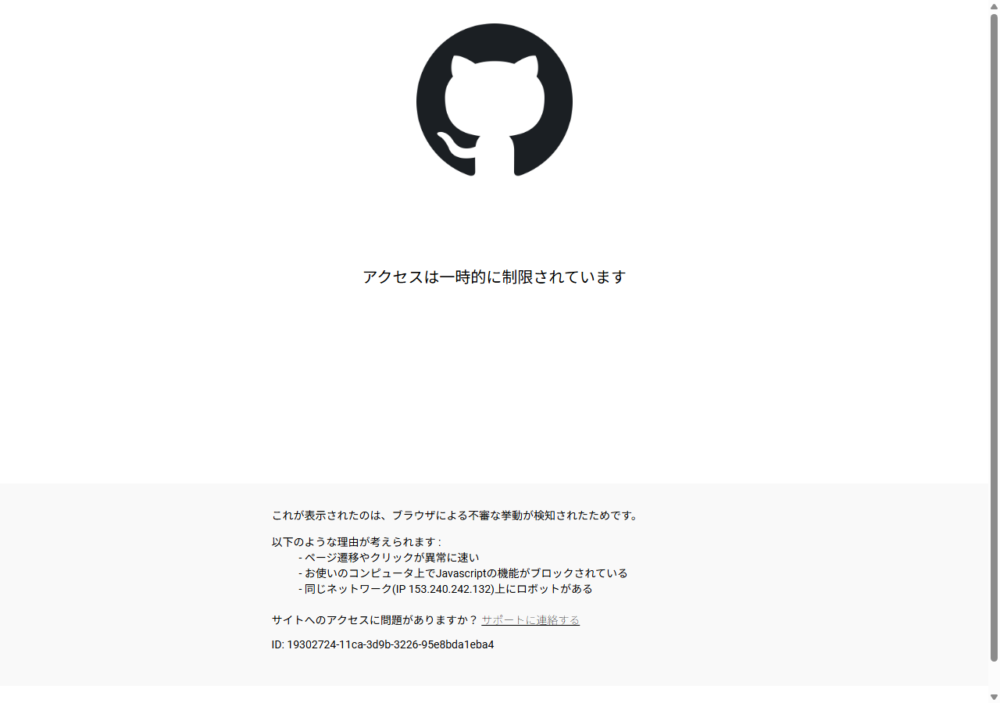

# 【1-02】GitHubアカウントを作ろう【1章：Git導入編】

1. クリア条件：GitHubのアカウントを作って、ログインできる状態にする

2. 前回、Gitは「タイムマシン付きの共有倉庫」だと説明しました。
   では、その倉庫はどこにあるのか？——それが今回のGitHub（ギットハブ）です。

   用語：GitとGitHubの違い
   よく混同されるので最初にハッキリさせておきます。
   - **Git**　＝　道具（あなたのPCに入れる、履歴を管理するソフト）
   - **GitHub**　＝　場所（ネット上にある、みんなでファイルを置いておく倉庫サービス）
   Photoshopが「Git」で、Google Driveが「GitHub」みたいな関係だと思ってください。片方だけでは成立しません。

3. ちなみにGitHubは黒い猫（正確にはタコと猫を合体させた「Octocat」というマスコット）が目印のサイトです。世界中のプログラマーが使っていて、無料で使えます。

4. では作りましょう。ブラウザで下のURLを開いてください。

   https://github.com/signup

   

5. 入力するのは3つだけです。

   - **Email**：普段使っているメールアドレス
   - **Password**：15文字以上、または8文字以上＋数字と小文字を含む
   - **Username**：あなたのID。**チームメンバーに見える名前**なので、あだ名など呼ばれ慣れた名前がおすすめ

   ※Usernameはあとから変更できますが、URLが変わって面倒なので、最初に決め打ちしましょう。半角英数とハイフンのみ使えます。

6. 「Country/Region」は Japan を選択。メール配信の希望は好みでどうぞ（チェックしなくてOK）。

7. 「Create account」を押すと、メールに6桁の確認コードが届きます。入力すれば完了です。
   ※届かない人は迷惑メールフォルダを確認してください。

8. その後、「What do you want to do first?」みたいなアンケート画面が出てきますが、全部スキップして大丈夫です。右下の「Skip personalization」や「Continue for free」を選びましょう。
   ※有料プランを勧められますが、**Freeで十分**です。

9. ログインした状態で、自分のトップページが表示されたら成功です！
   まだ何もない真っさらな状態ですが、これであなたの倉庫を借りる権利が手に入りました。

10. 最後に、**Usernameをチームのリーダーに伝えておきましょう**。
    リーダーがあなたを「このプロジェクトの共同編集者」として招待するのに必要です。招待されないと、倉庫に納品する権限がもらえません。

    ※Discordなどで「GitHubのIDは○○です」と一言送っておけばOK。

11. GitHubにログインできて、IDをチームに伝えたら、今回は完成です！

12. ↓ーーー　質問コーナー　ーーー↓
