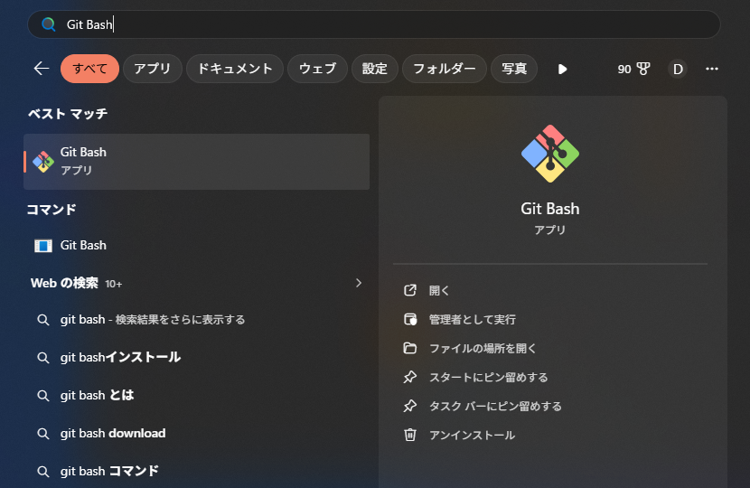

# 【1-03】Gitをインストールしよう【1章：Git導入編】

1. クリア条件：自分のPCにGit本体が入って、名前とメールアドレスの設定ができればOK！

2. 前回はGitHub（インターネット側）の準備をしました。今回は自分のPCにGit本体を入れます。

   Git本体は、変更履歴を記録する処理そのものを担当します。次回入れるアプリ（Fork）は、このGit本体を裏側で呼び出して動く**操作画面**です。
   つまり、**Git本体が入っていないとForkは動きません**。順番として、先にこちらを入れます。

3. まずは、すでに入っていないか確認しましょう。UnityやVisual Studioを入れたときに、一緒に入っていることがあります。

   **Windowsの人**：スタートメニューを開いて「Git Bash」と検索してください。

   

   このように「Git Bash」というアプリが出てきたら、すでに入っています。→ 手順8へ進んでください。
   何も出てこなければ、まだ入っていません。→ 手順4へ。

   **Macの人**：手順7を見てください。

   用語：Git Bash
   Gitを入れると一緒に付いてくる、**文字を打ってPCに命令するためのアプリ**です。Windowsの「コマンドプロンプト」の仲間だと思ってください。
   このチュートリアルでGit Bashを使うのは、**今回の確認と設定だけ**です。次回以降の作業は全部マウス操作でやります。

4. 入っていなかった人は、公式サイトからダウンロードします。

   https://git-scm.com/downloads

   

   ※黒背景に赤いロゴの、ちょっと無骨なサイトです。合っています。

5. 【Windowsの人】「Windows」を選び、「Click here to download」から最新版をダウンロード。
   ダウンロードした .exe をダブルクリックして進めます。

6. 【Windowsの人】インストーラーの設定項目がたくさん出てきますが、**全部そのまま「Next」で大丈夫**です。標準の設定で問題なく動きます。
   最後に「Install」→「Finish」で完了。

   ※途中で「デフォルトのエディタを選べ」という画面が出ます。ここもそのまま（Vim）で問題ありません。今回は使いません。

7. 【Macの人】Macは少し簡単です。「ターミナル」アプリを開いて、`git --version` と打ってEnterを押してください。
   入っていなければ「開発者ツールをインストールしますか？」というダイアログが出るので、「インストール」を押すだけで入ります。
   ※Homebrewを使っている人は `brew install git` でもOKです。

8. 入ったかどうか確認しましょう。
   Windowsは「Git Bash」、Macは「ターミナル」を開いて、下の1行を打ってEnterを押します。

   ```bash
   git --version
   ```

   `git version 2.55.0` のようにバージョン番号が表示されたら成功です！

9. 続けて、あなたの名前とメールアドレスを設定します。
   Gitは変更履歴に「誰が記録したか」を残すので、この2つを最初に教えておく必要があります。設定しないと、あとで記録するときにエラーになります。

   同じ画面で、下の2行を1行ずつ実行してください（`""` の中は自分のものに書き換え）。

   ```bash
   git config --global user.name "あなたの名前"
   ```

   ```bash
   git config --global user.email "GitHubに登録したメールアドレス"
   ```

   ※名前は日本語でも動きますが、ローマ字かGitHubのIDにしておくと、あとで履歴を見たときに読みやすいです。
   ※メールアドレスは**1-02でGitHubに登録したもの**にしてください。ここが違うと、GitHub上で「誰の作業か」が正しく表示されません。

10. 設定できたか確認するには、下の1行を打ちます。設定した名前とメールアドレスが表示されればOKです。

    ```bash
    git config --global --list
    ```

11. お疲れさまでした。**文字を打つ操作はここまでです。**
    次回、マウス操作でGitを使うアプリを入れたら、そこから先はボタン操作だけで進みます。

12. バージョン番号が表示されて、名前とメールアドレスの設定ができたら、今回は完成です！
