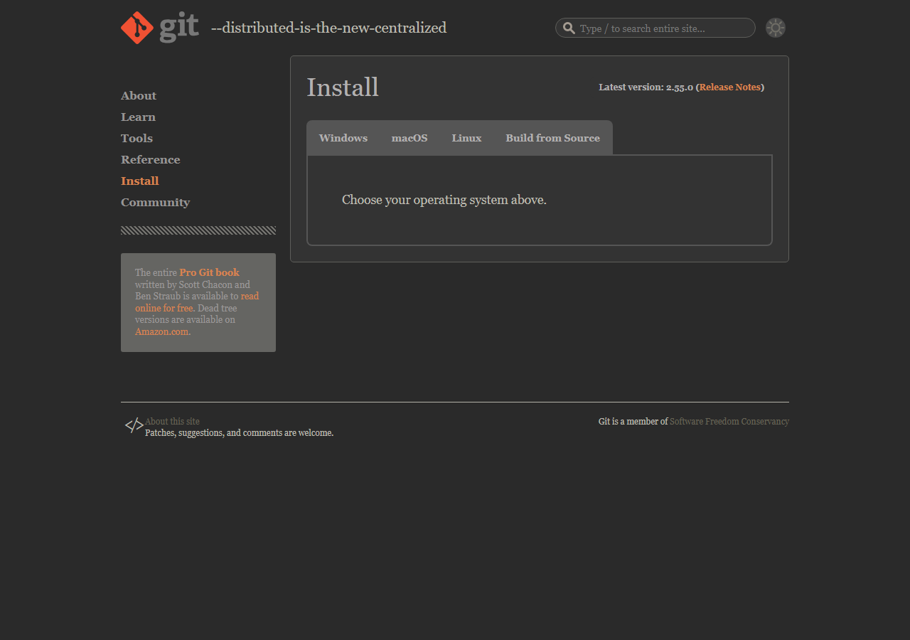

# 【1-03】Gitをインストールしよう【1章：Git導入編】

1. クリア条件：自分のPCにGit本体を入れる

2. 前回は「倉庫」を借りました。今回は「道具」であるGit本体をPCに入れます。
   これは**エンジン**みたいなものです。この後で入れるアプリ（Fork）は、いわばハンドルとメーター。エンジンがないと動きません。

3. まずは、すでに入っていないか確認しましょう。実はUnityやVisual Studioを入れたときに、一緒に入っていることがあります。

   Windowsの人：スタートメニューで「Git Bash」と検索してみてください。出てきたら、もう入っています。→ 手順8へ
   Macの人：後述の手順7を見てください。

4. 入っていなかった人は、公式サイトからダウンロードします。

   https://git-scm.com/downloads

   

   ※黒背景に赤いロゴの、ちょっと無骨なサイトです。合っています。

5. 【Windowsの人】「Windows」を選び、「Click here to download」から最新版をダウンロード。
   ダウンロードした .exe をダブルクリックして進めます。

6. 【Windowsの人】インストーラーの設定項目がやたら多くて心が折れそうになりますが、**全部そのまま「Next」で大丈夫**です。デフォルト設定がちゃんと考えられているので、いじる必要はありません。
   最後に「Install」→「Finish」で完了。

   ※途中で「デフォルトのエディタを選べ」という画面が出ます。ここもそのまま（Vim）で問題ありません。今回は使いませんので。

7. 【Macの人】Macは少し楽です。「ターミナル」アプリを開いて、`git --version` と打ってEnter。
   入っていなければ「開発者ツールをインストールしますか？」というダイアログが出るので、「インストール」を押すだけで入ります。
   ※Homebrewを使っている人は `brew install git` でもOKです。

8. 入ったかどうか確認しましょう。
   Windowsは「Git Bash」、Macは「ターミナル」を開いて、こう打ちます。

   ```bash
   git --version
   ```

   `git version 2.55.0` のようにバージョン番号が返ってきたら成功です！

   ※ここだけ黒い画面を使いますが、確認のためだけです。**この先はもう黒い画面は出てきません**。安心してください。

9. 最後に、あなたの「署名」を設定します。
   Gitは変更履歴に「誰がやったか」を記録するので、名前とメールアドレスを教えてあげる必要があります。これをやらないと、後でコミットするときに怒られます。

   同じ黒い画面で、下の2行をそれぞれ実行してください（`""`の中は自分のものに書き換え）。

   ```bash
   git config --global user.name "あなたの名前"
   ```

   ```bash
   git config --global user.email "GitHubに登録したメールアドレス"
   ```

   ※名前は日本語でも大丈夫ですが、ローマ字やGitHubのIDにしておくと後々見やすいです。
   ※メールアドレスは**1-02でGitHubに登録したもの**にしてください。ここが違うと、GitHub上で「誰の作業か」が紐づきません。

10. `git --version` が表示されて、署名の設定ができたら、今回は完成です！
    次回は、これをマウス操作で使えるようにするアプリを入れます。

11. ↓ーーー　質問コーナー　ーーー↓
