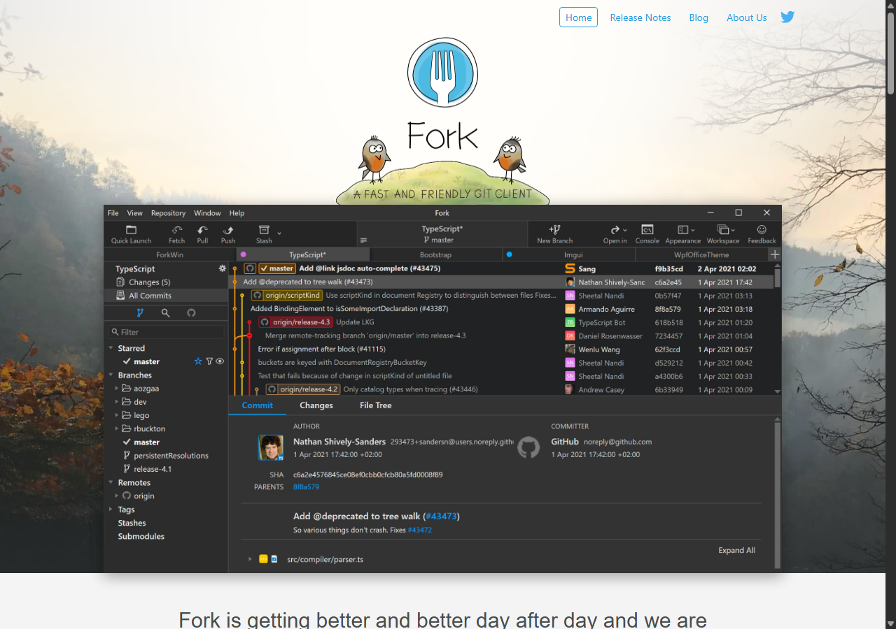
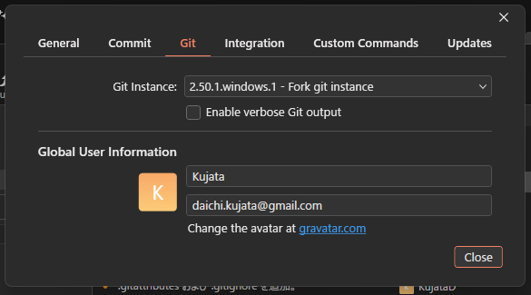
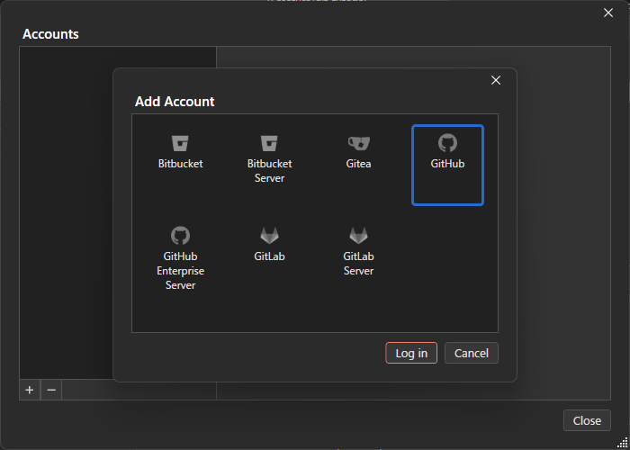

# 【1-04】Forkを入れよう（マウスでGitを使う）【1章：Git導入編】

1. クリア条件：GitのアプリForkを入れて、GitHubアカウントと連携できればOK！

2. 前回入れたGit本体だけだと、記録や送信のたびに文字を打つことになります。毎日やるには大変なので、**マウスで操作できるアプリ**を入れます。

   用語：Gitクライアント
   Gitの操作をボタンやアイコンでできるようにしたアプリのこと。裏でやっていることはGit本体と同じなので、**できることも結果も文字入力の場合と全く同じ**です。

3. 今回使うのは **Fork** というアプリです。理由は3つ。

   - 変更履歴が**枝分かれの図**で表示されるので、誰がどこで何をしたか目で追える
   - 変更されたファイルの中身を、画像はサムネイル付きで確認できる
   - 動作が軽い

   ※Windows版とMac版があり、**画面の作りがほぼ同じ**なのも採用理由です。チーム内でOSが混ざっていても、同じ説明が通じます。

4. では入れましょう。下のURLを開いてください。

   https://git-fork.com/

   

   自分のOSのボタン（Download for Windows / Download for Mac）を押してダウンロード、インストールします。

   ※Forkは「期限なしで試用できる有料アプリ」です。起動のたびに購入案内が出ますが、機能制限なく使い続けられます。気に入ったら購入を検討してください（買い切り $59.99）。

5. 初回起動時に、名前とメールアドレスを聞かれます。1-03で設定したものと同じものを入れてください。
   （1-03で設定済みなら、自動で入っているはずです）

   あとから確認・変更するときは、`File > Preferences` を開いて「Git」タブを見ます。ここの「Global User Information」が、1-03で設定した内容です。

   

6. 次に、GitHubアカウントと連携します。連携しておくと、GitHubにデータを送るたびにパスワードを聞かれずに済みます。

   - Windows：`File > Accounts...`
   - Mac：`Fork > Accounts...`

   を開いてください。

7. 左下の「＋」ボタンを押すと、サービスの一覧が出ます。**GitHub**を選んで「Log in」を押しましょう。

   

8. ブラウザが開いてGitHubの認証画面が表示されるので、緑色の「Authorize fork」ボタンを押せば連携完了です。
   Forkの画面に自分のGitHubアカウント名が表示されていれば成功です。

9. 【補足】VSCodeを使っている人へ
   Visual Studio Code にも、Gitの機能が最初から入っています（左端の枝分かれアイコン）。
   スクリプトを書きながらそのまま記録できるので便利ですが、**履歴の枝分かれが確認しづらい**のが弱点です。
   おすすめは併用です。「日々の記録はVSCode、ブランチ操作や履歴の確認はFork」という使い分けをしている人が多いです。もちろん全部Forkでも構いません。

10. Forkが起動して、GitHubと連携できたら、今回は完成です！
    これで環境の準備は終わりです。次回からは実際のプロジェクトを触っていきます。
