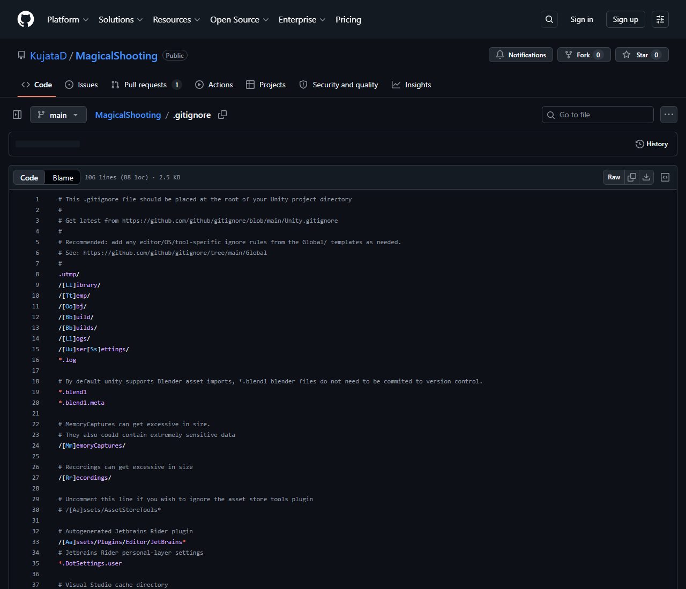

# 【1-05】Unity用の.gitignoreを知ろう【1章：Git導入編】

1. クリア条件：Gitで共有しないファイルがあることが分かって、Unity用の設定を用意できればOK！

2. 今回は操作より説明が多めですが、**ここを飛ばすとチーム制作でほぼ確実に事故ります**。5分だけお付き合いください。

3. まず、Unityのプロジェクトフォルダを開いてみてください。こんなフォルダが並んでいます。

   ```
   Assets/          ← 自分で作った素材・スクリプト
   ProjectSettings/ ← プロジェクトの設定
   Packages/        ← 使っている機能のリスト
   Library/         ← ★
   Temp/            ← ★
   Logs/            ← ★
   obj/             ← ★
   ```

4. ★の付いたフォルダは、**Unityが自動で作る一時ファイル**の置き場です。
   特にLibraryは、Assetsに入れた画像や音をUnityが内部用に変換したデータが入っていて、数GBになることもあります。

5. ここで問題です。このLibraryフォルダは、チームで共有すべきでしょうか？

   答えは**共有しない**です。理由は3つ。

   - **サイズが大きい**：数GBを毎回アップロード・ダウンロードすることになる
   - **共有する意味がない**：Assetsさえあれば、Unityが各自のPCで自動的に作り直してくれる
   - **必ず食い違う**：全員のPCで中身が微妙に違うため、毎回「変更あり」と判定されて衝突の原因になる

   つまり、**共有するのは自分で作ったもの（Assets、ProjectSettings、Packages）だけ**。Unityが自動生成するものは各自のPCで作らせる、が基本方針です。

6. そこで使うのが .gitignore（ギット・イグノア）です。

   用語：.gitignore
   「このファイルはGitで記録しなくていい」というリストを書いた設定ファイル。ignore（無視する）ものを指定します。ファイル名がドットから始まるので、フォルダ内で先頭のほうに表示されます。

7. Unity用の.gitignoreは、**GitHubが公式のテンプレートを用意してくれています**。自分で書く必要はありません。
   次回リポジトリを作るときに、選択肢から「Unity」を選ぶだけで自動生成されます。今回は中身を眺めるだけでOKです。

   ```
   # Unityが自動生成するフォルダ（共有しない）
   [Ll]ibrary/
   [Tt]emp/
   [Oo]bj/
   [Bb]uild/
   [Ll]ogs/

   # ビルドの成果物（共有しない）
   *.apk
   *.unitypackage

   # OSが自動で作るファイル（共有しない）
   .DS_Store        ← Macが作る隠しファイル
   Thumbs.db        ← Windowsが作るサムネイルの一時ファイル
   ```

   実物はこんな感じです。100行ほどありますが、全部GitHubが用意してくれたものです。

   

8. 【超重要】Unity特有の注意点：.metaファイルは必ず一緒に記録する

   Assetsフォルダを見ると、画像1枚につき「Player.png」と「Player.png.meta」の2つがあるはずです。
   この.metaファイルには、**その素材の設定（Pixels Per Unit、Sprite Modeなど）と、Unity内部での識別番号（GUID）**が書かれています。

   もし.metaを共有し忘れると、こうなります。

   - 自分のPCでは、Playerオブジェクトに絵がちゃんと付いている
   - 相手のPCでは、**絵が外れて白い四角（Missing）になる**

   Unityでよくある事故です。「相手の環境だけ絵が消える」の原因は、だいたいこれ。
   Forkを使っていれば.metaも一覧に表示されるので、**変更されたファイルは全部まとめて記録する**と覚えておけば大丈夫です。

9. 【もうひとつ重要】シーンとプレハブは同時に触らない

   .gitignoreの話とセットで覚えてほしいのがこれです。
   Gitは、テキストファイルなら「Aさんは3行目、Bさんは50行目を変えた」と判断して自動でまとめられます。
   でもUnityのシーンファイル（.unity）やプレハブ（.prefab）は中身が複雑なテキストなので、**同じシーンを2人が同時に編集すると、ほぼ確実に自動でまとめられなくなります**（これをコンフリクトと呼びます。1-13で扱います）。

   なので、チームでの決めごとはこの3つです。

   - **同じシーン・同じプレハブを、同時に2人で触らない**
   - 誰がどのシーンを触るか、作業前にDiscordで宣言する
   - 大きなシーンは、機能ごとにプレハブに分けて分担する

   ※これは1-14の作業マニュアルにも載せます。忘れてもそちらを見ればOKです。

10. 「Libraryは共有しない」「.metaは一緒に記録する」「同じシーンを同時に触らない」の3つが頭に入ったら、今回は完成です！
