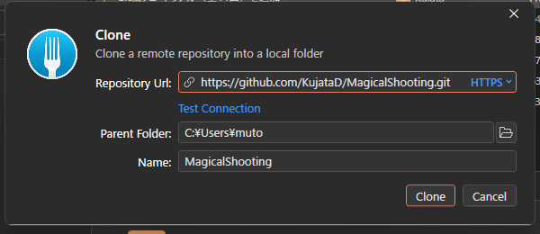

# 【1-07】クローンしよう（手元に持ってくる）【1章：Git導入編】

1. クリア条件：GitHubのリポジトリを自分のPCにコピーして、Unityで開ければOK！

2. リポジトリはできましたが、まだGitHub上にあるだけです。作業するには自分のPCに持ってくる必要があります。
   この操作をクローンと呼びます。

   用語：クローン（clone）
   GitHub上のリポジトリを、まるごと自分のPCにコピーすること。**ファイルをダウンロードするのとの違いは、変更履歴も一緒にコピーされて、GitHubとつながった状態になること**です。

3. ※ここからは**チーム全員がやる作業**です。代表の人も含めて全員、自分のPCに持ってきましょう。

4. まず、GitHubのリポジトリページを開いて、緑色の「Code」ボタンを押します。
   出てきたURL（`https://github.com/...` で終わるもの）の右にあるコピーアイコンを押して、URLをコピーします。

   

5. 次にForkを開いて、`File > Clone` を選びます。

   

6. 入力するのは2つです。

   - **Repository Url**：さっきコピーしたURLを貼り付け
   - **Parent Folder**：どのフォルダの中に置くか（例：`C:\Users\自分の名前\source\repos`）

   ※Nameは自動で入ります。**Parent Folderに指定したフォルダの中に、リポジトリ名のフォルダが自動で作られます**。あらかじめ空フォルダを作っておく必要はありません。

7. 【重要】置き場所の注意
   Parent Folderに指定するフォルダは、次の条件を守ってください。

   - **パスに日本語やスペースを含めない**（`C:\Users\山田\デスクトップ` などはNG）
   - **OneDriveやGoogle Driveの同期フォルダの中に置かない** ← これが特に重要！

   後者は事故が多いです。GitとOneDriveが同時に同じファイルを書き換えようとして、両方おかしくなります。**バックアップはGitHub側で取れているので、クラウド同期は不要**です。おすすめは `C:\Users\自分の名前\source\repos` あたりです。

8. 「Clone」ボタンを押すと、ダウンロードが始まります。プロジェクトの大きさによっては数分かかります。

9. 完了すると、Forkの画面に変更履歴が表示されます。ここが今後の作業画面になります。

   

   画面の見方は3ブロックだけ覚えておけば大丈夫です。

   - **左**：ブランチ（作業場所）の一覧
   - **中央**：変更履歴の一覧
   - **下**：選択した履歴の中身

10. では、UnityHubからこのプロジェクトを開いてみましょう。

    - UnityHubの「Add」→「Add project from disk」
    - さっきクローンしたフォルダを選択

    初回はLibraryフォルダを一から作り直すので、**5〜15分ほどかかります**。これが1-05で説明した「Unityが自動生成するデータを各自のPCで作る」作業です。待ちましょう。

11. Unityでプロジェクトが開けたら、今回は完成です！
    準備はここまで。次回からは、実際に作業して記録していきます。
