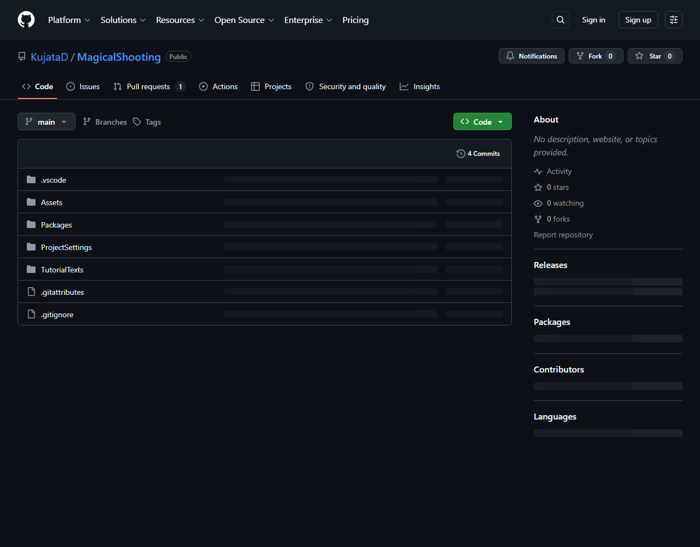
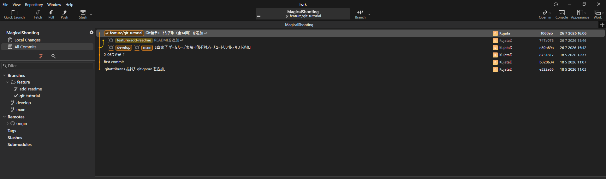

# 【1-07】クローンしよう（手元に持ってくる）【1章：Git導入編】

1. クリア条件：GitHubのリポジトリを自分のPCにコピーして、Unityで開ける状態にする

2. 倉庫はできましたが、まだネットの向こう側にあります。作業するには手元に持ってこないといけません。
   この「持ってくる」操作をクローンと呼びます。

   用語：クローン（clone）
   リポジトリを丸ごと自分のPCにコピーすること。**ダウンロードとの違いは、履歴も一緒に付いてくること**。単にファイルをもらうのではなく、倉庫ごと複製して、GitHubと繋がった状態にします。

3. ※ここからは**チーム全員がやる作業**です。リーダーも含めて全員、自分のPCに持ってきましょう。

4. まず、GitHubのリポジトリページを開いて、緑色の「Code」ボタンを押します。
   出てきたURL（`https://github.com/...` で終わるやつ）の右にあるコピーアイコンを押して、URLをコピーします。

   

5. 次にForkを開いて、`File > Clone` を選びます。

   【スクショ：ForkのCloneダイアログ】

6. ダイアログに入力するのは2つ。

   - **Repository URL**：さっきコピーしたURLを貼り付け
   - **Parent Folder**：どこに置くか（例：`C:\Users\自分の名前\source\repos`）

   ※「Parent Folder」に指定したフォルダの**中に、リポジトリ名のフォルダが自動で作られます**。あらかじめ空フォルダを作っておく必要はありません。

7. 【重要】置き場所の注意
   ここで指定するフォルダは、次の条件を守ってください。守らないと後で泣きます。

   - **パスに日本語やスペースを含めない**（`C:\Users\山田\デスクトップ` などはNG）
   - **OneDriveやGoogle Driveの同期フォルダの中に置かない** ← これ超重要！

   後者が特に事故ります。GitとOneDriveが同時に同じファイルをいじろうとして、両方が壊れます。**バックアップはGitHubがやってくれるので、クラウド同期は不要**です。おすすめは `C:\Users\自分の名前\source\repos` あたり。

8. 「Clone」ボタンを押すと、ダウンロードが始まります。プロジェクトの大きさによっては数分かかります。

9. 完了したら、Forkの画面に履歴が表示されます。これがあなたの作業場所です。

   

   左に**ブランチ一覧**、中央に**変更履歴**、下に**選択したコミットの中身**。この3ブロックだけ覚えておけば大丈夫です。

10. では、UnityHubからこのプロジェクトを開いてみましょう。

    - UnityHubの「Add」→「Add project from disk」
    - さっきクローンしたフォルダを選択

    初回はLibraryフォルダを一から生成するので、**5〜15分ほどかかります**。これが1-05で話した「作り置きを各自のキッチンで作る」作業です。お茶でも飲んで待ちましょう。

11. Unityでプロジェクトが開けたら、今回は完成です！
    ここまでで準備完了。次回からいよいよ、作業してGitに記録していきます。

12. ↓ーーー　質問コーナー　ーーー↓
