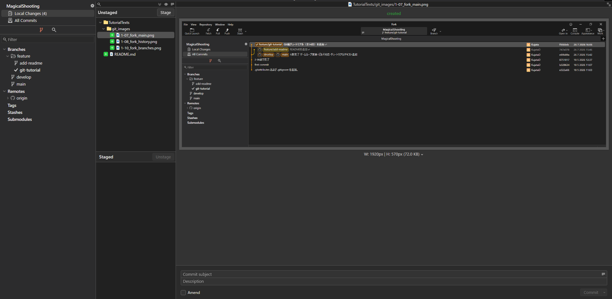
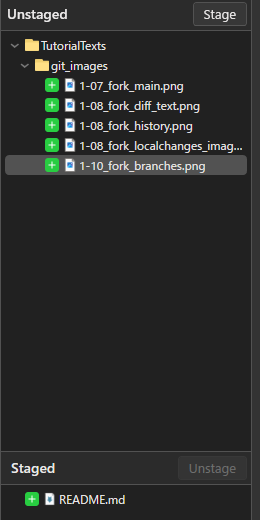
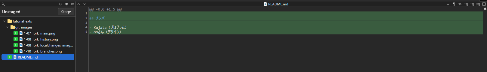
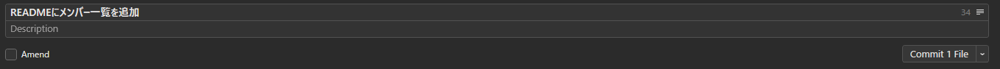
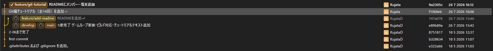

# 【1-08】コミットしよう（変更を記録する）【1章：Git導入編】

1. クリア条件：ファイルを変更して、コミットを1回できればOK！

2. いよいよGitの基本操作、コミットです。

   用語：コミット（commit）
   その時点のファイルの状態を、変更履歴として記録すること。ゲームのセーブに近いですが、**上書きではなく、記録するたびにセーブデータが1つずつ増えていく**タイプです。だから何度でも過去の状態に戻れます。

3. まずは何か変更を作りましょう。練習なので内容は何でもOKです。
   （例：シーンにテキストを1つ追加して保存、画像を1枚Assetsに追加、など）
   ※必ず**Unity側でCtrl+Sして保存**してから、Forkに戻ってください。保存していない変更はGitからは見えません。

4. Forkを開くと、左メニューの一番上に「Local Changes」という項目があり、数字が付いているはずです。この数字が「変更されたファイルの数」です。クリックしてみましょう。

   

   画像ファイルを選ぶと、右側にプレビューが表示されます。素材を差し替えたときの確認に便利です。

5. 画面が上下2つに分かれています。ここがコミットの操作画面です。

   - **上（Unstaged）**：変更されたけど、まだ記録の対象に選んでいないファイル
   - **下（Staged）**：記録の対象に選んだファイル

   用語：ステージング
   「この変更を今回の記録に含める」と選ぶ作業のこと。変更したファイル全部を毎回記録する必要はなく、**今回の作業に関係するファイルだけを選べます**。

6. ファイルを選んで「Stage」ボタン（または右クリック→Stage）を押すと、下に移動します。
   全部まとめて記録するなら、全選択して「Stage」でOKです。

   

   ※ファイルを選ぶと、右側にそのファイルの変更内容が表示されます。テキストファイルなら、**追加した行が緑色**で表示されます。

   

7. 【1-05の復習】.metaファイルも一緒にステージしてください。
   画像を1枚追加すると「Player.png」と「Player.png.meta」の2つが出てくるはずです。**必ずセットで**記録します。片方だけだと、相手の環境で絵が外れます。

8. 下の入力欄に、コミットメッセージを書きます。ここが実は一番大事です。

   用語：コミットメッセージ
   「この変更で何をしたか」を書く一言メモ。あとから履歴を見たとき、**自分とチームメンバーがこれだけを頼りに中身を判断します**。

9. 良いメッセージと悪いメッセージの例を挙げます。

   | ❌ 悪い例 | ⭕ 良い例 |
   |---|---|
   | 修正 | 敵キャラの当たり判定を小さく修正 |
   | aaa | タイトル画面のロゴ画像を差し替え |
   | いろいろ | プレイヤーの移動速度を5.0に調整 |
   | (空欄) | ゲームオーバー時のBGMを追加 |

   コツは「**何を**」「**どうしたか**」を書くことです。3ヶ月後の自分は「修正」の中身を覚えていません。

10. メッセージを書いたら「Commit」ボタンを押します。これで記録完了です！

    

    ※ボタンに「Commit 1 File」のように対象ファイル数が表示されます。意図した数になっているか確認してから押しましょう。

11. 左メニューの「All Commits」（変更履歴）を見てみましょう。今のコミットが、名前とメッセージ付きで一番上に追加されているはずです。

    

    左端のカラフルな線は、ブランチ（作業場所）の枝分かれを表しています。今は意味が分からなくてOKです。1-10で扱います。

12. 【コツ】コミットは細かく、こまめに
    「1日の終わりにまとめて1回」ではなく、「1つの作業が終わるたびに1回」がおすすめです。

    - ❌ 「今日やったこと全部」を1回で記録（戻れる場所が粗くなる）
    - ⭕ 「敵の絵を追加」「敵のサイズ調整」「敵の色味修正」と3回に分ける（ピンポイントで戻れる）

13. コミットが履歴に表示されたら、今回は完成です！
    ……ただし、これはまだ**自分のPCの中だけ**の記録です。チームにはまだ何も届いていません。次回、GitHubに送ります。
