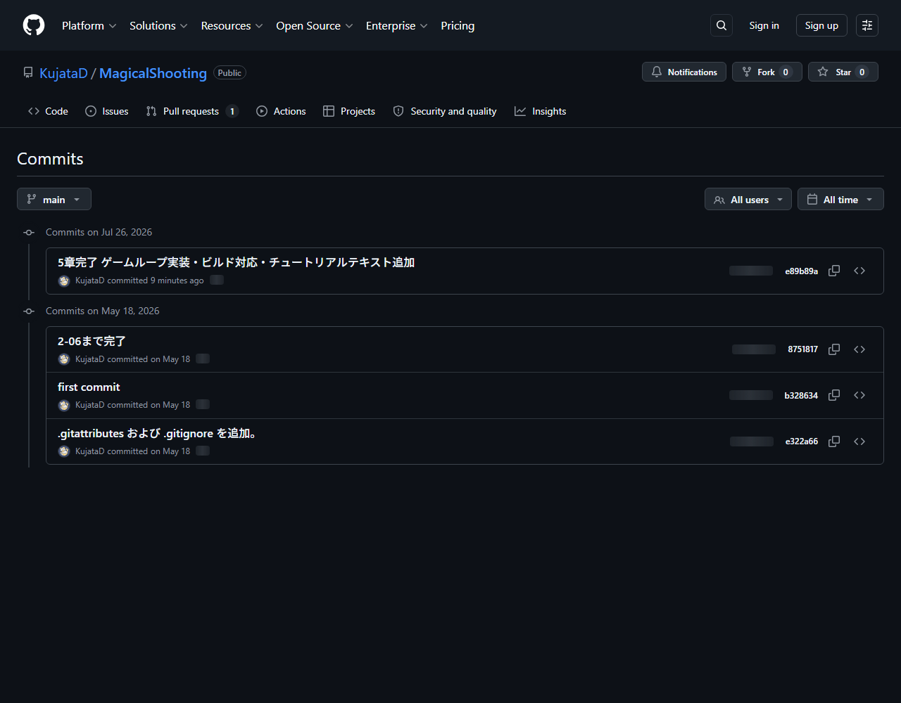

# 【1-08】コミットしよう（セーブポイントを刻む）【1章：Git導入編】

1. クリア条件：ファイルを変更して、コミットを1回作る

2. いよいよGitの基本動作、コミットです。これはゲームで言う**セーブ**にあたります。

   用語：コミット（commit）
   その時点のファイルの状態を、履歴として記録すること。**上書きセーブではなく、セーブデータが毎回増えていくタイプのセーブ**。だから何度でも過去に戻れます。

3. まずは何か変更を作りましょう。何でもいいのですが、練習ならUnityで簡単な変更を1つしてみてください。
   （例：シーンにテキストを1つ追加して保存、画像を1枚Assetsに追加、など）
   ※必ず**Unity側でCtrl+Sして保存**してから、Forkに戻ってください。保存していない変更はGitからは見えません。

4. Forkを開くと、左メニューの一番上に「Local Changes」という項目があり、数字が付いているはずです。この数字が「変更されたファイルの数」です。クリックしてみましょう。

   【スクショ：ForkのLocal Changes画面】

5. 画面が上下2つに分かれています。ここがコミットの操作盤です。

   - **上（Unstaged）**：変更されたけど、まだセーブ対象に選んでいないファイル
   - **下（Staged）**：セーブ対象に選んだファイル

   用語：ステージング
   「この変更をセーブに含める」と選ぶ作業。**カメラのファインダーを覗いて、写す範囲を決める作業**だと思ってください。全部写す必要はなく、今回の作業に関係するものだけ選べます。

6. ファイルを選んで「Stage」ボタン（または右クリック→Stage）を押すと、下に移動します。
   全部まとめて送るなら「Stage All」でOK。

   ※このとき、右側にそのファイルの変更内容が表示されます。画像なら**変更前と変更後を並べて見られる**ので、デザイナーさんには嬉しい機能です。

7. 【1-05の復習】.metaファイルも一緒にステージしてください。
   画像を1枚追加すると「Player.png」と「Player.png.meta」の2つが出てくるはずです。**必ずセット**で。片方だけコミットすると、相手の環境で絵が外れます。

8. 下の入力欄に、コミットメッセージを書きます。ここが実は一番大事です。

   用語：コミットメッセージ
   「この変更で何をしたか」の一言メモ。**未来の自分とチームメンバーへの手紙**です。

9. 良いメッセージと悪いメッセージの例を挙げます。

   | ❌ 悪い例 | ⭕ 良い例 |
   |---|---|
   | 修正 | 敵キャラの当たり判定を小さく修正 |
   | aaa | タイトル画面のロゴ画像を差し替え |
   | いろいろ | プレイヤーの移動速度を5.0に調整 |
   | (空欄) | ゲームオーバー時のBGMを追加 |

   コツは「**何を**どうしたか」を書くこと。3ヶ月後の自分は、絶対に「修正」の中身を覚えていません。

10. メッセージを書いたら「Commit」ボタンを押します。これでセーブ完了！

11. 左メニューの「All Commits」（履歴）を見てみましょう。あなたのコミットが、名前とメッセージ付きで一番上に追加されているはずです。

    

12. 【コツ】コミットは細かく、こまめに
    「1日の終わりにまとめて1回」ではなく、「1つの作業が終わるたびに1回」がおすすめです。
    - ❌ 「今日やったこと全部」（何かあった時に戻る場所が粗い）
    - ⭕ 「敵の絵を追加」「敵のサイズ調整」「敵の色味修正」（ピンポイントで戻れる）

    セーブポイントは、多くて困ることはありません。

13. コミットが履歴に表示されたら、今回は完成です！
    ……ただし、これはまだ**自分のPCの中だけ**の話。チームには何も届いていません。次回、いよいよ倉庫に送ります。

14. ↓ーーー　質問コーナー　ーーー↓
