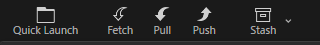
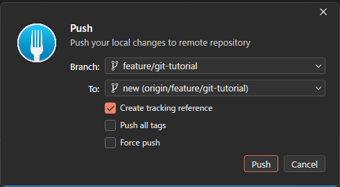

# 【1-09】プッシュ＆プルしよう（納品と仕入れ）【1章：Git導入編】

1. クリア条件：自分のコミットをGitHubに送り、メンバーの変更を受け取る

2. 前回のコミットは、実は**まだ自分のPCの中だけ**の出来事でした。
   Gitは「手元の倉庫」と「ネットの倉庫（GitHub）」の2階建てになっていて、この2つは自動では同期しません。自分のタイミングで送ったり受け取ったりします。

3. 今回覚える操作は2つ。往復するだけです。

   | 操作 | 向き | たとえるなら |
   |---|---|---|
   | **プッシュ（push）** | 自分 → GitHub | 納品する |
   | **プル（pull）** | GitHub → 自分 | 仕入れる |

   用語：プッシュ / プル
   push は「押し出す」、pull は「引っぱる」。自分から見て、荷物を押し出すのか、引き寄せるのか、と覚えると迷いません。

4. まずプッシュしてみましょう。Forkの上部ツールバーにある「Push」ボタン（↑の矢印アイコン）を押します。

   

   ※左から Quick Launch / Fetch / **Pull** / **Push** / Stash。今回使うのは3番目と4番目です。

5. 確認ダイアログが出るので、そのまま「Push」を押せばOK。
   数秒待って、エラーが出なければ納品完了です。

   

   ※「Create tracking reference」にチェックが入っていればそのままでOK。これは「このブランチをGitHub側と紐づける」という意味です。

   ※初回はGitHubのログインを求められることがあります。1-04で連携していれば自動で通ります。

6. GitHubのリポジトリページをブラウザで開いて、リロードしてみてください。
   さっきのコミットメッセージが、ちゃんとサイトに反映されているはずです。これでチーム全員があなたの作業を見られる状態になりました。

7. 次はプル。他のメンバーが納品したものを受け取る操作です。
   さっきのツールバーの「Pull」ボタン（↓の矢印アイコン）を押すだけ。こちらも確認ダイアログでそのままOKで大丈夫です。

8. 【超重要】作業を始める前は、必ずプルする

   これはチーム制作の**鉄の掟**です。理由を絵で説明します。

   ```
   ✕ 悪い例：プルしないで作業
      Aさん：古いデータのまま作業 → 納品しようとする
      GitHub：「その間に他の人が更新してるよ」→ 拒否される
      Aさん：手作業で合体させるハメに（つらい）

   ⭕ 良い例：作業前にプル
      Aさん：最新を取得 → 作業 → 納品（すんなり通る）
   ```

   Unityを開く前に、まずForkでPull。これを習慣にしてください。**朝イチのメールチェックと同じ**だと思ってください。

9. 【Unity特有の注意】プルする前に、Unityは閉じておく

   Unityを開いたままプルすると、Unityが「開いているファイルが勝手に書き換わった！」と混乱して、最悪プロジェクトが壊れます。
   安全な手順はこれです。

   1. Unityで作業 → 保存 → **Unityを閉じる**
   2. Forkでプル
   3. Unityを開き直す

   ※慣れてくると開いたままでも大丈夫な場面は分かりますが、最初は必ず閉じましょう。

10. 【エラーが出たら】「Push rejected」と言われた場合

    これは「あなたが作業している間に、他の人が先に納品したよ」という意味です。焦らなくて大丈夫。

    1. まず **Pull** する（相手の変更を受け取る）
    2. 自動で合体できれば、そのまま **Push** し直す
    3. 合体に失敗した（コンフリクト）場合は、1-13で対処法をやります

11. プッシュしてGitHub上で確認できて、プルもできたら、今回は完成です！
    これでGitの基本操作（コミット・プッシュ・プル）は全部そろいました。次回からは、チームで衝突しないための仕組みに入ります。

12. ↓ーーー　質問コーナー　ーーー↓
