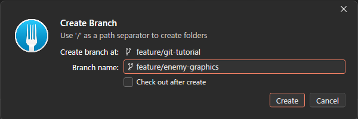
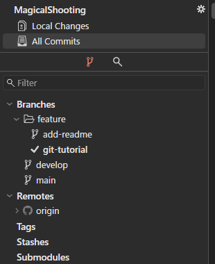

# 【1-10】ブランチってなに？【1章：Git導入編】

1. クリア条件：ブランチを1本作って、切り替えられればOK！

2. ここまでで、1人での作業はできるようになりました。でもチーム全員が同じ場所に送り続けると、こうなります。

   - Aさんが作業途中の「まだ動かない敵キャラ」を送る
   - Bさんがそれを受け取る → **ゲームが起動しなくなる**
   - Bさん「動かないんだけど！」
   - Aさん「ごめん、作業途中で……」

   これを防ぐのがブランチです。

3. ブランチとは、**他の人に影響を与えずに作業できる、独立した作業場所**のことです。

   用語：ブランチ（branch）
   直訳は「枝」。元の状態から枝分かれさせて作る作業用のコピーのこと。**枝の中で何をしても、元の状態や他の人の枝には影響しません**。作業が終わってから、元の場所に合流させます。

4. 具体的には、こういう使い分けをします。

   - **main**：完成している状態を置いておくブランチ。ここは常に動く状態を保つ
   - **feature/○○**：自分の作業用のブランチ。ここで好きなだけ試して、途中で壊れていてもOK

   作業が完成したら、featureブランチの内容をまとめて合流させます。詳しいルールは次回（1-11）決めます。

5. では実際に作ってみましょう。Forkの左メニューに「Branches」という項目があり、今は `main` だけがあるはずです。

6. ブランチを作るには、画面右上の「Branch」ボタン（またはメニューの `Repository > Create Branch`）を押します。

   

   ※「Create branch at」は「どこから枝分かれさせるか」の指定です。今いるブランチが自動で入ります。
   ※「Check out after create」にチェックを入れると、作成と同時にそのブランチに移動します。入れておくと便利です。

7. 名前を付けます。ここでルールがあります。

   ```
   feature/作業内容
   ```

   例：
   - `feature/enemy-graphics`（敵の絵を作る）
   - `feature/title-ui`（タイトル画面のUI）
   - `feature/bgm`（BGM追加）

   「/」で区切ると、Forkの画面上でフォルダのようにまとまって表示されて見やすくなります。日本語も使えますが、トラブルの原因になるので**半角英数**にしてください。

8. 「Create Branch」を押すと、新しいブランチができて、**自動でそちらに切り替わります**。

   用語：チェックアウト（checkout）
   作業するブランチを切り替えること。切り替えると、**プロジェクトフォルダの中身が、そのブランチの状態に入れ替わります**。Gitが履歴から復元しているだけなので、ファイルが消えたわけではありません。

9. 【重要】今どのブランチにいるか、必ず確認するクセをつける

   Forkの左メニューで、**チェックマーク（✔）が付いているのが現在のブランチ**です。作業を始める前にここを確認してください。
   「mainで作業してしまった」は、最初のうち一番多いミスです（直し方は1-14の逆引き表に載せます）。

   

   ※`feature` の下に枝がぶら下がって見えるのは、`feature/○○` という名前の「/」でForkが自動的にフォルダ分けして表示しているためです。

10. 試しに、ブランチを行き来してみましょう。

    - featureブランチで何かファイルを追加してコミット
    - mainにチェックアウト（ブランチ名をダブルクリックで切り替え）
    - **エクスプローラーでフォルダを見ると、追加したファイルが無くなっている**
    - featureに戻すと、また現れる

    消えたのではなく、ブランチごとに中身が切り替わっているだけです。これがブランチの感覚です。

    ※ブランチを切り替えるときも、Unityは閉じておきましょう（1-09と同じ理由です）。

11. ブランチを作って、切り替えができたら、今回は完成です！
    次回は、チームでブランチをどう使い分けるかのルールを決めます。
