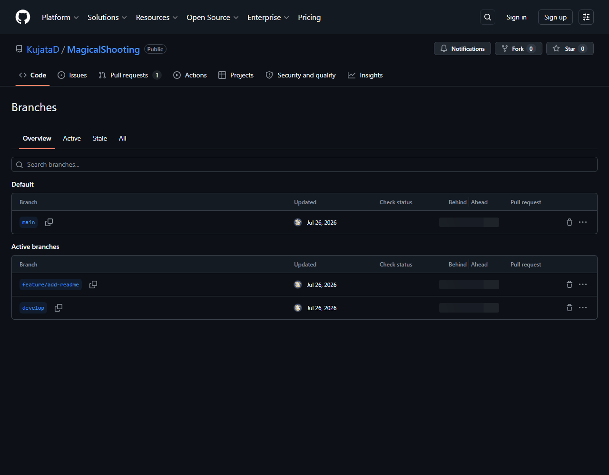

# 【1-11】main / develop / feature で運用しよう【1章：Git導入編】

1. クリア条件：3種類のブランチの役割が分かって、チームのルールを決められればOK！

2. 前回でブランチを作れるようになりました。ただ、全員が好きなようにブランチを作ると管理しきれなくなります。
   そこで、ブランチを**3種類に分けて**使います。これは多くの開発チームで使われている定番のやり方です。

3. 3つのブランチの役割はこうです。

   | ブランチ | 役割 | 状態 |
   |---|---|---|
   | **main** | 完成版。提出・公開できる状態を保つ | 常に動く |
   | **develop** | 開発版。全員の作業がここに集まる | だいたい動く |
   | **feature/○○** | 個人の作業用。1タスクにつき1本 | 途中で壊れていてOK |

4. 図にするとこうです。作業は下から上に合流していきます。

   ```
   main     ●────────────────────●  ← 完成したときだけ更新
             \                  /
   develop    ●──────●───────●─●    ← 日々ここに集まる
               \    /  \    /
   feature/A    ●──●    \  /        ← 敵の絵を作る人
   feature/B            ●●          ← UIを作る人
   ```

5. ルールは3つだけです。

   - **mainには直接コミットしない**
   - **developにも直接コミットしない**（プルリクエスト経由で入れます。1-12でやります）
   - **作業は必ずfeatureブランチを作ってから**

   「じゃあどこで作業するの？」→ **常にfeatureです**。これだけ覚えてください。

6. 【なぜmainを直接触らないのか】
   提出日に「今の状態をとりあえず出そう」となったとき、mainが常に動く状態になっていれば、そこから出せば済みます。
   逆にmainが壊れていると、提出直前に慌てることになります。**mainは最後の避難先**として、きれいなまま置いておきます。

7. featureブランチの名前は、作業内容が分かるように付けます。

   ```
   feature/enemy-graphics     敵キャラの絵
   feature/title-ui           タイトル画面
   feature/bgm-stage1         ステージ1のBGM
   feature/fix-player-speed   プレイヤー速度の調整
   ```

   ポイントは「**1つのブランチ＝1つの作業**」。
   「今日やること全部」を1本に詰め込むと、あとで中身を確認する人が大変になります。半日〜2日で終わるくらいの大きさが目安です。

8. では実際に、チームのdevelopブランチを作りましょう（**代表の人が1回だけやればOK**）。

   - Forkで `main` にいることを確認
   - Branch（新規作成）→ 名前を `develop` にして作成
   - **Push** して、GitHub側にもdevelopを作る

9. GitHubのリポジトリページで「Branches」を見ると、mainとdevelopの2本があるはずです。

   

10. 【代表の人向け・おすすめ】mainを保護する

    GitHubには「このブランチには直接送れないようにする」設定があります。ミスを仕組みで防げるので、設定しておくと安心です。

    - リポジトリの `Settings > Branches`
    - 「Add branch ruleset」または「Add rule」
    - Branch name pattern に `main` を入力
    - 「Require a pull request before merging」にチェック

    これで、うっかりmainに直接送ろうとしても、GitHubが止めてくれます。

11. 【メンバー全員でやること】自分の作業ブランチを作る

    developができたら、各自こうします。

    1. Forkで `develop` にチェックアウト
    2. **Pull**（最新のdevelopにする）
    3. Branch（新規作成）で `feature/自分の作業名` を作成
    4. そこで作業開始！

    ※featureは**必ずdevelopから枝分かれさせて**ください。mainから作ると、他の人の作業が入っていない古い状態から始まってしまいます。

12. developブランチができて、各自がfeatureブランチを持てたら、今回は完成です！
    次回は、featureで終わった作業をdevelopに合流させる手続きをやります。
