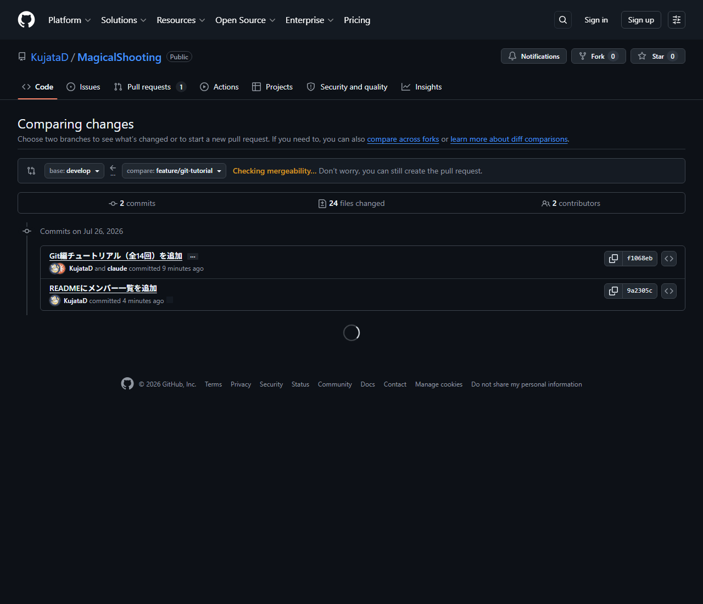
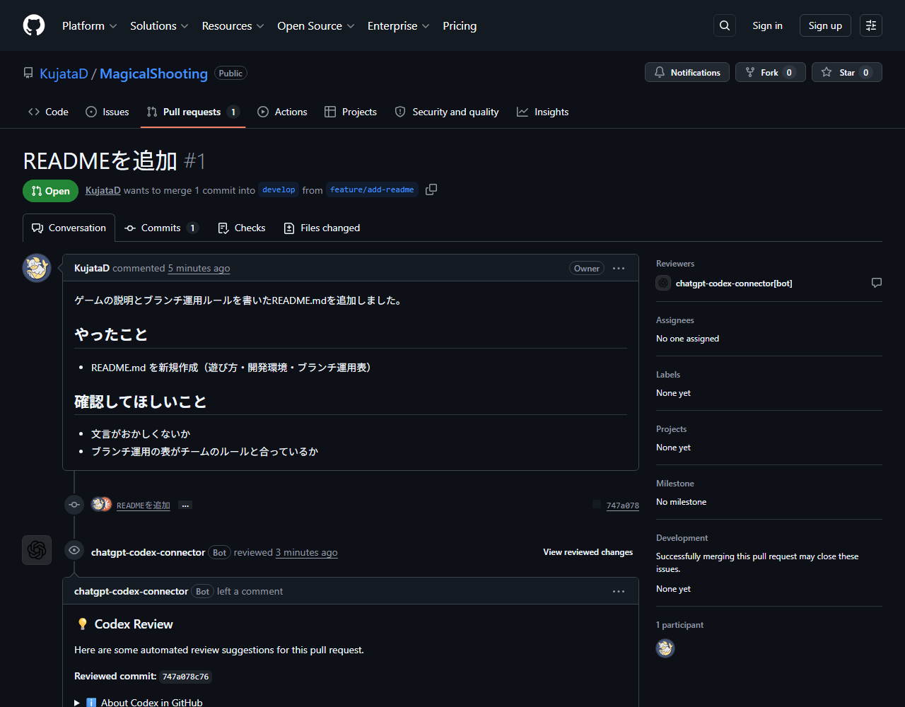
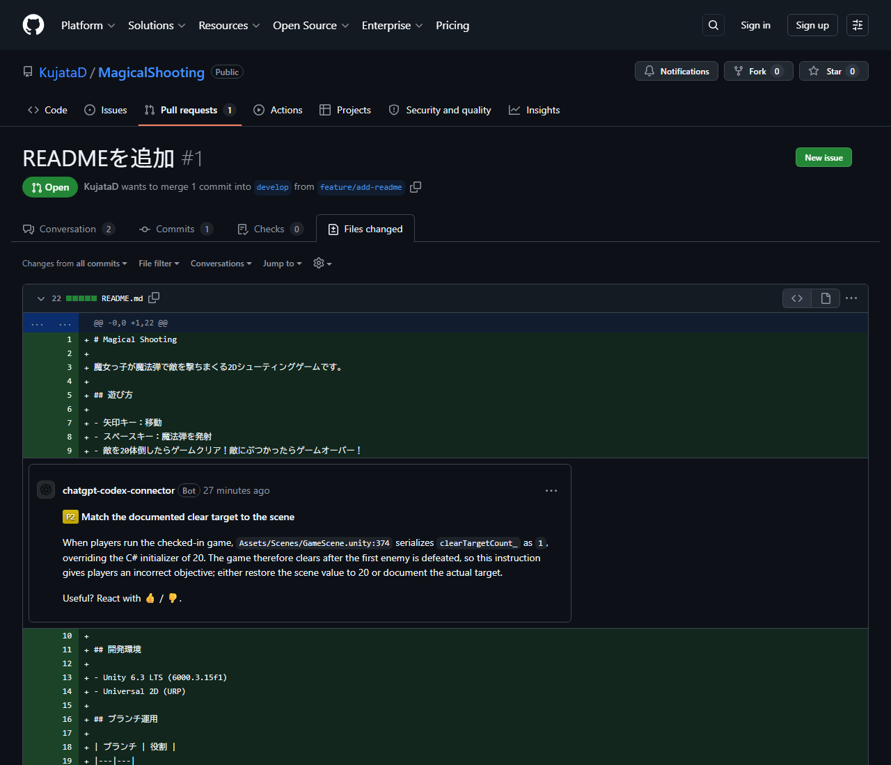

# 【1-12】プルリクエストを出そう【1章：Git導入編】

1. クリア条件：featureブランチからdevelopへのプルリクエストを1本作る

2. featureブランチで作業が終わりました。これをdevelopに合流させたいのですが、勝手に合流させると誰も気づきません。
   そこで、**「合流させていいですか？」とチームにお伺いを立てる**手続きを踏みます。これがプルリクエストです。

   用語：プルリクエスト（Pull Request、略してPR）
   「私の作業を取り込んでください」というお願い。**提出箱**、あるいは**校正依頼**だと思ってください。出すと、他のメンバーが中身を確認して、OKなら合流させます。

3. デザインの現場で言えば、**クライアントチェック**に近いです。
   - 自分の作業（feature）が完成した
   - いきなり本番に載せず、まず確認してもらう（PR）
   - 修正指摘があれば直す
   - OKが出たら本番に反映（マージ）

4. まず、作業をプッシュします。1-09でやったやつです。
   Forkで自分のfeatureブランチにいることを確認して、コミット → **Push**。

   ※初回のプッシュ時は「Publish branch」のような表示になります。これはGitHub側にまだこのブランチが無いので、新しく作るという意味です。そのままPushでOK。

5. プッシュしたら、GitHubのリポジトリページをブラウザで開いてください。
   黄色い帯で「feature/○○ had recent pushes」と表示され、「Compare & pull request」という緑のボタンが出ているはずです。これを押します。

   ※出ていない場合は、上部メニューの「Pull requests」→「New pull request」からでもOK。

6. 【最重要】合流先（base）の確認

   PR作成画面の上部に、こういう表示があります。

   ```
   base: main  ←  compare: feature/enemy-graphics
   ```

   **ここのbaseを `develop` に変更してください。**
   デフォルトだとmainになっていることが多いですが、1-11のルール通り、featureはdevelopに合流させます。

   ```
   base: develop  ←  compare: feature/enemy-graphics   ⭕ これが正解
   ```

   

7. タイトルと説明を書きます。

   - **タイトル**：何をしたか一言（例：「敵キャラのグラフィックを追加」）
   - **説明**：もう少し詳しく

   説明のテンプレートを置いておきます。これに沿って書けば十分です。

   ```markdown
   ## やったこと
   - 敵キャラ（お化け）の画像を3種類追加
   - Enemyプレハブの見た目を差し替え

   ## 確認してほしいこと
   - サイズ感が他のキャラと合っているか
   - 色味が背景と喧嘩していないか

   ## スクショ
   （ここに画像をドラッグ＆ドロップで貼れます）
   ```

   ※GitHubの説明欄は、**画像をドラッグ&ドロップでそのまま貼れます**。デザイナーさんは変更前後のスクショを貼ると、レビューする人がとても助かります。

8. 「Create pull request」を押せば、PRの完成です！

   

9. PR画面には便利なタブがあります。

   - **Conversation**：コメントのやり取り。ここで議論します
   - **Commits**：このPRに含まれるコミット一覧
   - **Files changed**：**変更されたファイルの中身が全部見られる**タブ。画像も変更前後を並べて表示できます

   「Files changed」は、レビューするときのメイン画面です。行にマウスを乗せると「＋」が出て、**ピンポイントでコメント**を付けられます。

   

   ※このスクショ、実は自動レビューBotが「READMEには敵20体でクリアと書いてあるけど、シーンの設定は1体になってるよ」と指摘してくれているところです。こういう食い違いを、合流前に見つけられるのがPRの価値です。

10. PRを出したら、チームに一声かけましょう。

    > 「敵の絵のPR出しました！レビューお願いします 🙏」

    GitHubは通知を出しますが、埋もれがちです。DiscordやSlackで言うのが確実です。

11. 【レビューする側になったら】
    難しく考えなくて大丈夫です。見るのはこの3点だけ。

    - 意図した変更だけが入っているか（関係ないファイルが混ざっていないか）
    - 明らかにおかしいところがないか
    - 自分の作業と衝突しそうな部分がないか

    問題なければ「Files changed」→「Review changes」→「Approve」でOKサインを出します。
    気になる点があれば、コメントを残して「Request changes」。遠慮せず質問して大丈夫です。**PRは指摘の場ではなく、共有の場**です。

12. PRが作れて、レビュー依頼まで出せたら、今回は完成です！
    次回、いよいよ合流させます。

13. ↓ーーー　質問コーナー　ーーー↓
