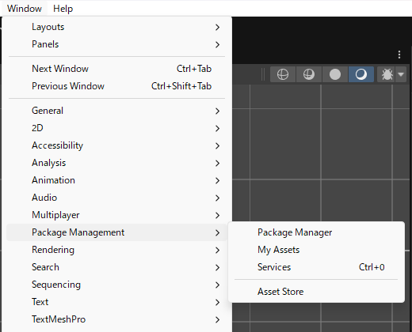
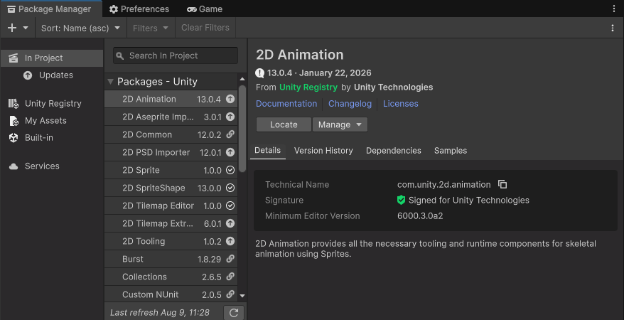
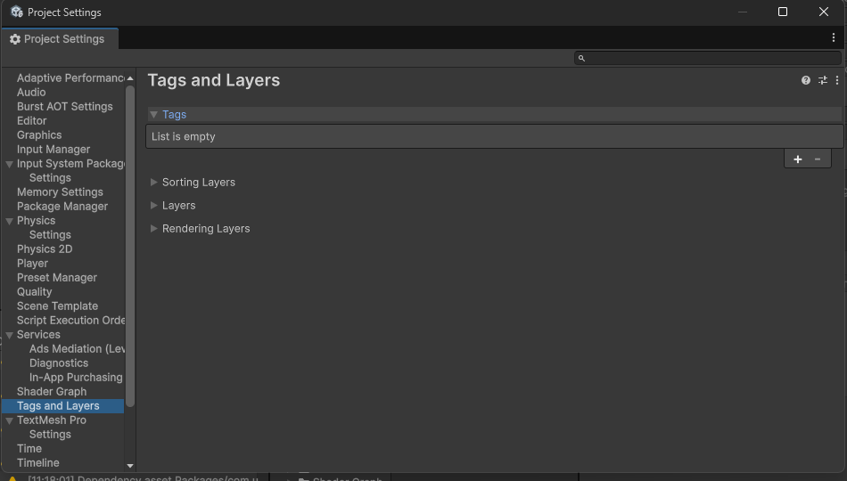
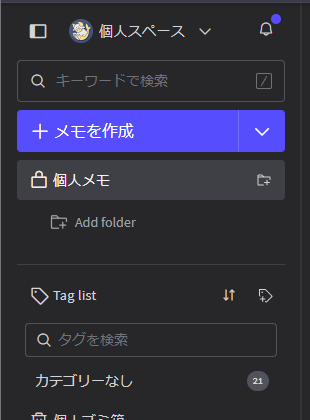
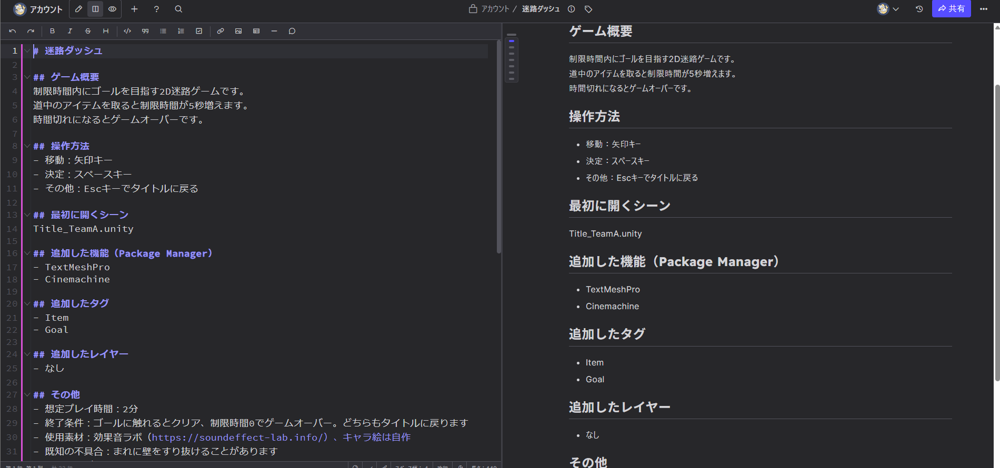
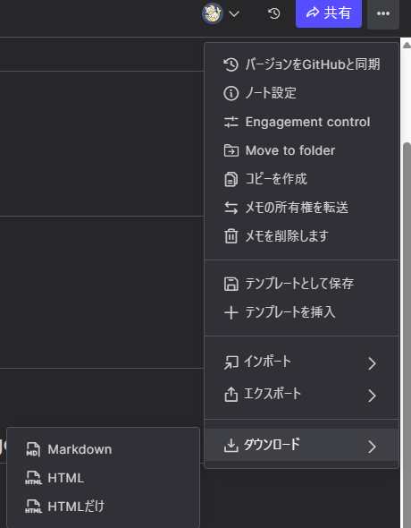
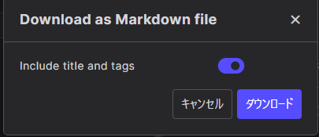

# 【3】ReadMe.mdを書く

1. パッケージのファイルだけ渡されても、迷とら運営には「どう操作するのか」「どのシーンから始まるのか」「何を追加したのか」が分かりません。
   そこで、**説明書のファイルを一緒に提出します**。名前は `ReadMe.md` に統一します。

   用語：ReadMe（リードミー）
   「最初に読んでね」という意味の、説明書ファイルの定番の名前。フォルダの中にReadMeがあれば、まずそれを読むという習慣があります。

   用語：.md（マークダウン）
   文字だけで見出しや箇条書きを書けるファイル形式。`#` を付ければ見出し、`-` を付ければ箇条書きになります。

2. まず、書く内容のうち**調べないと分からない2つ**を先に確認します。

3. 【調べる1】Package Managerで追加した機能

   TextMeshPro、Cinemachine、DOTweenなど、後から追加した機能は**パッケージに入りません**。統合プロジェクトに同じものを入れてもらう必要があるので、名前を控えます。

   `Window > Package Management > Package Manager` を開きます。

   

   左側の「In Project」を選ぶと、このプロジェクトで使っている機能の一覧が表示されます。

   

   問題は、この一覧には**Unityに最初から入っているものと、自分で追加したものが混ざって表示される**ことです。見分けがつかない人向けに、確実な方法を2つ紹介します。

   **方法1：最初から入っている一覧と見比べる**

   2Dのテンプレートでプロジェクトを作った場合、以下は最初から入っています。一覧の中にこれらの名前があっても、気にしなくて大丈夫です。

   ```
   2D Animation
   2D Aseprite Importer
   2D PSD Importer
   2D Sprite
   2D SpriteShape
   2D Tilemap Editor
   2D Tilemap Extras
   2D Tooling
   Input System
   Multiplayer Center
   Universal RP
   Test Framework
   Timeline
   Visual Scripting
   Version Control
   Visual Studio Editor（または JetBrains Rider Editor）
   ```

   **一覧の中に、この中に無い名前があれば、それが自分で追加した機能です。**（例：TextMeshPro、Cinemachine、DOTween など）

   ※3Dなど別のテンプレートで作った人は、最初から入っているものが多少変わります。次の方法2で確認してください。

   **方法2：まっさらな新規プロジェクトと見比べる（確実）**

   一番確実なのは、**UnityHubで自分のミニゲームと同じテンプレート・同じバージョンの新規プロジェクトを作り**、そのPackage ManagerのIn Project一覧を見ることです。
   何も追加していない状態のプロジェクトなので、そこに表示される名前が「最初から入っているもの」そのものです。自分のプロジェクトの一覧と見比べて、**新規プロジェクトの方には無い名前**が、自分で追加した機能です。

4. 【調べる2】自分で追加したタグ・レイヤー

   `Project Settings` の中身は、パッケージには**一切入りません**。自分で追加したタグやレイヤーがあると、統合先では存在しないため、実行時にエラーで止まります。

   `Edit > Project Settings...` を開いて、左のリストから「Tags and Layers」を選び、「Tags」の欄を開きます。

   

   ※スクショのように「List is empty」と表示されていれば、自分で追加したタグは無いということです。この場合は「なし」と書きます。
   ※`Untagged` `MainCamera` `Player` などの最初からあるタグは、統合先にも最初からあるので大丈夫です。

5. ここからReadMe.mdを作ります。使うのは **HackMD** というWebサービスです。

   用語：HackMD
   ブラウザ上でマークダウン（.md）を書けるサービス。左に書いた文字が、右にすぐ表示されて確認できます。**WindowsでもMacでも同じ画面**なので、メモ帳やテキストエディットの違いを気にせずに済みます。

   https://hackmd.io/

   ※アカウント登録が必要です。GoogleアカウントやGitHubアカウントでログインできます。

6. ログインしたら、左上の「＋ メモを作成」を押します。

   

7. 空のメモが開くので、下のテンプレートを**そのままコピーして貼り付け**、中身を自分のゲームの内容に書き換えます。

   ```markdown
   # ゲームタイトル

   ## ゲーム概要
   （どんなゲームか2〜3行で。ジャンル、目的、勝敗条件など）

   ## 操作方法
   - 移動：
   - 決定：
   - その他：

   ## プレイ制限時間
   （15秒〜5分の範囲で。この時間でゲームが強制終了されます）

   ## ゲームのテーマカラーを1色選ぶなら
   （6桁カラーコードで1色。#000000〜#ffffffの1,677万色から選んでください）

   ## まとめPV用の説明とタイトルの読み方
   - 50文字以内の説明：
   - タイトルの正しい読み方（ひらがな）：

   ## 最初に開くシーン
   （例：Title_TeamA.unity）

   ## 追加した機能（Package Manager）
   - 無ければ「なし」

   ## 追加したタグ
   - 無ければ「なし」

   ## 追加したレイヤー
   - 無ければ「なし」

   ## その他
   - 終了条件：（どうなったらゲームが終わるか）
   - 使用素材：（配布サイトの名前とURL。自作なら「自作」）
   - 既知の不具合：
   - 制作メンバー：
   - 連絡先：（DiscordのID）
   ```

8. 書くと、左に入力した内容が右にすぐ表示されます。見出しや箇条書きがきれいに表示されていれば、書き方は合っています。

   

9. 書いたときの例です。テンプレートを埋めるとこうなります。

   ```markdown
   # 迷路ダッシュ

   ## ゲーム概要
   制限時間内にゴールを目指す2D迷路ゲームです。
   道中のアイテムを取ると制限時間が5秒増えます。
   時間切れになるとゲームオーバーです。

   ## 操作方法
   - 移動：矢印キー
   - 決定：スペースキー
   - その他：Escキーでタイトルに戻る

   ## プレイ制限時間
   40秒

   ## ゲームのテーマカラーを1色選ぶなら
   #2b2f77

   ## まとめPV用の説明とタイトルの読み方
   - 50文字以内の説明：壁の向こうにゴールが見える。あと一歩、あと一歩が命取り。試されるのは記憶力と度胸だ。
   - タイトルの正しい読み方（ひらがな）：めいろだっしゅ

   ## 最初に開くシーン
   Title_TeamA.unity

   ## 追加した機能（Package Manager）
   - TextMeshPro
   - Cinemachine

   ## 追加したタグ
   - Item
   - Goal

   ## 追加したレイヤー
   - なし

   ## その他
   - 終了条件：ゴールに触れるとクリア、制限時間0でゲームオーバー。どちらもタイトルに戻ります
   - 使用素材：効果音ラボ（https://soundeffect-lab.info/）、キャラ絵は自作
   - 既知の不具合：まれに壁をすり抜けることがあります
   - 制作メンバー：○○、△△
   - 連絡先：Discord @maruo
   ```

   「追加した機能」と「追加したタグ」は、手順3・4で調べた内容をそのまま書き写せばOKです。

9. 各項目が何に使われるかを知っておくと、書く内容に迷いません。

   | 項目 | 迷とら運営がこう使う |
   |---|---|
   | ゲームタイトル | タイトル画面のメニューに表示する名前になる |
   | ゲーム概要 | 遊び方が分からないときに読む。紹介文にも使う |
   | 操作方法 | 動作確認に必要。遊ぶ人への案内にも使う |
   | **プレイ制限時間** | **この時間を過ぎるとゲームが強制終了されます。最短15秒〜最長5分の範囲で書いてください**。実際の時間と大きくずれていると、遊びきる前に終了したり、次のミニゲームに進めなくなります |
   | ゲームのテーマカラー | サムネイルやロゴなど、ミニゲーム集全体の見た目を揃えるときの色の目安に使います |
   | まとめPV用の説明とタイトルの読み方 | 全チームのミニゲームを紹介するまとめPVで、そのまま**ナレーションやテロップ**に使います |
   | 最初に開くシーン | タイトル画面から**このシーンへつなぎます**。これが無いと組み込めません |
   | 追加した機能 | 統合プロジェクトに同じ機能を入れます。無いとエラーで動きません |
   | 追加したタグ | 統合プロジェクトに同じタグを追加します。無いと実行時に止まります |
   | 追加したレイヤー | 同上。当たり判定に関わるので、抜けると挙動が変わります |
   | 終了条件 | ミニゲームが終わったらタイトルに戻す処理を入れるときに使います |
   | 使用素材 | 配布サイトによっては表記が必要です。まとめてクレジットに載せます |
   | 既知の不具合 | 統合後に発覚したとき「元からか、統合で壊れたか」の判断材料になります |
   | 連絡先 | 統合中に不明点が出たとき、すぐ確認できます |

10. 書けたら、ファイルとして書き出します。右上の「…」→「ダウンロード」→「Markdown」を選びます。

    

11. 確認画面が出るので、そのまま「ダウンロード」を押します。

    

    ※「Include title and tags」をオンのままにすると、ファイルの先頭にタイトル情報の数行が追加されます。付いていても問題ありませんが、気になる場合はオフにしてください。

12. ダウンロードしたファイルは、**メモのタイトルがそのままファイル名**になっています（例：`迷路ダッシュ.md`）。
    これを **`ReadMe.md`** に名前を変更してください。

13. 名前を変更したら、**自分のミニゲームのフォルダの中**に入れます。

    ```
    Assets/
      └ GameJam_2026_07_TeamA_MazeRunner/
          ├ ReadMe.md      ← ここに置く
          ├ Scenes/
          ├ Scripts/
          └ ...
    ```

    ここに置いてからパッケージを書き出すことで、ReadMe.mdもパッケージに含まれます。

14. 書くときの注意は3つです。

    - **「なし」も書く**。空欄だと「書き忘れ」なのか「無い」のか分かりません
    - シーン名は**拡張子（.unity）まで正確に**。`Title` と `title` の違いでも動きません
    - プレイ制限時間は**15秒〜5分**の範囲で。実際に遊んで測った時間を、単位まで含めて書きます（例：40秒）
    - テーマカラーは**6桁カラーコード1色だけ**。`#` を付けて書きます
    - まとめPV用の説明は**50文字以内**。長いとテロップに入りきりません
    - 【重要】説明文は「制限時間内にゴールを目指す2D迷路ゲーム」のような**ジャンルの説明だけ**になりがちです。それだと全チームの文章が似たり寄ったりになってしまいます。**Nintendo Directの「もうすぐ発売！ ソフトラインナップ」のナレーション**がとても参考になるので、見てみてください。世界観や煽り文句で、自分のゲームらしさを出しましょう
    - タイトルの読み方は**すべてひらがな**で。読み間違えられそうな部分（伸ばす音、濁点など）が分かるように書きます
