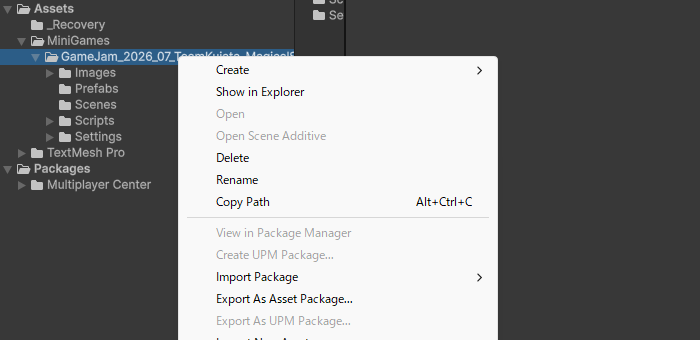
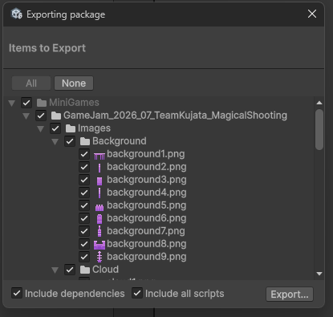
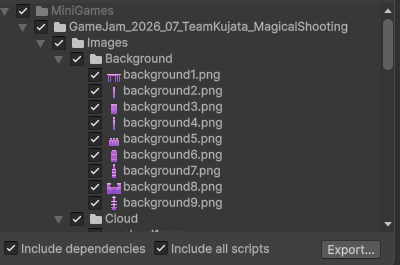
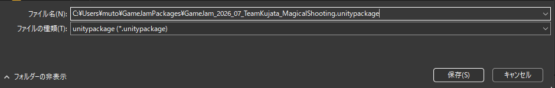

# 【4】パッケージに書き出す

1. フォルダの整理とReadMe.mdの準備ができたら、書き出します。

2. Projectウィンドウで、**自分のミニゲーム用フォルダ（`GameJam_<開始年yyyy>_<開始月mm>_Team<チーム名>_<ゲームタイトル>`）を右クリック**します。
   メニューの中から「**Export As Asset Package...**」を選びます。

   

   ※右クリックするのは **Assets ではありません**。Assetsを右クリックすると、他のフォルダも含めた全部が対象になってしまいます。
   ※選んだフォルダの名前が青くハイライトされていることを確認してから、右クリックしてください。
   ※Unityのバージョンによっては「Export Package...」という名前です。どちらも同じ機能です。

3. 「Exporting package」というウィンドウが開きます。ここが書き出しの設定画面です。

   

4. 書き出す前に、次の2点を確認します。

   **確認1：自分のフォルダより下の階層すべてに、チェックが入っているか**

   

   リストに表示されるのは、選んだフォルダとその中身だけです。すべての行にチェックが入っていれば正しい状態です。
   **【2】の手順どおりに操作していれば、ここは変更する必要はありません。** チェックが外れている行があれば、クリックして入れてください。

   **確認2：下にある2つのチェックボックスが両方オンになっているか**

   - **Include dependencies**：選んだファイルが使っている他のファイルも自動で追加する
   - **Include all scripts**：プロジェクト内のスクリプトをまとめて追加する

   用語：Include dependencies（依存関係を含める）
   例えばプレハブを1つ選んだとき、そのプレハブが使っている画像やスクリプトも一緒に書き出す設定です。**オフにすると、統合先で「絵が付いていない」「スクリプトが無い」状態になります**。特別な理由がなければ、オンのままにしてください。

5. 確認できたら、右下の「**Export...**」ボタンを押します。
   保存先を聞かれるので、分かりやすい場所（デスクトップなど）を選び、ファイル名を入力します。

6. ファイル名は、決められた形式で付けます。

   ```
   GameJam_<開始年yyyy>_<開始月mm>_Team<チーム名>_<ゲームタイトル>
   ```

   例：

   ```
   GameJam_2026_07_TeamA_MazeRunner
   ```

   

   ※スクショは操作画面の例です。実際は自分のチーム名とゲームタイトルを入れてください。
   ※`.unitypackage` の部分は自動で付くので、入力しなくて大丈夫です。
   ※半角英数とアンダースコア（_）だけを使ってください。

7. 「保存」を押すと書き出しが始まります。プロジェクトの大きさによっては1分ほどかかります。
   指定した場所に `.unitypackage` ファイルができていれば成功です。

8. 最後に、ファイルサイズを確認します。

   - **数MB〜数十MB**：正常です
   - **数百バイト〜数KB**：ほとんど中身が入っていません。手順2でフォルダを選び忘れた可能性があります
   - **1GB以上**：本来入らないものが混ざっている可能性があります。書き出す対象を見直してください
