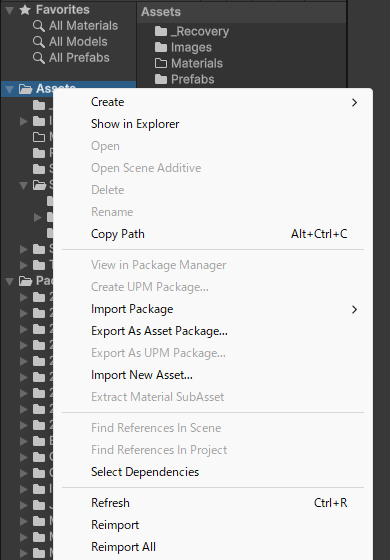
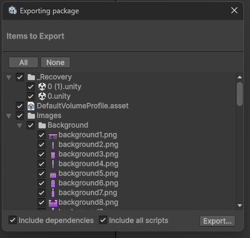

# 【1-04】unitypackageに書き出そう【1章：パッケージ編】

1. クリア条件：決められた名前で .unitypackage ファイルが作れればOK！

2. 準備ができたので、書き出します。操作自体は3ステップで終わります。

3. まず、Projectウィンドウで**自分のミニゲーム用フォルダを右クリック**します。
   メニューの中から「**Export As Asset Package...**」を選んでください。

   

   ※Unityのバージョンによっては「Export Package...」という名前です。どちらも同じ機能です。
   ※`Assets` を右クリックすると全部が対象になります。**必ず自分のフォルダを選んでから**右クリックしてください。

4. 「Exporting package」というウィンドウが開きます。ここが書き出しの設定画面です。

   

   - 中央のリスト：書き出すファイルの一覧。チェックが付いているものが書き出されます
   - **All / None**：全部にチェックを付ける／全部外す
   - リストの各行のチェックボックス：個別に外すこともできます

5. 下にある2つのチェックボックスは、**両方チェックを入れたままにしてください**。

   

   - **Include dependencies**：選んだファイルが使っている他のファイルも自動で追加する
   - **Include all scripts**：プロジェクト内のスクリプトをまとめて追加する

   用語：Include dependencies（依存関係を含める）
   例えばプレハブを1つ選んだとき、そのプレハブが使っている画像やスクリプトも一緒に書き出す設定です。**チェックを外すと、統合先で「絵が付いていない」「スクリプトが無い」状態になります**。特別な理由がなければ、必ずチェックを入れてください。

6. 準備ができたら、右下の「**Export...**」ボタンを押します。
   保存先を聞かれるので、分かりやすい場所（デスクトップなど）を選び、ファイル名を入力します。

7. 【最重要】ファイル名は、決められた形式で付けてください。

   ```
   GameJam_2026_07_Team<チーム名>_<ゲームタイトル>
   ```

   

   ※スクショの例では `GameJam_2026_07_TeamKujata_MagicalShooting.unitypackage` としています。
   ※`.unitypackage` の部分は自動で付くので、入力しなくて大丈夫です。
   ※半角英数とアンダースコア（_）だけを使ってください。

8. 「保存」を押すと書き出しが始まります。プロジェクトの大きさによっては1分ほどかかります。
   指定した場所に `.unitypackage` ファイルができていれば成功です。

9. ファイルサイズを確認しておきましょう。

   - 数MB〜数十MB：正常です
   - 数百バイト〜数KB：ほとんど中身が入っていません。手順3でフォルダを選び忘れた可能性があります
   - 1GB以上：Libraryフォルダなど、本来入らないものが混ざっている可能性があります。書き出す対象を見直してください

10. 決められた名前の .unitypackage ファイルができたら、今回は完成です！
    ただし、**このまま提出してはいけません**。次回、ちゃんと動くかを自分で確認します。
