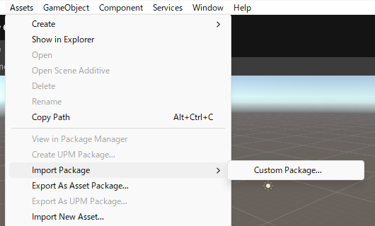
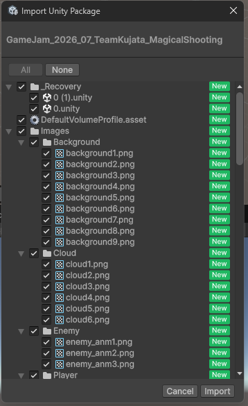
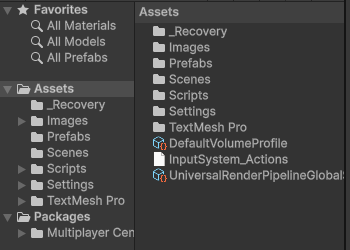
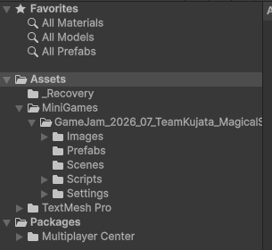
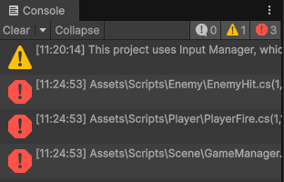
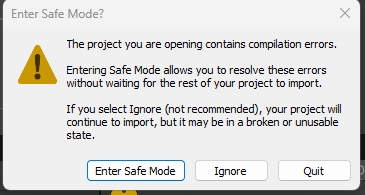

# 【1-07】統合プロジェクトに読み込もう【1章：パッケージ編】

1. クリア条件：受け取ったパッケージを統合プロジェクトに読み込めればOK！

2. ここからは受け取る側、迷とら運営の作業です。
   ※自分が運営でない人も、目を通しておいてください。**自分の提出物がどう扱われるか**が分かると、提出物の作り方が変わります。

3. 全チームのパッケージがそろったら、統合プロジェクトを開きます。
   まだ無ければ、UnityHubで新規プロジェクトを作ってください（テンプレートとバージョンは、チームで決めたものにそろえます）。

4. `Assets > Import Package > Custom Package...` を選びます。

   

5. ファイル選択の画面が出るので、1チーム分のパッケージを選びます。
   ※**必ず1つずつ読み込んでください**。まとめて読み込むと、問題が起きたときにどのチームのものが原因か分からなくなります。

6. 「Import Unity Package」というウィンドウが開きます。中身の一覧が表示されるので、そのまま右下の「Import」を押します。

   

   - 上部にパッケージ名が表示されます。**ここで名前を確認**しておくと、どのチームのものか分かります
   - 緑の「New」は新しく追加されるファイル、「Changed」は既にあるファイルが上書きされるという意味です

   ※「Changed」が出たら要注意です。他のチームのファイルを上書きしようとしている可能性があります。その場合はImportを押さず、提出したチームに確認してください。

7. 読み込みが終わると、Projectウィンドウにファイルが追加されます。

   

   1-02でフォルダをまとめてもらっているので、チームごとにきれいに分かれているはずです。

   

8. 読み込んだら、まず**そのチームのReadMe.mdを開いてください**。

   - 追加した機能 → 統合プロジェクトにも同じものを入れる
   - 追加したタグ・レイヤー → `Edit > Project Settings > Tags and Layers` で追加する
   - 最初に開くシーン → タイトル画面からつなぐ先として控えておく

   ここを先にやっておくと、次のエラー確認がスムーズになります。

9. 【ここからが本番】Consoleを確認する

   赤いエラーが出ていたら、そのチームのミニゲームはまだ動きません。

   

   実際にやってみたところ、3つのエラーが出ました。内容はこれです。

   

   ```
   error CS0234: The type or namespace name 'VisualScripting'
   does not exist in the namespace 'Unity'
   ```

   これは「スクリプトが使っている機能が、このプロジェクトに入っていない」という意味です。1-03で説明した「パッケージに入らないもの」が原因です。

10. 【対処】足りない機能を追加する

    `Window > Package Management > Package Manager` を開いて、エラーに出ている機能を追加します。
    または、その機能を実際には使っていない場合、スクリプトの `using` の行を消せば直ります（提出したチームに確認してから消しましょう）。

11. 【注意】エラーがあるまま再起動すると、Safe Modeになる

    コンパイルエラーが残った状態でUnityを開き直すと、この画面が出ます。

    

    - **Enter Safe Mode**：エラーを直すことに集中できるモードで開く
    - **Ignore**：とりあえず無視して開く（エラーは残ったまま）

    どちらを選んでも、エラーを直さない限りゲームは動きません。**エラーは読み込んだその日に直す**のが鉄則です。

12. 【全チーム分を読み込む手順】

    1チーム読み込む → ReadMe.mdの内容を反映 → エラーを確認 → 直す → 動作確認 → **次のチームを読み込む**

    この順番を必ず守ってください。まとめて読み込むと、エラーが混ざって原因が分からなくなります。

13. 【最後に】シーンをBuild Settingsに登録する

    各ミニゲームのシーンは、読み込んだだけではビルドに含まれません。
    `File > Build Profiles` を開いて、Scene Listに全ミニゲームのシーンを追加してください。
    ※ReadMe.mdの「最初に開くシーン」が、ここで役に立ちます。

14. 全チームのパッケージを読み込めて、エラーが無くなったら、今回は完成です！
    次回は最終回、提出前のチェックリストをまとめます。
