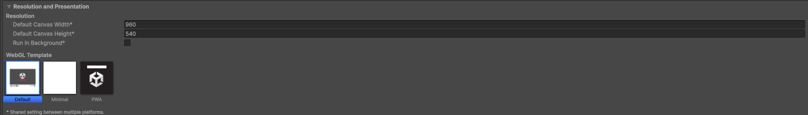
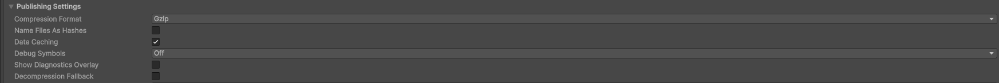

# 【2】ビルド設定を確認する

1. ビルドする前に、Project SettingsをunityroomのWeb向けに合わせておきます。ここを間違えると、アップロードしてもゲームが動きません。

2. Unityで `Edit > Project Settings...` を開き、左のリストから「Player」を選びます。右側の「Settings for Web」の中の「Resolution and Presentation」を開きます。

   

   - **Default Canvas Width**：960
   - **Default Canvas Height**：540

   unityroomの標準的な画面サイズです。この数字と違っていても投稿はできますが、ゲームページ内での表示が窮屈になったり余白ができたりします。

3. 同じ画面の下にある「Publishing Settings」を開きます。

   

   ここが**今回いちばん重要な設定**です。

   - **Compression Format**：Gzip
   - **Decompression Fallback**：チェックを外す

   用語：Compression Format（圧縮形式）
   ビルドしたファイルをどう圧縮するかの設定。ゲーム本体はサイズが大きいので、圧縮せずに配ると読み込みに時間がかかります。unityroomはGzip形式でのアップロードを前提にしているので、ここは必ずGzipにします。

   Decompression Fallbackは「サーバー側で解凍できない場合に、ゲーム側で解凍する」ための機能ですが、unityroomでは**逆にチェックを外しておく必要があります**。入れたままビルドすると、拡張子が `.unityweb` になってしまい、unityroomが求める形式と合わなくなります。

4. 【この2つを間違えるとどうなるか】

   | 設定 | 間違えた場合 |
   |---|---|
   | Compression Format が Gzip 以外 | アップロード後、ゲームが読み込み中のまま止まる |
   | Decompression Fallback にチェックが入ったまま | ファイルの拡張子が `.unityweb` になり、正しくアップロードできない |

   どちらも、**ビルドし直せば直ります**。あとで気づいても大丈夫です。

5. 設定できたら、Project Settingsのウィンドウを閉じて次に進みます。
