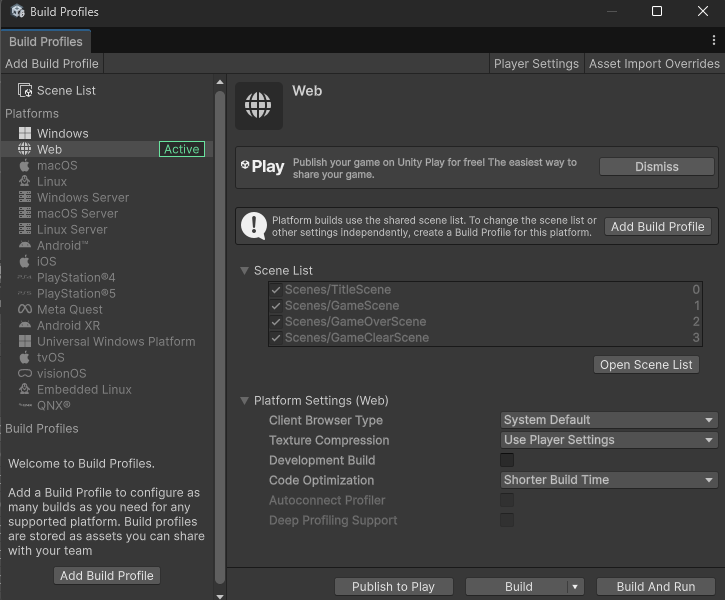
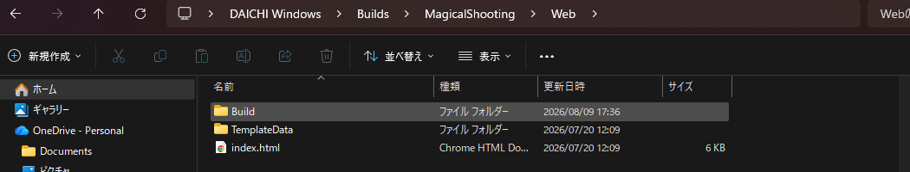

# 【3】Web向けにビルドする

1. `File > Build Profiles` を開きます。左のPlatformsから「Web」を選び、「Active」と表示されていることを確認します。

   

   ※他のプラットフォームがActiveになっている場合は、「Web」をクリックしてから「Switch Platform」を押します。切り替えには数分かかります。

2. 「Build」ボタンを押します。書き出し先のフォルダを聞かれるので、分かりやすい場所を選びます。

   ※フォルダのパスに日本語やスペースが入らない場所を選んでください。

3. ビルドが始まります。プロジェクトの大きさによって数分〜十数分かかります。ステータスバーに「Build completed with a result of 'Succeeded'」と表示されたら成功です。

4. 書き出したフォルダの中を見ると、`index.html` と `Build` フォルダ、`TemplateData` フォルダができています。

   

   unityroomにアップロードするのは、この中の **`Build` フォルダ**です。`Build` フォルダの中には `.loader.js` や `.data.gz` などのファイルが入っています。

5. 【設定を間違えたままビルドしていたら】

   `Build` フォルダの中のファイルの拡張子を確認します。

   - `.data.gz` `.wasm.gz` になっていれば正しい設定です。次に進んで大丈夫です。
   - `.data.unityweb` `.wasm.unityweb` になっていたら、【2】のDecompression Fallbackのチェックが外れていません。チェックを外して、もう一度ビルドし直してください。
