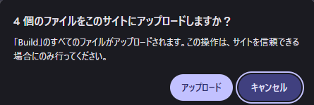
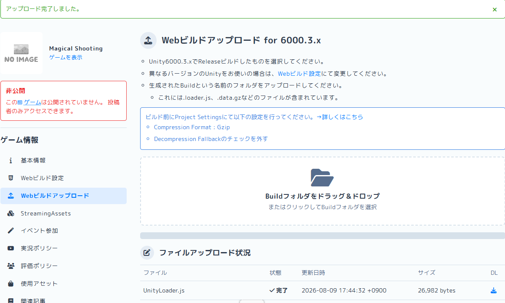

# 【5】ビルドファイルをアップロードする

1. 左のメニューから「Webビルドアップロード」を選びます。

   

   ここにも、【2】で説明したCompression FormatとDecompression Fallbackの注意書きが表示されています。unityroom側もそれだけ重要視している設定だということです。

2. 「Buildフォルダをドラッグ＆ドロップ」の枠に、【3】でビルドした `Build` フォルダをそのままドラッグ＆ドロップします。
   （またはクリックしてフォルダ選択ダイアログから `Build` フォルダを選びます）

3. 「4個のファイルをこのサイトにアップロードしますか？」という確認が出ます。「アップロード」を押します。

   

4. アップロードが完了すると、緑色の帯で「アップロード完了しました。」と表示され、ファイル一覧の状態がすべて「完了」になります。

   

5. 【うまくいかないとき】

   | 症状 | 原因 |
   |---|---|
   | アップロードしてもファイルが「未完了」のまま | 通信が不安定な可能性。もう一度ドラッグ＆ドロップし直す |
   | ファイル名が `.unityweb` になっていて選べない | 【2】のDecompression Fallbackが外れていない。ビルドし直す |
   | フォルダごと選んだのにエラーになる | `Build` フォルダの中身が空、または別バージョンでビルドしたファイルが混ざっている。作り直したフォルダで試す |

6. アップロードが完了したら、この時点でもう一度ゲームを開いて確認できます。左上の「基本情報」の「ゲームを表示」から実際の画面を見てみましょう。
