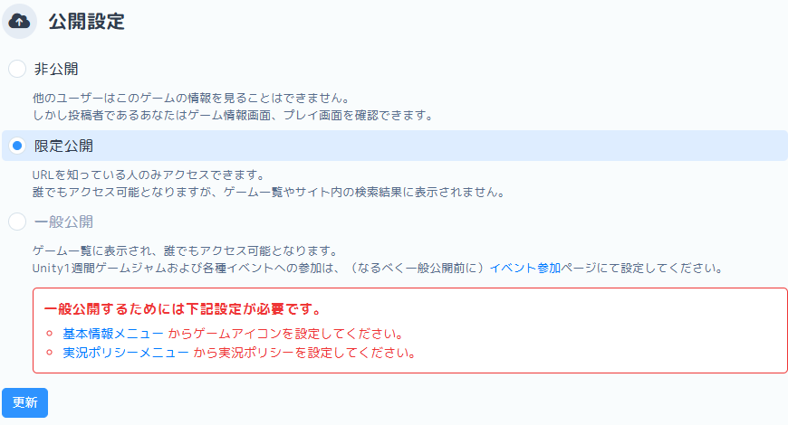
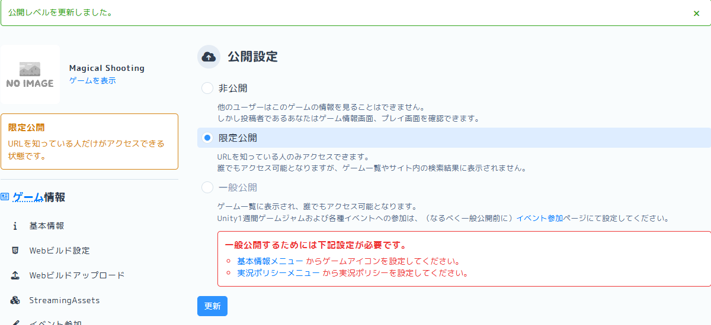
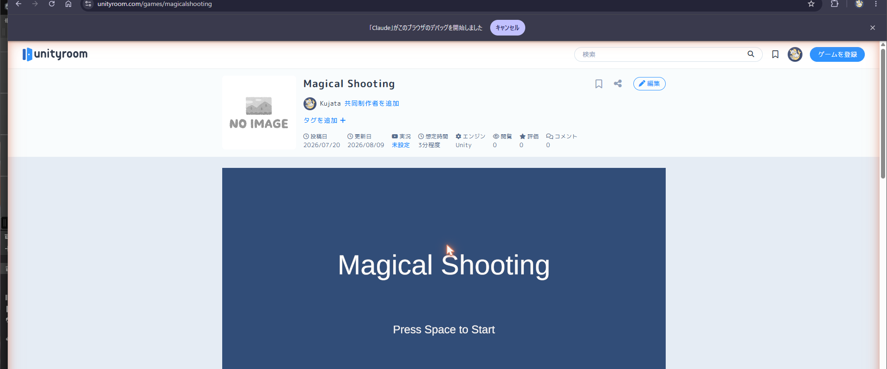

# 【6】公開設定を限定公開にする

1. 左のメニューから「公開設定」を選びます。初期状態は「非公開」になっています。

   

2. 「限定公開」を選びます。

   

   一般公開の欄には「一般公開するためには下記設定が必要です」と赤字で注意書きが出ていますが、限定公開にはこの制約がありません。**アイコンや実況ポリシーが未設定でも、限定公開にはできます。**

3. 「更新」を押します。緑色の帯で「公開レベルを更新しました。」と表示され、左側の表示も「限定公開　URLを知っている人だけがアクセスできる状態です。」に変わります。

   

4. これで、URLを知っている人だけがゲームを開けるようになりました。実際に「ゲームを表示」からアクセスすると、ちゃんとゲームが動きます。

   

5. 【注意】限定公開でも、URLを知っていれば誰でもアクセスできます

   「限定公開」は身内向けの合言葉のようなものではなく、**URLさえ知っていれば誰でも遊べる**状態です。ゲーム一覧や検索結果には出ませんが、URLをオープンな場所（公開のSNSなど）に貼ると誰でも遊べてしまいます。共有はDiscordのプレイ会用チャンネルなど、閉じた場所で行いましょう。
